# Chapter 3 - Implementation

<!-- page 11 -->

Chapter 3
                                             Implementation
3.1 Pin Interface

Table 1: AHB pins used to interface to external devices

   Signal Name                       Source                  Width            Description
                                                                         Bus clock that times all
                                                                          transfers. All timings
         hclk                    Clock source                  1
                                                                         are related to its rising
                                                                                  edge.
                                                                           Active LOW reset
      hresetn                  Reset controller                1          signal for the system
                                                                              and the bus.
                                                                           Byte address of the
                                                                                transfer.
       haddr                         Master               ADDR_WIDTH       ADDR_WIDTH is
                                                                         recommended between
                                                                               10 and 64.
                                                                         Indicates burst transfer
                                                                           count and address
       hburst                        Master               HBURST_WIDTH       increment type.
                                                                           HBURST_WIDTH
                                                                             must be 0 or 3.
                                                                         Indicates if transfer is
    hmastlock                        Master                    1             part of a locked
                                                                                sequence.
                                                                           Protection control
        hprot                        Master               HPROT_WIDTH    signal providing access
                                                                            type information.

AHB_AVIP                                                                                        10

<!-- page 12 -->

                                       Indicates the size of the
     hsize    Master         3
                                               transfer.
                                        Indicates if transfer is
   hnonsec    Master         1
                                       Non-secure or Secure.
                                       Indicates if the transfer
     hexcl    Master         1         is part of an Exclusive
                                          Access sequence.
                                          Master identifier.
                                             Modified by
   hmaster    Master   HMASTER_WIDTH   interconnect for unique
                                        identification during
                                        Exclusive Transfers.
                                       Indicates transfer type
                                           (IDLE, BUSY,
    htrans    Master         2
                                        NONSEQUENTIAL,
                                          SEQUENTIAL).
                                         Transfers data from
                                       Master to Slave during
    hwdata    Master    DATA_WIDTH
                                       writes. Recommended
                                        range: 32 to 256 bits.
                                       Write strobes indicating
    hwstrb    Master   DATA_WIDTH/8
                                           valid data lanes.
                                          Indicates transfer
    hwrite    Master         1           direction: HIGH for
                                        write, LOW for read.
                                         Transfers data from
    hrdata    Slave     DATA_WIDTH     Slave to Master during
                                                reads.
                                       Indicates if the transfer
  hreadyout   Slave          1
                                        on the bus is finished.
                                          Indicates transfer
    hresp     Slave          1         status: LOW (OKAY)
                                        or HIGH (ERROR).

AHB_AVIP                                                       11

<!-- page 13 -->

                                                                         Indicates success or
    hexokay                  Slave                       1             failure of an Exclusive
                                                                              Transfer.
                                                                        Indicates selection of
      hselx                 Master                       1             the current Slave for the
                                                                               transfer.
                                                                       Indicates to Master and
     hready               Mux/Slave                      1             Slaves that the previous
                                                                         transfer is complete.
                                                                           Selected transfer
      hresp                  Slave                       1                response from the
                                                                                Slave.
                                                                         Selected Exclusive
    hexokay                  Slave                       1             Transfer status from the
                                                                                Slave.

3.2 Testbench Components
In this section, testbench components of the ahb-avip are discussed

3.2.1 AHB HDL Top

Hdl top is synthesizable, where generation of the clock and reset is done. Instantiation of the
ahb interface handle, master agent bfm handle and slave agent bfm handle is done as shown in
Figure 3.1.

AHB_AVIP                                                                                   12

<!-- page 14 -->

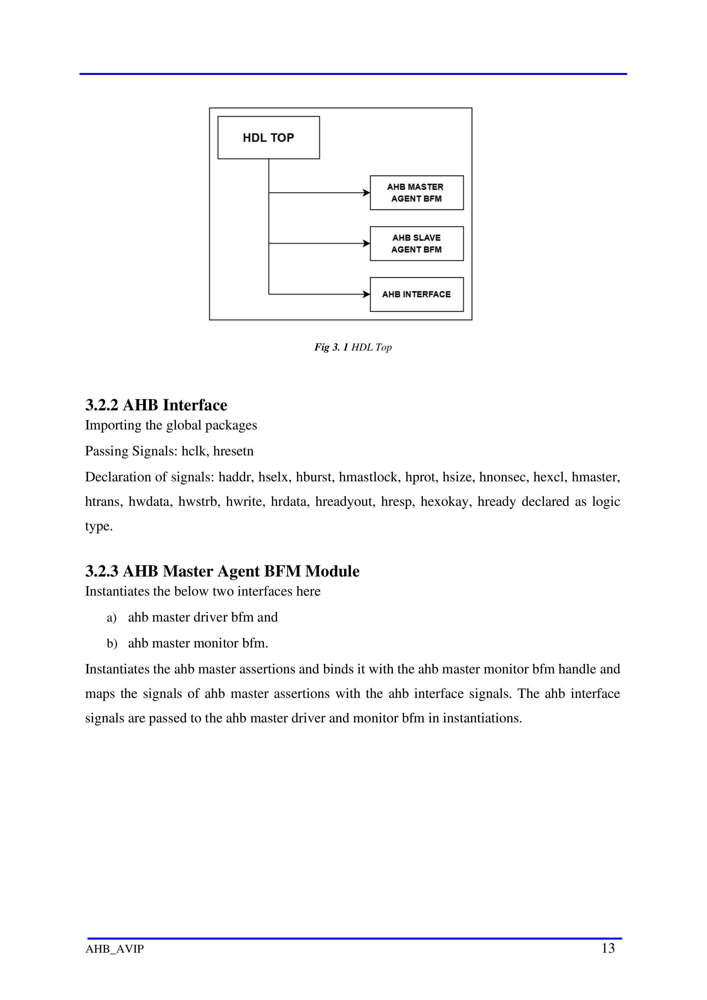

                                        Fig 3. 1 HDL Top

3.2.2 AHB Interface
Importing the global packages
Passing Signals: hclk, hresetn
Declaration of signals: haddr, hselx, hburst, hmastlock, hprot, hsize, hnonsec, hexcl, hmaster,
htrans, hwdata, hwstrb, hwrite, hrdata, hreadyout, hresp, hexokay, hready declared as logic
type.

3.2.3 AHB Master Agent BFM Module
Instantiates the below two interfaces here
   a) ahb master driver bfm and
   b) ahb master monitor bfm.
Instantiates the ahb master assertions and binds it with the ahb master monitor bfm handle and
maps the signals of ahb master assertions with the ahb interface signals. The ahb interface
signals are passed to the ahb master driver and monitor bfm in instantiations.

AHB_AVIP                                                                                   13

<!-- page 15 -->

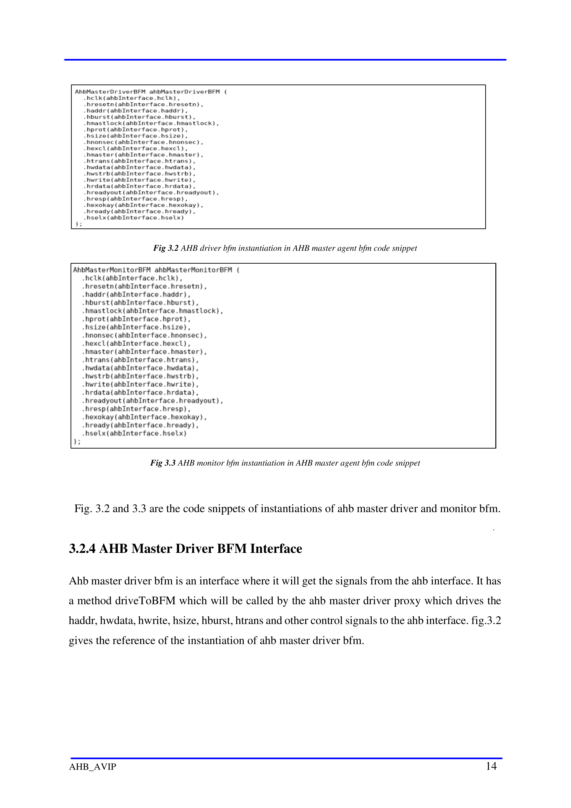

                   Fig 3.2 AHB driver bfm instantiation in AHB master agent bfm code snippet

                  Fig 3.3 AHB monitor bfm instantiation in AHB master agent bfm code snippet

 Fig. 3.2 and 3.3 are the code snippets of instantiations of ahb master driver and monitor bfm.
                                                                                                  .

3.2.4 AHB Master Driver BFM Interface

Ahb master driver bfm is an interface where it will get the signals from the ahb interface. It has
a method driveToBFM which will be called by the ahb master driver proxy which drives the
haddr, hwdata, hwrite, hsize, hburst, htrans and other control signals to the ahb interface. fig.3.2
gives the reference of the instantiation of ahb master driver bfm.

AHB_AVIP                                                                                        14

<!-- page 16 -->

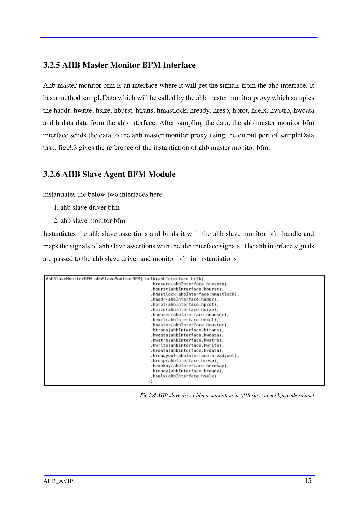

3.2.5 AHB Master Monitor BFM Interface

Ahb master monitor bfm is an interface where it will get the signals from the ahb interface. It
has a method sampleData which will be called by the ahb master monitor proxy which samples
the haddr, hwrite, hsize, hburst, htrans, hmastlock, hready, hresp, hprot, hselx, hwstrb, hwdata
and hrdata data from the ahb interface. After sampling the data, the ahb master monitor bfm
interface sends the data to the ahb master monitor proxy using the output port of sampleData
task. fig.3.3 gives the reference of the instantiation of ahb master monitor bfm.

3.2.6 AHB Slave Agent BFM Module

Instantiates the below two interfaces here
   1. ahb slave driver bfm
   2. ahb slave monitor bfm
Instantiates the ahb slave assertions and binds it with the ahb slave monitor bfm handle and
maps the signals of ahb slave assertions with the ahb interface signals. The ahb interface signals
are passed to the ahb slave driver and monitor bfm in instantiations

                                   Fig 3.4 AHB slave driver bfm instantiation in AHB slave agent bfm code snippet

AHB_AVIP                                                                                                    15

<!-- page 17 -->

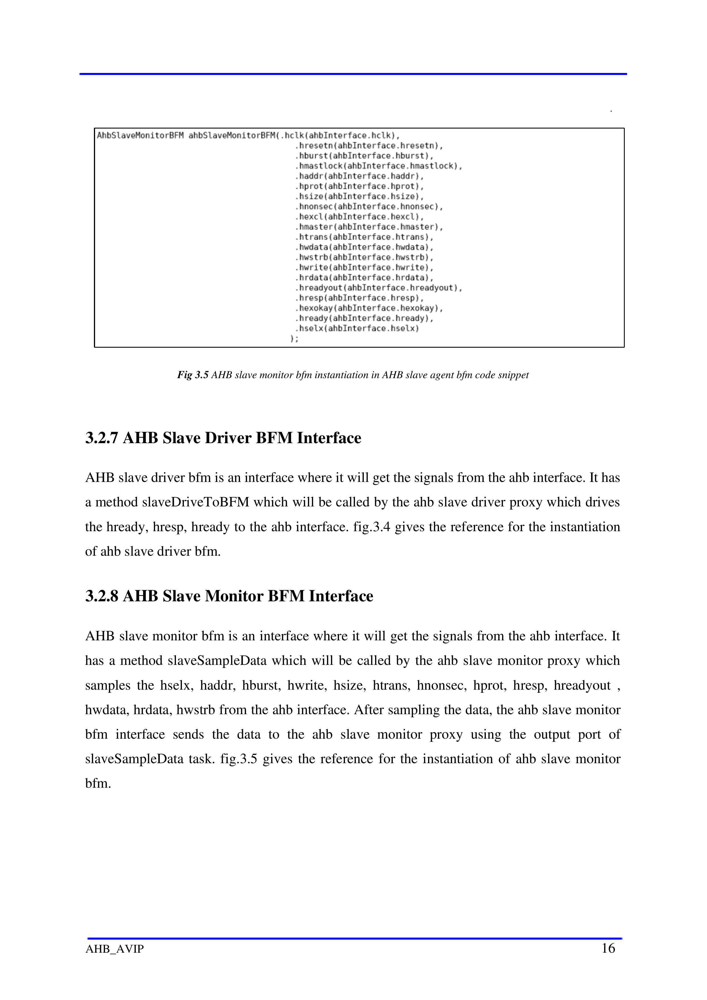

                                                                                                   .

                Fig 3.5 AHB slave monitor bfm instantiation in AHB slave agent bfm code snippet

3.2.7 AHB Slave Driver BFM Interface

AHB slave driver bfm is an interface where it will get the signals from the ahb interface. It has
a method slaveDriveToBFM which will be called by the ahb slave driver proxy which drives
the hready, hresp, hready to the ahb interface. fig.3.4 gives the reference for the instantiation
of ahb slave driver bfm.

3.2.8 AHB Slave Monitor BFM Interface

AHB slave monitor bfm is an interface where it will get the signals from the ahb interface. It
has a method slaveSampleData which will be called by the ahb slave monitor proxy which
samples the hselx, haddr, hburst, hwrite, hsize, htrans, hnonsec, hprot, hresp, hreadyout ,
hwdata, hrdata, hwstrb from the ahb interface. After sampling the data, the ahb slave monitor
bfm interface sends the data to the ahb slave monitor proxy using the output port of
slaveSampleData task. fig.3.5 gives the reference for the instantiation of ahb slave monitor
bfm.

AHB_AVIP                                                                                          16

<!-- page 18 -->

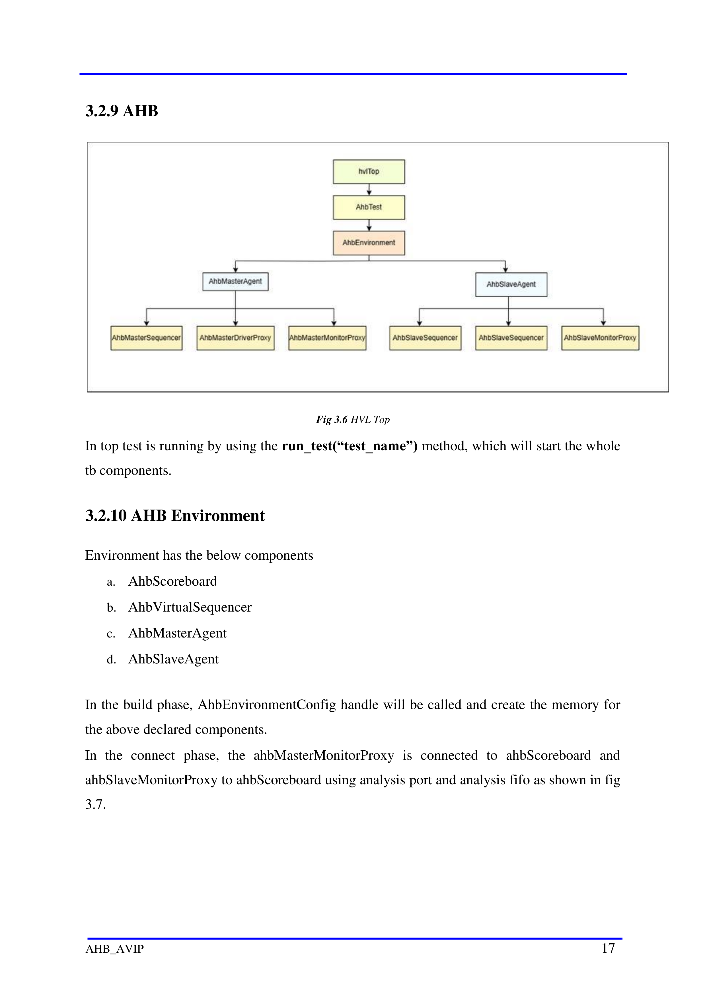

3.2.9 AHB

                                       Fig 3.6 HVL Top

In top test is running by using the run_test(“test_name”) method, which will start the whole
tb components.

3.2.10 AHB Environment

Environment has the below components
       a. AhbScoreboard
       b. AhbVirtualSequencer
       c. AhbMasterAgent
       d. AhbSlaveAgent

In the build phase, AhbEnvironmentConfig handle will be called and create the memory for
the above declared components.
In the connect phase, the ahbMasterMonitorProxy is connected to ahbScoreboard and
ahbSlaveMonitorProxy to ahbScoreboard using analysis port and analysis fifo as shown in fig
3.7.

AHB_AVIP                                                                                17

<!-- page 19 -->

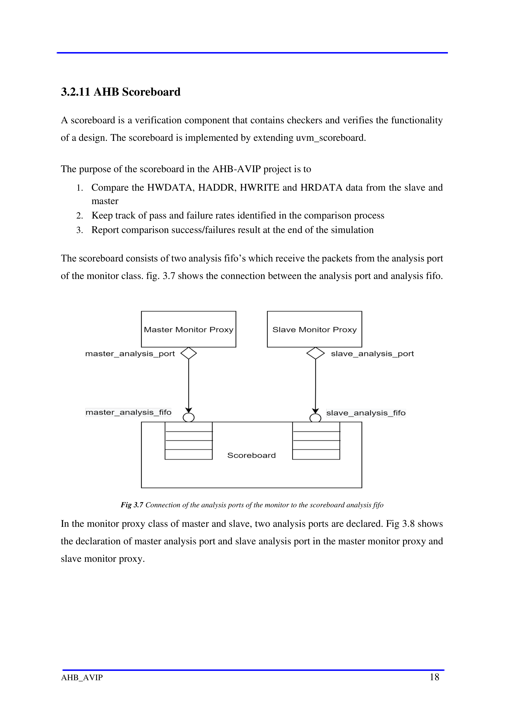

3.2.11 AHB Scoreboard

A scoreboard is a verification component that contains checkers and verifies the functionality
of a design. The scoreboard is implemented by extending uvm_scoreboard.

The purpose of the scoreboard in the AHB-AVIP project is to
   1. Compare the HWDATA, HADDR, HWRITE and HRDATA data from the slave and
      master
   2. Keep track of pass and failure rates identified in the comparison process
   3. Report comparison success/failures result at the end of the simulation

The scoreboard consists of two analysis fifo’s which receive the packets from the analysis port
of the monitor class. fig. 3.7 shows the connection between the analysis port and analysis fifo.

               Fig 3.7 Connection of the analysis ports of the monitor to the scoreboard analysis fifo

In the monitor proxy class of master and slave, two analysis ports are declared. Fig 3.8 shows
the declaration of master analysis port and slave analysis port in the master monitor proxy and
slave monitor proxy.

AHB_AVIP                                                                                                 18

<!-- page 20 -->

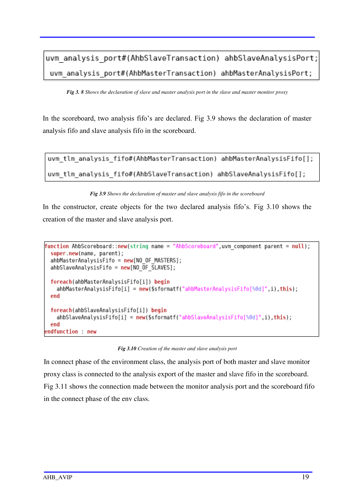

        Fig 3. 8 Shows the declaration of slave and master analysis port in the slave and master monitor proxy

In the scoreboard, two analysis fifo’s are declared. Fig 3.9 shows the declaration of master
analysis fifo and slave analysis fifo in the scoreboard.

                  Fig 3.9 Shows the declaration of master and slave analysis fifo in the scoreboard

In the constructor, create objects for the two declared analysis fifo’s. Fig 3.10 shows the
creation of the master and slave analysis port.

                               Fig 3.10 Creation of the master and slave analysis port

In connect phase of the environment class, the analysis port of both master and slave monitor
proxy class is connected to the analysis export of the master and slave fifo in the scoreboard.
Fig 3.11 shows the connection made between the monitor analysis port and the scoreboard fifo
in the connect phase of the env class.

AHB_AVIP                                                                                                         19

<!-- page 21 -->

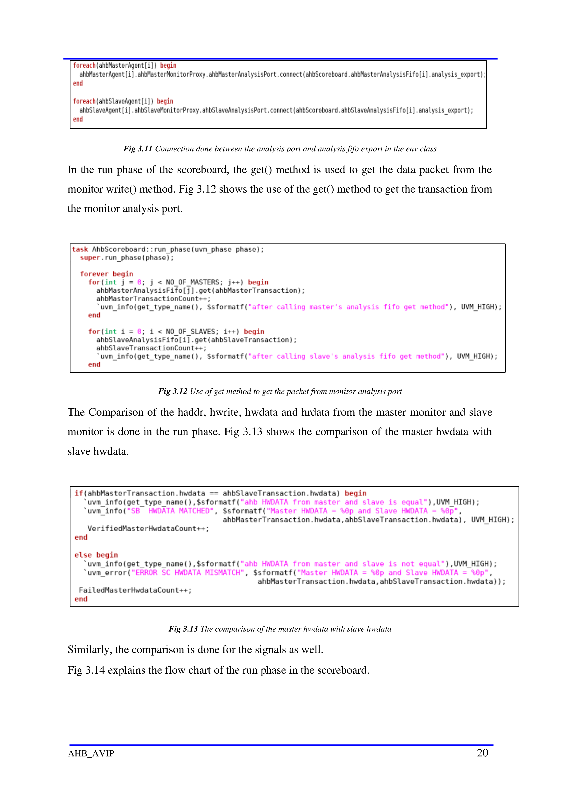

            Fig 3.11 Connection done between the analysis port and analysis fifo export in the env class

In the run phase of the scoreboard, the get() method is used to get the data packet from the
monitor write() method. Fig 3.12 shows the use of the get() method to get the transaction from
the monitor analysis port.

                      Fig 3.12 Use of get method to get the packet from monitor analysis port

The Comparison of the haddr, hwrite, hwdata and hrdata from the master monitor and slave
monitor is done in the run phase. Fig 3.13 shows the comparison of the master hwdata with
slave hwdata.

                         Fig 3.13 The comparison of the master hwdata with slave hwdata

Similarly, the comparison is done for the signals as well.
Fig 3.14 explains the flow chart of the run phase in the scoreboard.

AHB_AVIP                                                                                                   20

<!-- page 22 -->

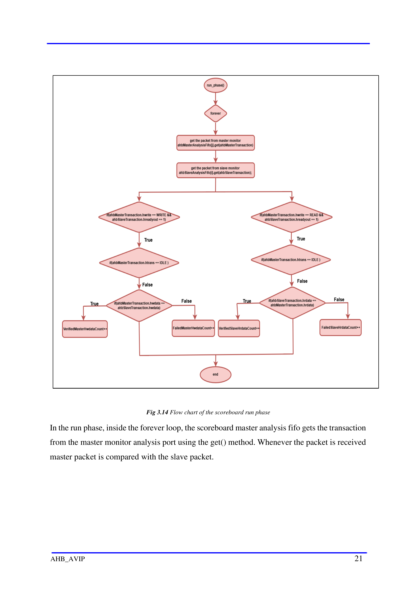

                              Fig 3.14 Flow chart of the scoreboard run phase

In the run phase, inside the forever loop, the scoreboard master analysis fifo gets the transaction
from the master monitor analysis port using the get() method. Whenever the packet is received
master packet is compared with the slave packet.

AHB_AVIP                                                                                       21

<!-- page 23 -->

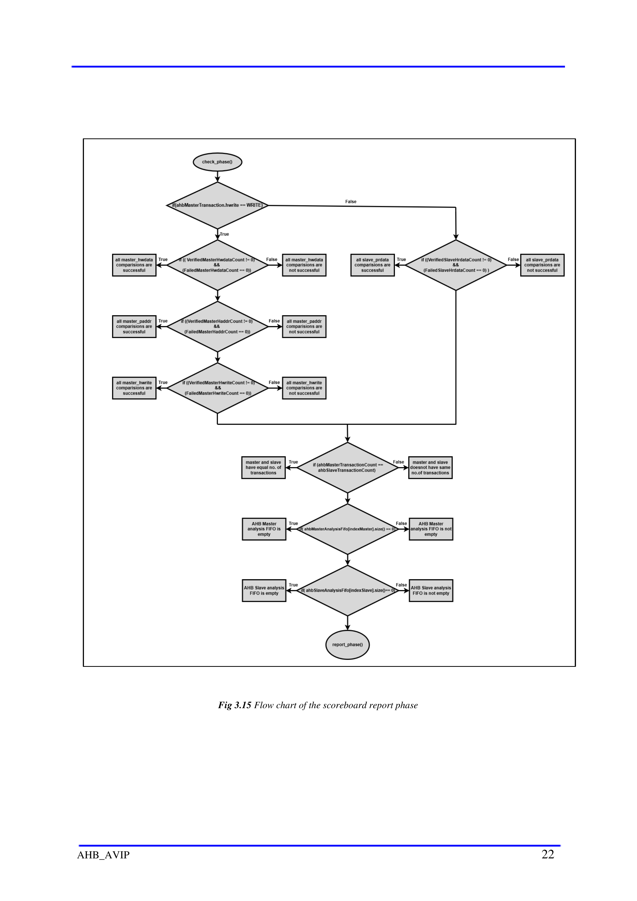

           Fig 3.15 Flow chart of the scoreboard report phase

AHB_AVIP                                                        22

<!-- page 24 -->

3.2.12 AHB Virtual Sequencer

It coordinates stimulus for the AHB Master and AHB Slave Sequencers. It declares their
handles and initializes them in the build_phase.

3.2.13 AHB Master Agent

The AHB Master Agent is a UVM component that extends uvm_agent. It declares a handle for
AhbMasterAgentConfig, which determines the creation and connection of components. The
AhbMasterSequencer and AhbMasterDriverProxy are instantiated only if the agent is active,
based   on   the   is_active    variable      in    AhbMasterAgentConfig.       Additionally,   the
AhbMasterCoverage component is created in the build_phase if the hasCoverage variable is
set to 1. Please refer to figure 3.16 for the AhbMasterAgent build_phase code snippet

The AHB Master Agent build phase involves the creation of the following components:
a. AhbMasterSequencer
b. AhbMasterDriverProxy
c. AhbMasterMonitorProxy
d. AhbMasterCoverage

                           Fig 3.16 AHB master agent build phase code snippet

In the connect_phase, configuration handles from the above components are mapped. If the
AHB Master Agent is active, the AhbMasterDriverProxy and AhbMasterSequencer are
connected using TLM ports. Additionally, the AhbMasterMonitorProxy’s

AHB_AVIP                                                                                        23

<!-- page 25 -->

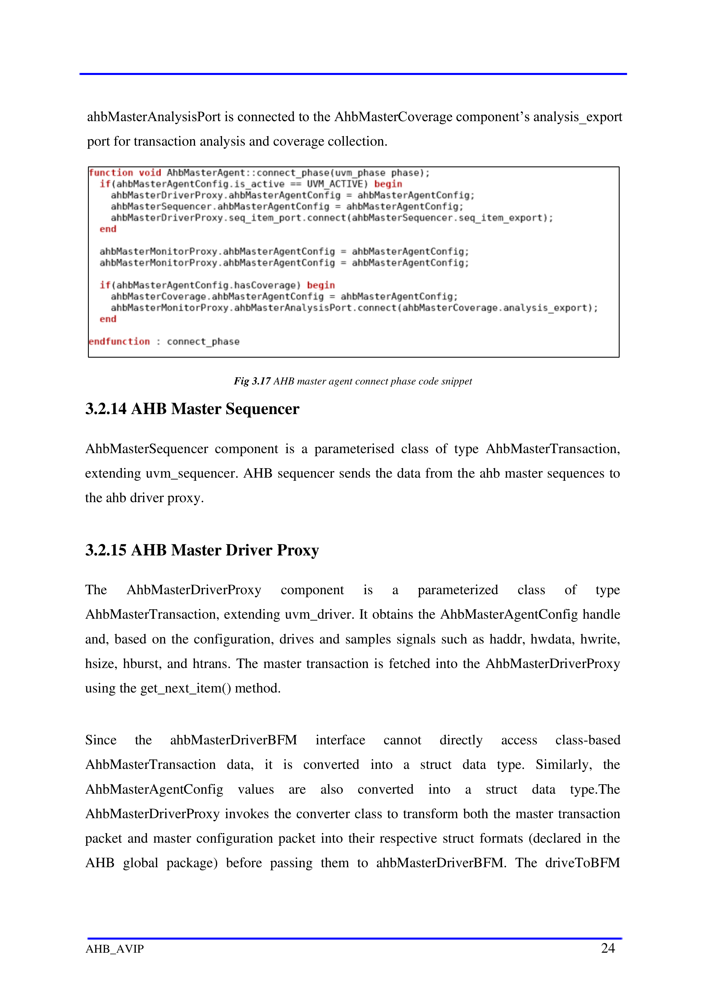

ahbMasterAnalysisPort is connected to the AhbMasterCoverage component’s analysis_export
port for transaction analysis and coverage collection.

                          Fig 3.17 AHB master agent connect phase code snippet

3.2.14 AHB Master Sequencer

AhbMasterSequencer component is a parameterised class of type AhbMasterTransaction,
extending uvm_sequencer. AHB sequencer sends the data from the ahb master sequences to
the ahb driver proxy.

3.2.15 AHB Master Driver Proxy

The     AhbMasterDriverProxy        component         is    a     parameterized           class    of   type
AhbMasterTransaction, extending uvm_driver. It obtains the AhbMasterAgentConfig handle
and, based on the configuration, drives and samples signals such as haddr, hwdata, hwrite,
hsize, hburst, and htrans. The master transaction is fetched into the AhbMasterDriverProxy
using the get_next_item() method.

Since    the   ahbMasterDriverBFM          interface       cannot     directly     access         class-based
AhbMasterTransaction data, it is converted into a struct data type. Similarly, the
AhbMasterAgentConfig       values    are    also     converted      into    a    struct     data    type.The
AhbMasterDriverProxy invokes the converter class to transform both the master transaction
packet and master configuration packet into their respective struct formats (declared in the
AHB global package) before passing them to ahbMasterDriverBFM. The driveToBFM

AHB_AVIP                                                                                                 24

<!-- page 26 -->

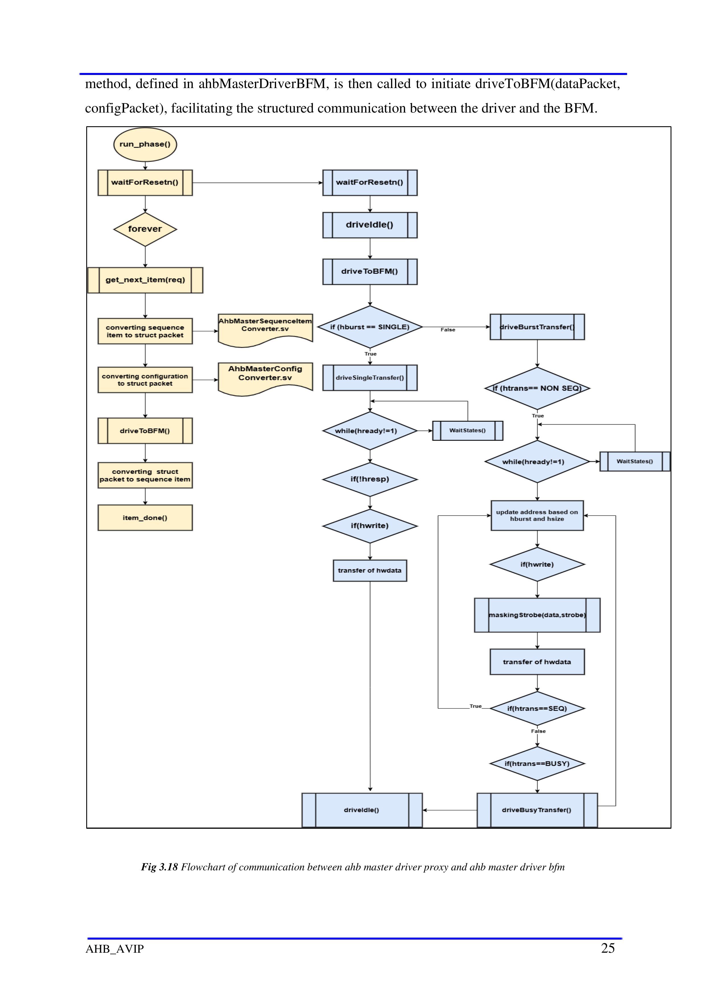

method, defined in ahbMasterDriverBFM, is then called to initiate driveToBFM(dataPacket,
configPacket), facilitating the structured communication between the driver and the BFM.

         Fig 3.18 Flowchart of communication between ahb master driver proxy and ahb master driver bfm

AHB_AVIP                                                                                                 25

<!-- page 27 -->

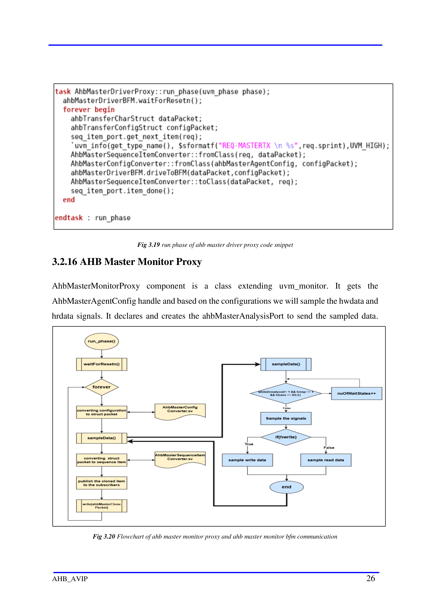

                          Fig 3.19 run phase of ahb master driver proxy code snippet

3.2.16 AHB Master Monitor Proxy

AhbMasterMonitorProxy component is a class extending uvm_monitor. It gets the
AhbMasterAgentConfig handle and based on the configurations we will sample the hwdata and
hrdata signals. It declares and creates the ahbMasterAnalysisPort to send the sampled data.

           Fig 3.20 Flowchart of ahb master monitor proxy and ahb master monitor bfm communication

AHB_AVIP                                                                                             26

<!-- page 28 -->

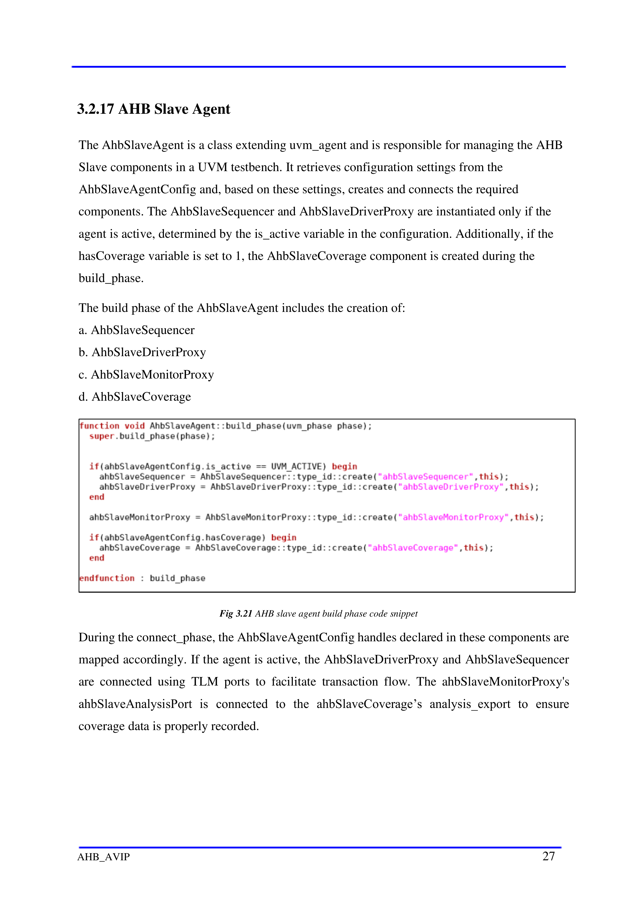

3.2.17 AHB Slave Agent

The AhbSlaveAgent is a class extending uvm_agent and is responsible for managing the AHB
Slave components in a UVM testbench. It retrieves configuration settings from the
AhbSlaveAgentConfig and, based on these settings, creates and connects the required
components. The AhbSlaveSequencer and AhbSlaveDriverProxy are instantiated only if the
agent is active, determined by the is_active variable in the configuration. Additionally, if the
hasCoverage variable is set to 1, the AhbSlaveCoverage component is created during the
build_phase.

The build phase of the AhbSlaveAgent includes the creation of:
a. AhbSlaveSequencer
b. AhbSlaveDriverProxy
c. AhbSlaveMonitorProxy
d. AhbSlaveCoverage

                            Fig 3.21 AHB slave agent build phase code snippet

During the connect_phase, the AhbSlaveAgentConfig handles declared in these components are
mapped accordingly. If the agent is active, the AhbSlaveDriverProxy and AhbSlaveSequencer
are connected using TLM ports to facilitate transaction flow. The ahbSlaveMonitorProxy's
ahbSlaveAnalysisPort is connected to the ahbSlaveCoverage’s analysis_export to ensure
coverage data is properly recorded.

AHB_AVIP                                                                                     27

<!-- page 29 -->

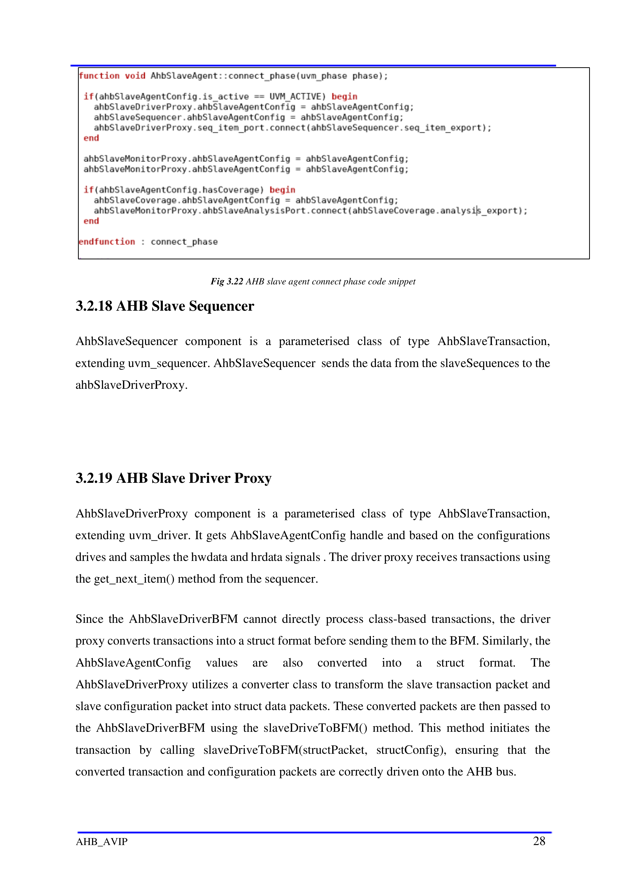

                           Fig 3.22 AHB slave agent connect phase code snippet

3.2.18 AHB Slave Sequencer

AhbSlaveSequencer component is a parameterised class of type AhbSlaveTransaction,
extending uvm_sequencer. AhbSlaveSequencer sends the data from the slaveSequences to the
ahbSlaveDriverProxy.

3.2.19 AHB Slave Driver Proxy

AhbSlaveDriverProxy component is a parameterised class of type AhbSlaveTransaction,
extending uvm_driver. It gets AhbSlaveAgentConfig handle and based on the configurations
drives and samples the hwdata and hrdata signals . The driver proxy receives transactions using
the get_next_item() method from the sequencer.

Since the AhbSlaveDriverBFM cannot directly process class-based transactions, the driver
proxy converts transactions into a struct format before sending them to the BFM. Similarly, the
AhbSlaveAgentConfig       values     are    also     converted       into        a   struct   format.   The
AhbSlaveDriverProxy utilizes a converter class to transform the slave transaction packet and
slave configuration packet into struct data packets. These converted packets are then passed to
the AhbSlaveDriverBFM using the slaveDriveToBFM() method. This method initiates the
transaction by calling slaveDriveToBFM(structPacket, structConfig), ensuring that the
converted transaction and configuration packets are correctly driven onto the AHB bus.

AHB_AVIP                                                                                                28

<!-- page 30 -->

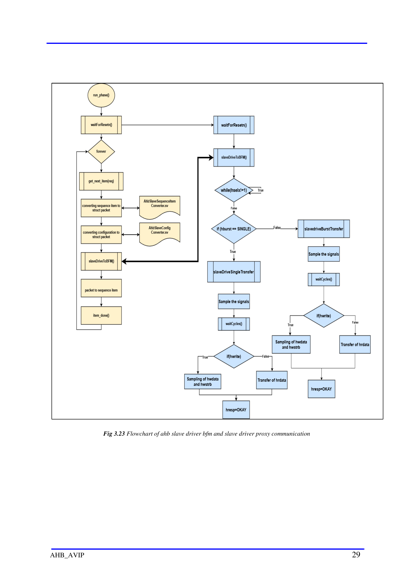

           Fig 3.23 Flowchart of ahb slave driver bfm and slave driver proxy communication

AHB_AVIP                                                                                     29

<!-- page 31 -->

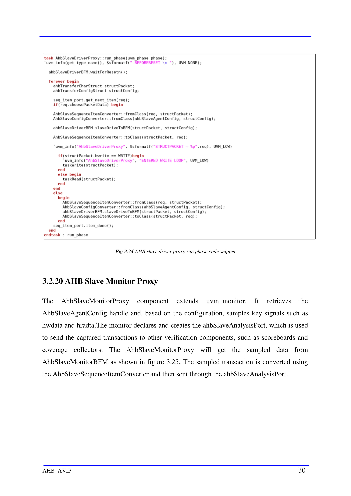

                         Fig 3.24 AHB slave driver proxy run phase code snippet

3.2.20 AHB Slave Monitor Proxy

The   AhbSlaveMonitorProxy        component         extends      uvm_monitor.     It   retrieves   the
AhbSlaveAgentConfig handle and, based on the configuration, samples key signals such as
hwdata and hradta.The monitor declares and creates the ahbSlaveAnalysisPort, which is used
to send the captured transactions to other verification components, such as scoreboards and
coverage collectors. The AhbSlaveMonitorProxy will get the sampled data from
AhbSlaveMonitorBFM as shown in figure 3.25. The sampled transaction is converted using
the AhbSlaveSequenceItemConverter and then sent through the ahbSlaveAnalysisPort.

AHB_AVIP                                                                                           30

<!-- page 32 -->

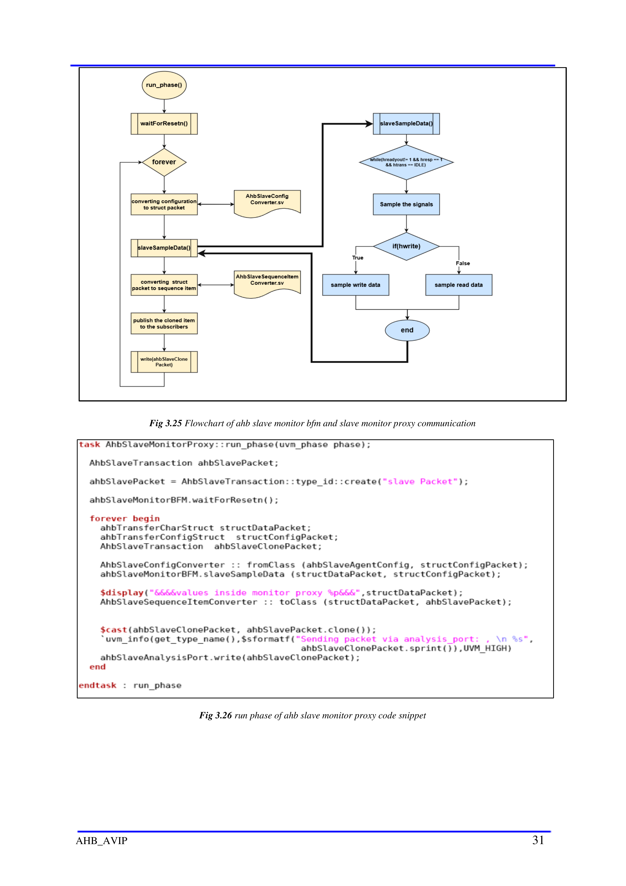

           Fig 3.25 Flowchart of ahb slave monitor bfm and slave monitor proxy communication

                       Fig 3.26 run phase of ahb slave monitor proxy code snippet

AHB_AVIP                                                                                       31

<!-- page 33 -->

3.2.21 UVM Verbosity

There are predefined UVM verbosity settings built into UVM (and OVM). These settings are
included in the UVM src/uvm_object_globals.svh file and the settings are part of the
enumerated uvm_verbosity type definition. The settings actually have integer values that
increment by 100 as shown below table

Table 2:UVM verbosity Priorities

 Verbosity                                                      Default Value

 UVM_NONE                                                       0(Highest Priority)

 UVM_LOW                                                        100

 UVM_MEDIUM                                                     200

 UVM_HIGH                                                       300

 UVM_FULL                                                       400

 UVM_DEBUG                                                      500(Lowest Priority)

By default, when running a UVM simulation, all messages with verbosity settings of
UVM_MEDIUM or lower (UVM_MEDIUM, UVM_LOW and UVM_NONE) will print.
Table 3 shows the Verbosity levels that have used in this particular project

Table 3:Descriptions of each Verbosity level

 Verbosity              Description

 UVM_NONE               UVM_NONE is level 0 and should be used to reduce report verbosity to a bare minimum of vital
                        simulation regression suite messages.

 UVM_LOW                UVM_LOW is level 100 and should be used to reduce report verbosity and only shows important
                        messages

AHB_AVIP                                                                                                          32

<!-- page 34 -->

UVM_MEDIUM   UVM_MEDIUM is level 200 and should be used as the default $display command. If the verbosity
             isn’t selected then, these messages will print by default as UVM_MEDIUM. This verbosity setting
             should not be used for any debugging messages or for standard test-passing messages.

UVM_HIGH     UVM_HIGH is level 300 and should be used to increase report verbosity by showing both failing
             and passing transaction information, but does not show annoying UVM phase status information
             after it has been established that the UVM phases are working properly

UVM_FULL     UVM_FULL is level 400 and should be used to increase report verbosity by showing UVM phase
             status information as well as both failing and passing transaction information.

AHB_AVIP                                                                                                 33

