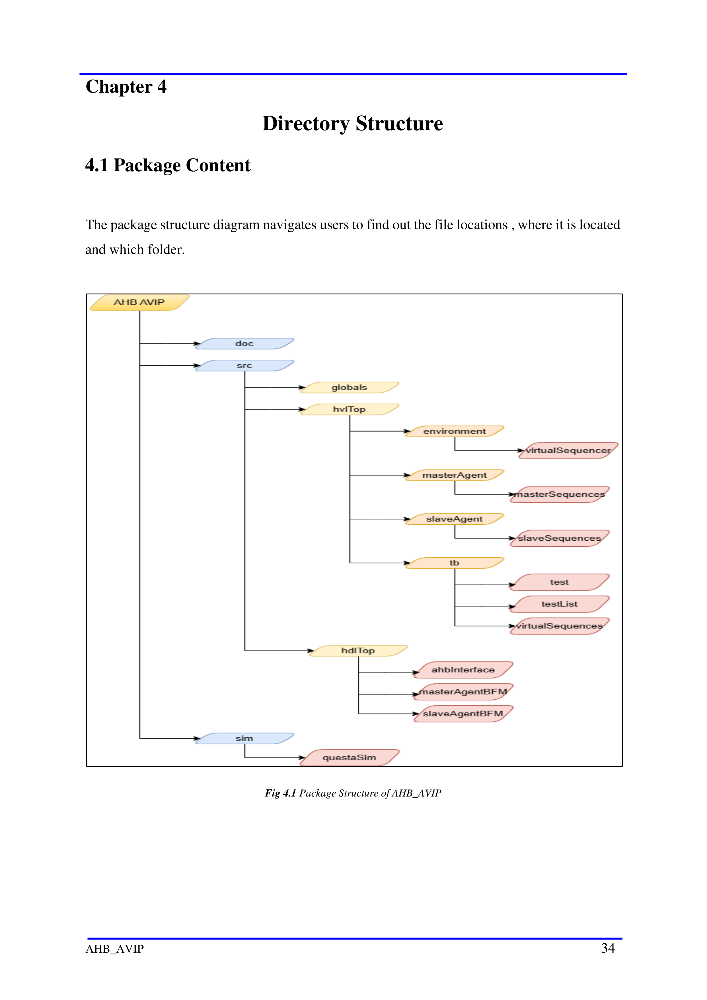

# Chapter 4 - Directory Structure

<!-- page 35 -->

Chapter 4
                                Directory Structure
4.1 Package Content

The package structure diagram navigates users to find out the file locations , where it is located
and which folder.

                                Fig 4.1 Package Structure of AHB_AVIP

AHB_AVIP                                                                                      34

<!-- page 36 -->

Table 4: Directory Path

                     Directory                                           Description

                     ahb_avip/doc                   Contains test      bench      architecture     and   components
                                                    description and verification plan and assertion plan

                     ahb_avip/sim                   Contains all simulating tools and ahb_compile.f file which
                                                    contain all directories and compiling files

                  ahb_avip/src/globals              Contains global package parameters(names,modes)

                  ahb_avip/src/hvlTop               Contains all tb component folders (environment, master
                                                    agent, slave agent, tb)

                  ahb_avip/src/hdlTop               Contains all bfm files and interface

                                                    Contains master agent , driver and monitor bfm files, master
        ahb_avip/src/hdlTop/masterAgentBFM
                                                    coverproperty and assertion files.

                                                    Contains slave agent, driver and monitor bfm files. Slave
        ahb_avip/src/hdlTop/slaveAgentBFM
                                                    coverproperty and assertion files.

           ahb_avip/src/hdlTop/ahbInterface         Contains ahb interface file

                ahb_avip/src/hvlTop/tb              Contains testbench for master and slave assertions,

                                                    coverproperty and ahbAssertion.f file.       Additionally, it
                                                    includes test files, test lists, and virtual sequences

              ahb_avip/src/hvlTop/tb/test           Contains all the test files

            ahb_avip/src/hvlTop/tb/testList         Contains test list for Regression test.

       ahb_avip/src/hvlTop/tb/virtualSequences      Contain all virtual sequence test files

                                                    Contains environment along with its config and package files
           ahb_avip/src/hvlTop/environment
                                                    and Scoreboard file and virtual sequencer folder

                                                    Contains master and slave virtual sequencer and base virtual
 ahb_avip/src/hvlTop/environment/virtualSequencer
                                                    sequencer

                                                    Contains master agent, agent config, conifg converter,
                                                    coverage, diver proxy, monitor proxy, package, sequence
                src/hvlTop/masterAgent
                                                    item converter, sequencer, transactions and a master sequence
                                                    folder

 src/hvlTop/masterAgent/masterSequences             Contains all master test sequences

AHB_AVIP                                                                                                            35

<!-- page 37 -->

                                        Contains slave agent, agent config, conifg converter,
                                        coverage, diver proxy, monitor proxy, package, sequence
 src/hvlTop/slaveAgent
                                        item converter, sequencer, transactions and a slave sequence
                                        folder.

 src/hvlTop/slaveAgent/slaveSequences   Contains all slave test sequences

AHB_AVIP                                                                                          36

