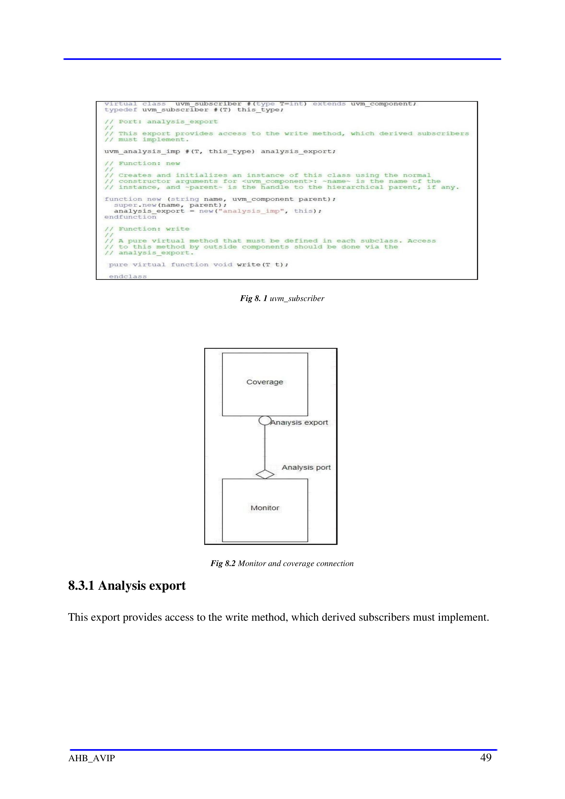
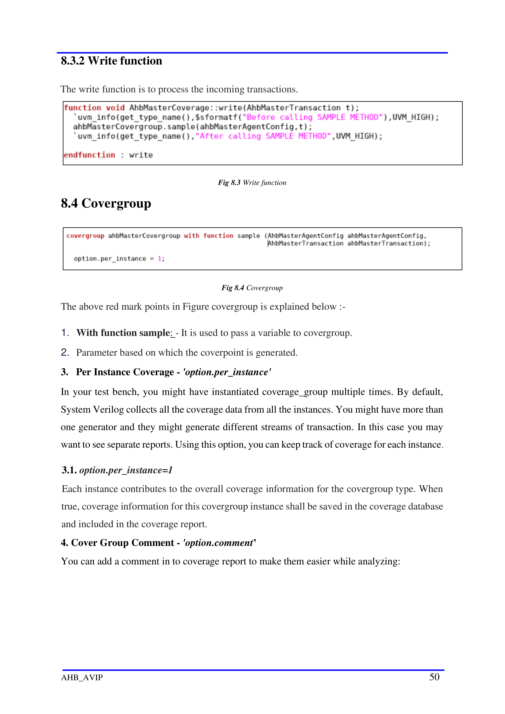
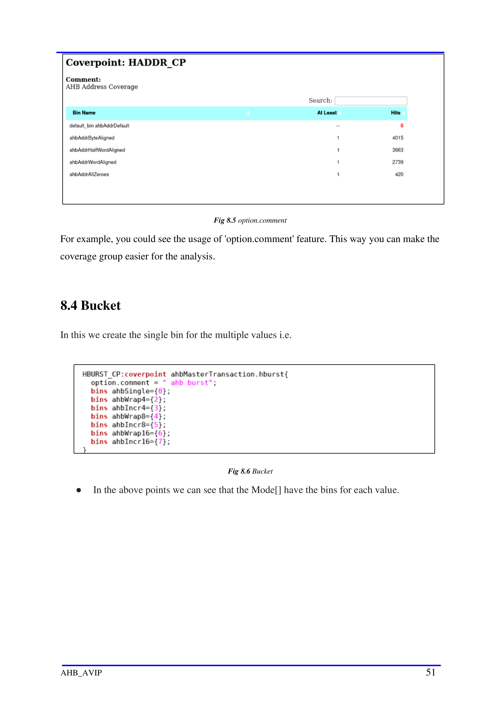
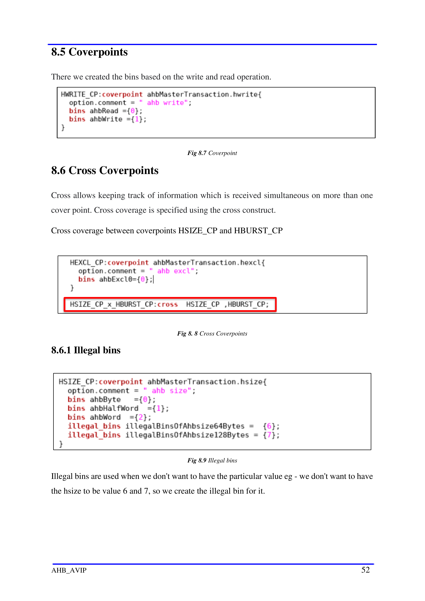
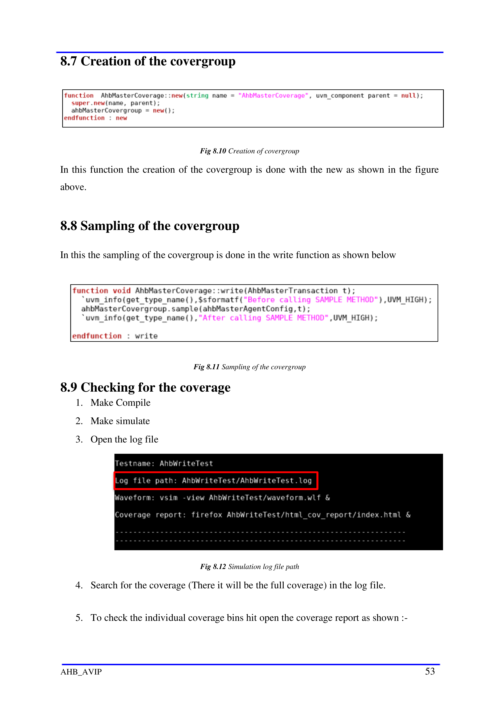
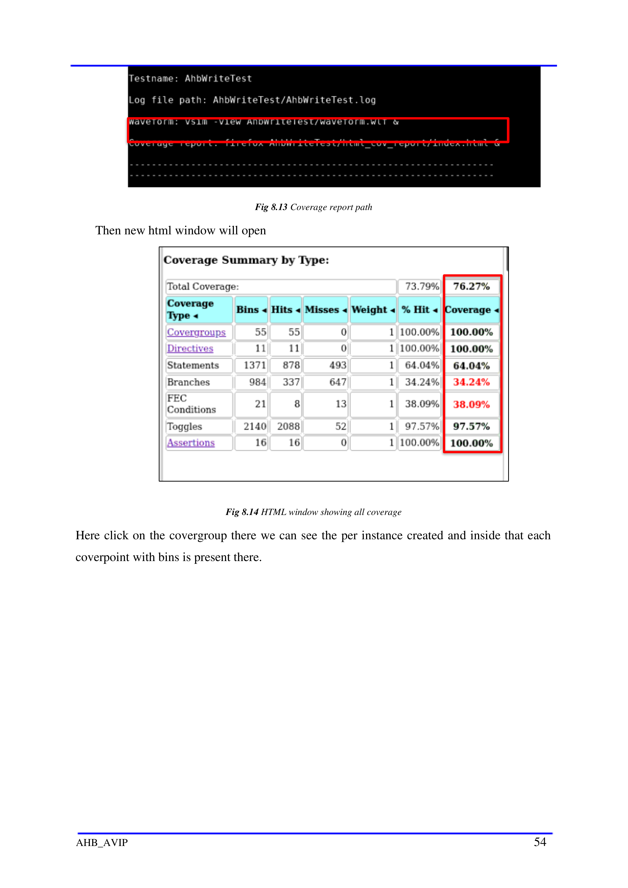
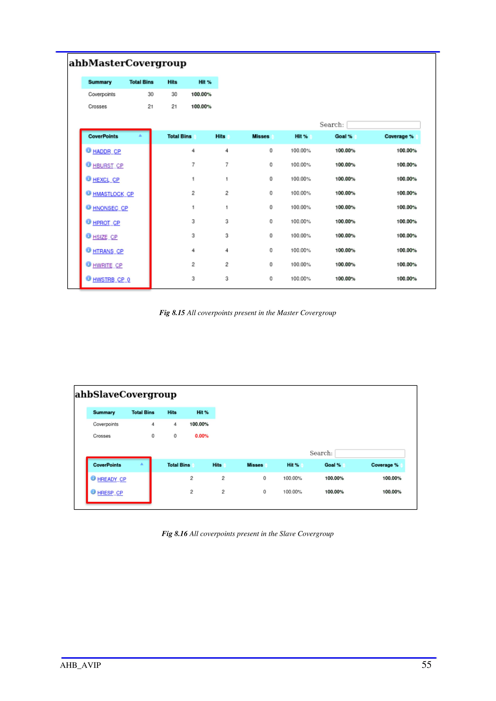
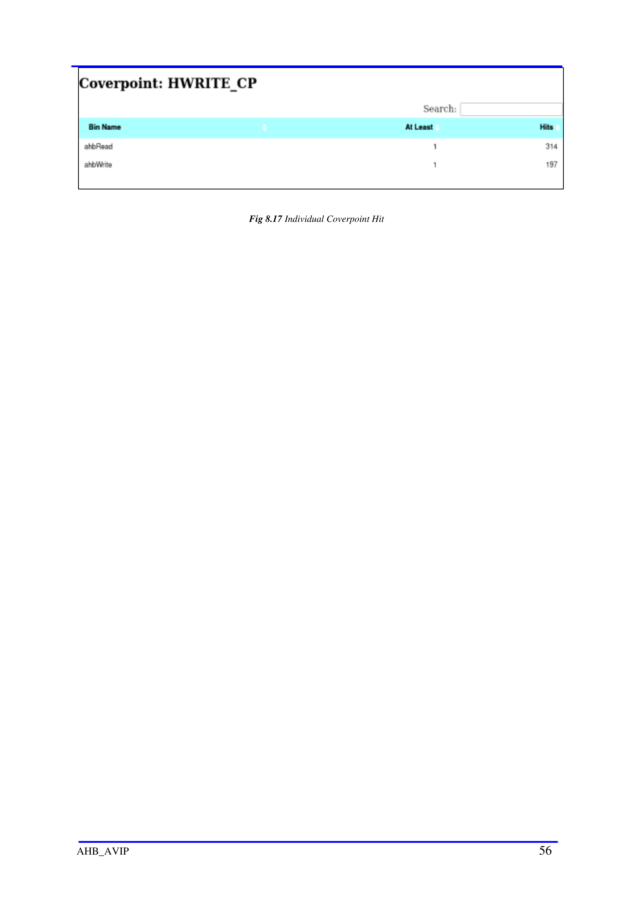

# Chapter 8 - Coverage Plan

<!-- page 49 -->

Chapter 8
                                   Coverage Plan
8.1 Template of Coverage Plan

Template for Coverage plan is done in an excel sheet and refer to link below:

AHB Coverage Plan

8.2 Functional Coverage
   ● Functional coverage is the coverage data generated from the user defined functional
       coverage model and assertions usually written in System Verilog During simulation,
       the simulator generates functional coverage based on the stimulus. Looking at the
       functional coverage data, one can identify the portions of the DUT [Features] verified.
       Also, it helps us to target the DUT features that are unverified.

   ● The reason for switching to the functional coverage is that we can create the bins
       manually as per our requirement while in the code coverage it is generated by the system
       by itself.

8.3 Uvm_Subscriber

   ● This class provides an analysis export for receiving transactions from a connected
       analysis export. Making such a connection "subscribes" this component to any
       transactions emitted by the connected analysis port. Subtypes of this class must define
       the write method to process the incoming transactions. This class is particularly useful
       when designing a coverage collector that attaches to a monitor.

AHB_AVIP                                                                                   48

<!-- page 50 -->

                                      Fig 8. 1 uvm_subscriber

                              Fig 8.2 Monitor and coverage connection

8.3.1 Analysis export

This export provides access to the write method, which derived subscribers must implement.

AHB_AVIP                                                                                49

<!-- page 51 -->

8.3.2 Write function

The write function is to process the incoming transactions.

                                        Fig 8.3 Write function

8.4 Covergroup

                                         Fig 8.4 Covergroup

The above red mark points in Figure covergroup is explained below :-

1. With function sample: - It is used to pass a variable to covergroup.
2. Parameter based on which the coverpoint is generated.
3. Per Instance Coverage - 'option.per_instance'
In your test bench, you might have instantiated coverage_group multiple times. By default,
System Verilog collects all the coverage data from all the instances. You might have more than
one generator and they might generate different streams of transaction. In this case you may
want to see separate reports. Using this option, you can keep track of coverage for each instance.

3.1. option.per_instance=1
Each instance contributes to the overall coverage information for the covergroup type. When
true, coverage information for this covergroup instance shall be saved in the coverage database
and included in the coverage report.
4. Cover Group Comment - 'option.comment’
You can add a comment in to coverage report to make them easier while analyzing:

AHB_AVIP                                                                                      50

<!-- page 52 -->

                                        Fig 8.5 option.comment

For example, you could see the usage of 'option.comment' feature. This way you can make the
coverage group easier for the analysis.

8.4 Bucket

In this we create the single bin for the multiple values i.e.

                                            Fig 8.6 Bucket

    ●   In the above points we can see that the Mode[] have the bins for each value.

AHB_AVIP                                                                               51

<!-- page 53 -->

8.5 Coverpoints

There we created the bins based on the write and read operation.

                                          Fig 8.7 Coverpoint

8.6 Cross Coverpoints

Cross allows keeping track of information which is received simultaneous on more than one
cover point. Cross coverage is specified using the cross construct.

Cross coverage between coverpoints HSIZE_CP and HBURST_CP

                                       Fig 8. 8 Cross Coverpoints

8.6.1 Illegal bins

                                          Fig 8.9 Illegal bins

Illegal bins are used when we don't want to have the particular value eg - we don't want to have
the hsize to be value 6 and 7, so we create the illegal bin for it.

AHB_AVIP                                                                                    52

<!-- page 54 -->

8.7 Creation of the covergroup

                                   Fig 8.10 Creation of covergroup

In this function the creation of the covergroup is done with the new as shown in the figure
above.

8.8 Sampling of the covergroup

In this the sampling of the covergroup is done in the write function as shown below

                                 Fig 8.11 Sampling of the covergroup

8.9 Checking for the coverage
   1. Make Compile
   2. Make simulate
   3. Open the log file

                                   Fig 8.12 Simulation log file path

   4. Search for the coverage (There it will be the full coverage) in the log file.

   5. To check the individual coverage bins hit open the coverage report as shown :-

AHB_AVIP                                                                               53

<!-- page 55 -->

                                    Fig 8.13 Coverage report path

    Then new html window will open

                              Fig 8.14 HTML window showing all coverage

Here click on the covergroup there we can see the per instance created and inside that each
coverpoint with bins is present there.

AHB_AVIP                                                                               54

<!-- page 56 -->

           Fig 8.15 All coverpoints present in the Master Covergroup

           Fig 8.16 All coverpoints present in the Slave Covergroup

AHB_AVIP                                                               55

<!-- page 57 -->

           Fig 8.17 Individual Coverpoint Hit

AHB_AVIP                                        56

