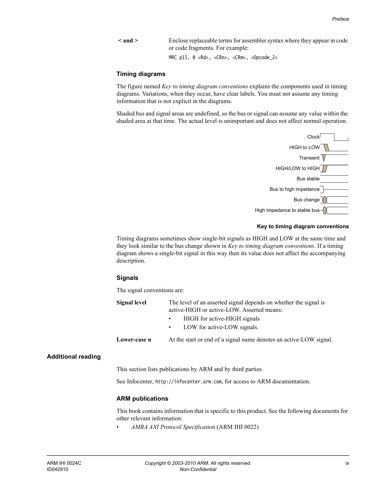

# AMBA APB Protocol Specification

Version 2.0

Specification

Copyright © 2003-2010 ARM. All rights reserved.

## Release Information

The following changes have been made to this book.

| Date | Issue | Confidentiality | Change |
|---|---:|---|---|
| 25 September 2003 | A | Non-Confidential | First release for v1.0 |
| 17 August 2004 | B | Non-Confidential | Second release for v1.0 |
| 13 April 2010 | C | Non-Confidential | First release for v2.0 |

## Proprietary Notice

Words and logos marked with ® or ™ are registered trademarks or trademarks of ARM® in the EU and other countries, except as otherwise stated below in this proprietary notice. Other brands and names mentioned herein may be the trademarks of their respective owners.

Neither the whole nor any part of the information contained in, or the product described in this document may be adapted or reproduced in any material form except with the prior written permission of the copyright holder.

The product described in this document is subject to continuous developments and improvements. All particulars of the product and its use contained in this document are given by ARM in good faith. However, all warranties implied or expressed, including but not limited to implied warranties of merchantability, or fitness for purpose, are excluded.

This document is intended only to assist the reader in the use of the product. ARM shall not be liable for any loss or damage arising from the use of any information in this document, or any error or omission in such information, or any incorrect use of the product.

Where the term ARM is used it means “ARM or any of its subsidiaries as appropriate”.

## ARM AMBA Specification Licence

THIS END USER LICENCE AGREEMENT (“LICENCE”) IS A LEGAL AGREEMENT BETWEEN YOU (EITHER A SINGLE INDIVIDUAL, OR SINGLE LEGAL ENTITY) AND ARM LIMITED (“ARM”) FOR THE USE OF THE RELEVANT AMBA SPECIFICATION ACCOMPANYING THIS LICENCE. ARM IS ONLY WILLING TO LICENSE THE RELEVANT AMBA SPECIFICATION TO YOU ON CONDITION THAT YOU ACCEPT ALL OF THE TERMS IN THIS LICENCE. BY CLICKING “I AGREE” OR OTHERWISE USING OR COPYING THE RELEVANT AMBA SPECIFICATION YOU INDICATE THAT YOU AGREE TO BE BOUND BY ALL THE TERMS OF THIS LICENCE. IF YOU DO NOT AGREE TO THE TERMS OF THIS LICENCE, ARM IS UNWILLING TO LICENSE THE RELEVANT AMBA SPECIFICATION TO YOU AND YOU MAY NOT USE OR COPY THE RELEVANT AMBA SPECIFICATION AND YOU SHOULD PROMPTLY RETURN THE RELEVANT AMBA SPECIFICATION TO ARM.

“LICENSEE” means You and your Subsidiaries.

“Subsidiary” means, if You are a single entity, any company the majority of whose voting shares is now or hereafter owned or controlled, directly or indirectly, by You. A company shall be a Subsidiary only for the period during which such control exists.

1. Subject to the provisions of Clauses 2, 3 and 4, ARM hereby grants to LICENSEE a perpetual, non-exclusive, non-transferable, royalty free, worldwide licence to:

   (i) use and copy the relevant AMBA Specification for the purpose of developing and having developed products that comply with the relevant AMBA Specification;

   (ii) manufacture and have manufactured products which either: (a) have been created by or for LICENSEE under the licence granted in Clause 1(i); or (b) incorporate a product(s) which has been created by a third party(s) under a licence granted by ARM in Clause 1(i) of such third party’s ARM AMBA Specification Licence; and

   (iii) offer to sell, sell, supply or otherwise distribute products which have either been (a) created by or for LICENSEE under the licence granted in Clause 1(i); or (b) manufactured by or for LICENSEE under the licence granted in Clause 1(ii).

2. LICENSEE hereby agrees that the licence granted in Clause 1 is subject to the following restrictions:

   (i) where a product created under Clause 1(i) is an integrated circuit which includes a CPU then either: (a) such CPU shall only be manufactured under licence from ARM; or (b) such CPU is neither substantially compliant with nor marketed as being compliant with the ARM instruction sets licensed by ARM from time to time;

   (ii) the licences granted in Clause 1(iii) shall not extend to any portion or function of a product that is not itself compliant with part of the relevant AMBA Specification; and

   (iii) no right is granted to LICENSEE to sublicense the rights granted to LICENSEE under this Agreement.

3. Except as specifically licensed in accordance with Clause 1, LICENSEE acquires no right, title or interest in any ARM technology or any intellectual property embodied therein. In no event shall the licences granted in accordance with Clause 1 be construed as granting LICENSEE, expressly or by implication, estoppel or otherwise, a licence to use any ARM technology except the relevant AMBA Specification.

4. THE RELEVANT AMBA SPECIFICATION IS PROVIDED “AS IS” WITH NO WARRANTIES EXPRESS, IMPLIED OR STATUTORY, INCLUDING BUT NOT LIMITED TO ANY WARRANTY OF SATISFACTORY QUALITY, MERCHANTABILITY, NONINFRINGEMENT OR FITNESS FOR A PARTICULAR PURPOSE.

5. No licence, express, implied or otherwise, is granted to LICENSEE, under the provisions of Clause 1, to use the ARM tradename, or AMBA trademark in connection with the relevant AMBA Specification or any products based thereon. Nothing in Clause 1 shall be construed as authority for LICENSEE to make any representations on behalf of ARM in respect of the relevant AMBA Specification.

6. This Licence shall remain in force until terminated by you or by ARM. Without prejudice to any of its other rights if LICENSEE is in breach of any of the terms and conditions of this Licence then ARM may terminate this Licence immediately upon giving written notice to You. You may terminate this Licence at any time. Upon expiry or termination of this Licence by You or by ARM LICENSEE shall stop using the relevant AMBA Specification and destroy all copies of the relevant AMBA Specification in your possession together with all documentation and related materials. Upon expiry or termination of this Licence, the provisions of clauses 6 and 7 shall survive.

7. The validity, construction and performance of this Agreement shall be governed by English Law.

ARM contract references: LEC-PRE-00490-V4.0 ARM AMBA Specification Licence

## Confidentiality Status

This document is Non-Confidential. The right to use, copy and disclose this document may be subject to license restrictions in accordance with the terms of the agreement entered into by ARM and the party that ARM delivered this document to.

## Product Status

The information in this document is final, that is for a developed product.

## Web Address

http://www.arm.com

---

# Preface

This preface introduces the *AMBA APB Protocol Specification*. It contains the following sections:

- *About this book* on page viii
- *Feedback* on page x.

## About this book

This book is for the AMBA APB Protocol Specification.

### Intended audience

This book is written for hardware and software engineers who want to become familiar with the *Advanced Microcontroller Bus Architecture* (AMBA) *Advanced Peripheral Bus* (APB) protocol.

### Using this book

This book is organized into the following chapters:

- **Chapter 1 *Introduction*** — Read this for an overview of the APB protocol.
- **Chapter 2 *Signal Descriptions*** — Read this for descriptions of the APB signals.
- **Chapter 3 *Transfers*** — Read this for information about the different types of APB transfer.
- **Chapter 4 *Operating States*** — Read this for descriptions of the APB operating states.
- **Appendix A *Revisions*** — Read this for a description of the technical changes between released issues of this book.

### Conventions

Conventions that this book can use are described in:

- *Typographical*
- *Timing diagrams* on page ix
- *Signals* on page ix.

#### Typographical

The typographical conventions are:

- *italic* — Highlights important notes, introduces special terminology, denotes internal cross-references, and citations.
- **bold** — Highlights interface elements, such as menu names. Denotes signal names. Also used for terms in descriptive lists, where appropriate.
- `monospace` — Denotes text that you can enter at the keyboard, such as commands, file and program names, and source code.
- `monospace` — Denotes a permitted abbreviation for a command or option. You can enter the underlined text instead of the full command or option name.
- `monospace italic` — Denotes arguments to monospace text where the argument is to be replaced by a specific value.
- `monospace bold` — Denotes language keywords when used outside example code.
- `< and >` — Enclose replaceable terms for assembler syntax where they appear in code or code fragments. For example:

  ```text
  MRC p15, 0 <Rd>, <CRn>, <CRm>, <Opcode_2>
  ```

#### Timing diagrams

The figure named *Key to timing diagram conventions* explains the components used in timing diagrams. Variations, when they occur, have clear labels. You must not assume any timing information that is not explicit in the diagrams.

Shaded bus and signal areas are undefined, so the bus or signal can assume any value within the shaded area at that time. The actual level is unimportant and does not affect normal operation.



Timing diagrams sometimes show single-bit signals as HIGH and LOW at the same time and they look similar to the bus change shown in *Key to timing diagram conventions*. If a timing diagram shows a single-bit signal in this way then its value does not affect the accompanying description.

#### Signals

The signal conventions are:

- **Signal level** — The level of an asserted signal depends on whether the signal is active-HIGH or active-LOW. Asserted means:
  - HIGH for active-HIGH signals
  - LOW for active-LOW signals.
- **Lower-case n** — At the start or end of a signal name denotes an active-LOW signal.

### Additional reading

This section lists publications by ARM and by third parties.

See Infocenter, http://infocenter.arm.com, for access to ARM documentation.

#### ARM publications

This book contains information that is specific to this product. See the following documents for other relevant information:

- *AMBA AXI Protocol Specification* (ARM IHI 0022)

## Feedback

ARM welcomes feedback on this product and its documentation.

### Feedback on this product

If you have any comments or suggestions about this product, contact your supplier and give:

- The product name.
- The product revision or version.
- An explanation with as much information as you can provide. Include symptoms and diagnostic procedures if appropriate.

### Feedback on content

If you have comments on content then send an e-mail to errata@arm.com. Give:

- the title, AMBA APB Protocol Specification
- the number, ARM IHI 0024C
- the page numbers to which your comments apply
- a concise explanation of your comments.

ARM also welcomes general suggestions for additions and improvements.
