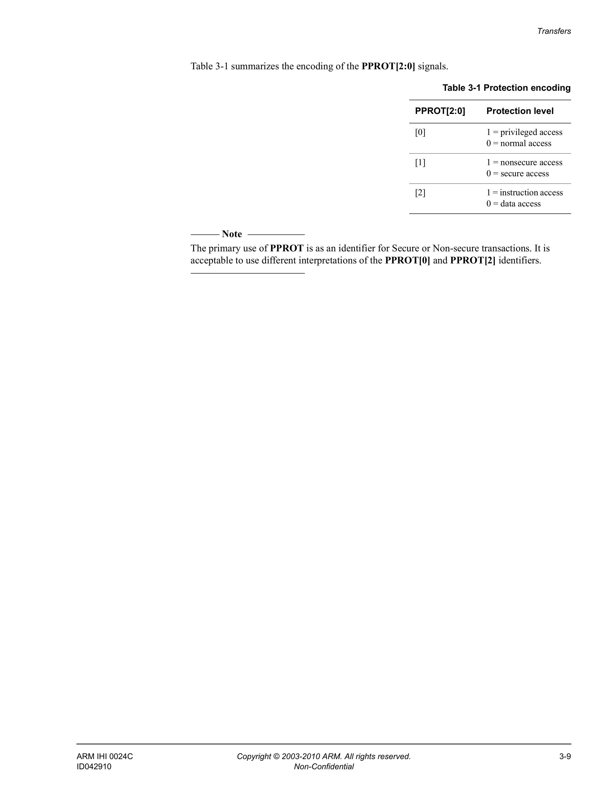

# Chapter 4 Operating States

This chapter describes the AMBA APB operating states. It contains the following section:

- *Operating states* on page 4-2.

## 4.1 Operating states

Figure 4-1 shows the operational activity of the APB.

The state machine operates through the following states:

**IDLE**  This is the default state of the APB.

**SETUP**  When a transfer is required the bus moves into the SETUP state, where the appropriate select signal, **PSELx**, is asserted. The bus only remains in the SETUP state for one clock cycle and always moves to the ACCESS state on the next rising edge of the clock.

**ACCESS**  The enable signal, **PENABLE**, is asserted in the ACCESS state. The address, write, select, and write data signals must remain stable during the transition from the SETUP to ACCESS state.

Exit from the ACCESS state is controlled by the **PREADY** signal from the slave:

- If **PREADY** is held LOW by the slave then the peripheral bus remains in the ACCESS state.
- If **PREADY** is driven HIGH by the slave then the ACCESS state is exited and the bus returns to the IDLE state if no more transfers are required. Alternatively, the bus moves directly to the SETUP state if another transfer follows.
