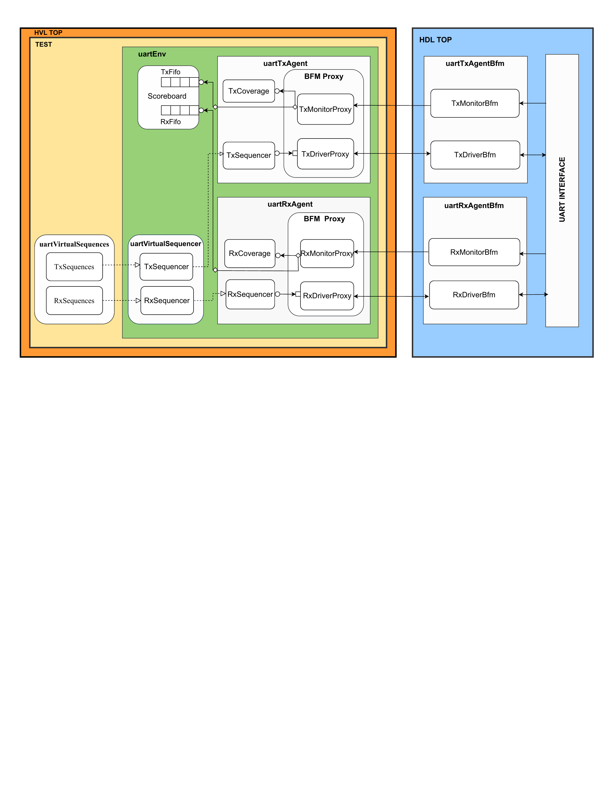

# UART verification environment architecture

This page is a block-diagram overview of the UART verification environment.

## Top-level partitioning

- **HLV TOP**
  - **TEST**
    - **uartEnv**
- **HDL TOP**

## TEST / uartEnv contents

### uartVirtualSequences

- **TxSequences**
- **RxSequences**

### uartVirtualSequencer

- **TxSequencer**
- **RxSequencer**

### Scoreboard

- **TxFifo**
- **RxFifo**

### uartTxAgent

- **TxCoverage**
- **TxSequencer**
- **BFM Proxy**
  - **TxMonitorProxy**
  - **TxDriverProxy**

### uartRxAgent

- **RxCoverage**
- **RxSequencer**
- **BFM Proxy**
  - **RxMonitorProxy**
  - **RxDriverProxy**

## HDL TOP contents

### uartTxAgentBfm

- **TxMonitorBfm**
- **TxDriverBfm**

### uartRxAgentBfm

- **RxMonitorBfm**
- **RxDriverBfm**

### Interface

- **UART INTERFACE**

## Connectivity shown in the figure

- Dashed arrows connect **uartVirtualSequences** to **uartVirtualSequencer**.
- The **TxSequencer** and **RxSequencer** inside **uartVirtualSequencer** connect into the respective agent proxies.
- The **TxMonitorProxy** connects to **TxMonitorBfm**.
- The **TxDriverProxy** connects to **TxDriverBfm**.
- The **RxMonitorProxy** connects to **RxMonitorBfm**.
- The **RxDriverProxy** connects to **RxDriverBfm**.
- The BFM blocks connect to the shared **UART INTERFACE**.
- The **Scoreboard** receives **TxFifo** and **RxFifo** inputs.
