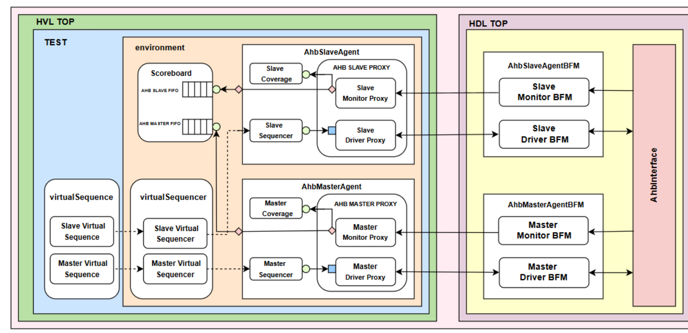

# Chapter 2 - Architecture

## 2.1 AHB AVIP Testbench Architecture

The Accelerated VIP (AVIP) for AHB is structured into two distinct top modules: `HVL TOP`
and `HDL TOP`, as depicted in Figure 2.1. This division separates the synthesizable and
unsynthesizable components of the testbench so the same environment works efficiently in both
simulation and emulation modes.

The `HDL TOP` contains the synthesizable components, including the interface plus clock and
reset generation. It houses the bus functional models (BFMs), with slave and master drivers and
monitors connected back to their proxy objects in the HVL domain so transaction-level methods
can remain non-blocking.

The `HVL TOP` contains the untimed, unsynthesizable parts of the environment. Master and slave
virtual sequences drive the virtual sequencer, which coordinates the agent proxies, BFMs, and
scoreboard. Data collected by the monitor BFMs is forwarded to the scoreboard for checking and
coverage collection.

Communication between the two modules is transaction-based, which allows the HDL and HVL
domains to exchange information-rich transactions rather than raw pin activity. Keeping clock
generation in the `HDL TOP` inside the emulator lets longer tests run at full emulator speed while
preserving a clean separation of concerns between synthesizable and untimed verification logic.
