# Chapter 3 - Implementation

## 3.1 Pin Interface

The AHB AVIP connects to external DUTs through the standard AHB control, address, data, and
response signals listed below.

| Signal Name | Source | Width | Description |
| --- | --- | --- | --- |
| `hclk` | Clock source | `1` | Bus clock; all transfer timing is referenced to its rising edge. |
| `hresetn` | Reset controller | `1` | Active-low reset for the system and bus. |
| `haddr` | Master | `ADDR_WIDTH` | Byte address for the transfer. The document recommends `ADDR_WIDTH` between 10 and 64. |
| `hburst` | Master | `HBURST_WIDTH` | Burst count and address-increment type. The document states that `HBURST_WIDTH` must be 0 or 3. |
| `hmastlock` | Master | `1` | Indicates a locked transfer sequence. |
| `hprot` | Master | `HPROT_WIDTH` | Protection-control information for the access. |
| `hsize` | Master | `3` | Transfer size. |
| `hnonsec` | Master | `1` | Indicates non-secure or secure access. |
| `hexcl` | Master | `1` | Indicates an exclusive-access sequence. |
| `hmaster` | Master | `HMASTER_WIDTH` | Master identifier, updated by the interconnect for unique identification during exclusive transfers. |
| `htrans` | Master | `2` | Transfer type: `IDLE`, `BUSY`, `NONSEQUENTIAL`, or `SEQUENTIAL`. |
| `hwdata` | Master | `DATA_WIDTH` | Write data from master to slave. The document recommends 32 to 256 bits. |
| `hwstrb` | Master | `DATA_WIDTH/8` | Byte-lane write strobes. |
| `hwrite` | Master | `1` | Transfer direction: high for write, low for read. |
| `hrdata` | Slave | `DATA_WIDTH` | Read data from slave to master. |
| `hreadyout` | Slave | `1` | Indicates that the slave-side transfer has completed. |
| `hresp` | Slave | `1` | Transfer response: `OKAY` or `ERROR`. |
| `hexokay` | Slave | `1` | Exclusive-transfer success/failure status. |
| `hselx` | Master | `1` | Selects the target slave for the current transfer. |
| `hready` | Mux/Slave | `1` | Indicates that the previous transfer completed and the next transfer may proceed. |

## 3.2 Testbench Components

### 3.2.1 AHB HDL Top

The HDL top is synthesizable. It generates clock and reset and instantiates the AHB interface,
the master-agent BFM handle, and the slave-agent BFM handle.

*Figure 3.1: HDL Top*

### 3.2.2 AHB Interface

The AHB interface imports the global packages, passes `hclk` and `hresetn`, and declares the
main bus signals as `logic`, including `haddr`, `hselx`, `hburst`, `hmastlock`, `hprot`,
`hsize`, `hnonsec`, `hexcl`, `hmaster`, `htrans`, `hwdata`, `hwstrb`, `hwrite`, `hrdata`,
`hreadyout`, `hresp`, `hexokay`, and `hready`.

### 3.2.3 AHB Master Agent BFM Module

The master-agent BFM module instantiates:

1. The AHB master driver BFM
2. The AHB master monitor BFM

It also binds the AHB master assertions to the master monitor BFM and maps the AHB interface
signals into the driver and monitor BFMs.

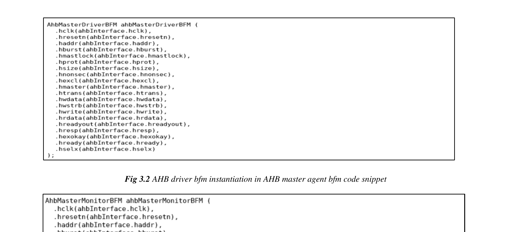

*Figure 3.2: AHB driver bfm instantiation in AHB master agent bfm code snippet*

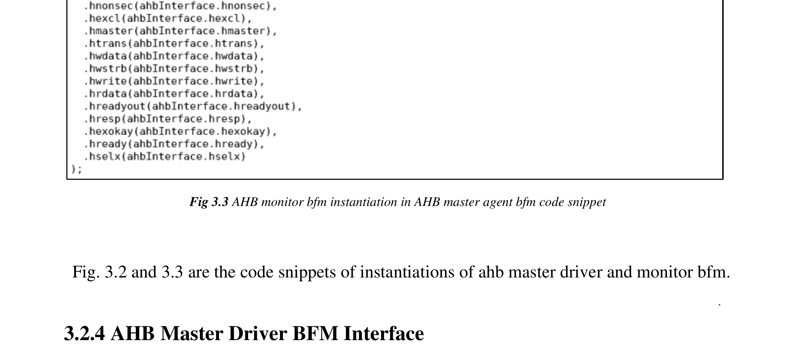

*Figure 3.3: AHB monitor bfm instantiation in AHB master agent bfm code snippet*

### 3.2.4 AHB Master Driver BFM Interface

The AHB master driver BFM receives signals from the AHB interface. Its `driveToBFM()`
method is called by the master driver proxy and drives `haddr`, `hwdata`, `hwrite`, `hsize`,
`hburst`, `htrans`, and the related control signals onto the bus.

### 3.2.5 AHB Master Monitor BFM Interface

The AHB master monitor BFM samples `haddr`, `hwrite`, `hsize`, `hburst`, `htrans`,
`hmastlock`, `hready`, `hresp`, `hprot`, `hselx`, `hwstrb`, `hwdata`, and `hrdata` through its
`sampleData()` task and returns the sampled data to the master monitor proxy.

### 3.2.6 AHB Slave Agent BFM Module

The slave-agent BFM module instantiates:

1. The AHB slave driver BFM
2. The AHB slave monitor BFM

It binds the AHB slave assertions to the slave monitor BFM and maps the AHB interface signals
into the slave driver and monitor BFMs.

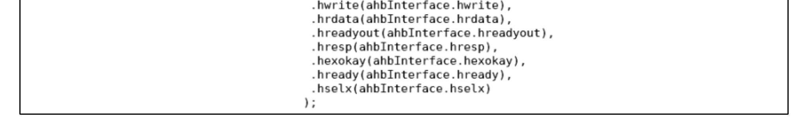

*Figure 3.4: AHB slave driver bfm instantiation in AHB slave agent bfm code snippet*

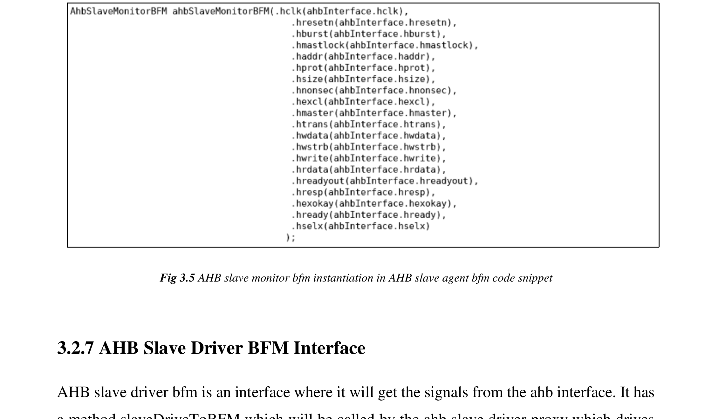

*Figure 3.5: AHB slave monitor bfm instantiation in AHB slave agent bfm code snippet*

### 3.2.7 AHB Slave Driver BFM Interface

The AHB slave driver BFM receives AHB-interface signals and uses `slaveDriveToBFM()` to
drive the slave-side response signals, including `hready` and `hresp`.

### 3.2.8 AHB Slave Monitor BFM Interface

The AHB slave monitor BFM samples `hselx`, `haddr`, `hburst`, `hwrite`, `hsize`, `htrans`,
`hnonsec`, `hprot`, `hresp`, `hreadyout`, `hwdata`, `hrdata`, and `hwstrb` through
`slaveSampleData()`, then forwards the sampled information to the slave monitor proxy.

### 3.2.9 AHB HVL Top

The HVL top hosts the untimed UVM testbench logic and starts the top-level test through
`run_test("test_name")`.

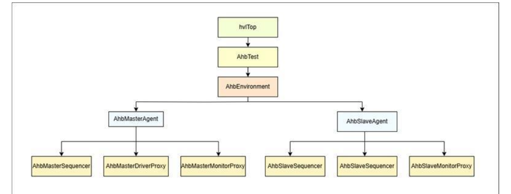

*Figure 3.6: HVL Top*

### 3.2.10 AHB Environment

The environment contains:

- `AhbScoreboard`
- `AhbVirtualSequencer`
- `AhbMasterAgent`
- `AhbSlaveAgent`

Its build phase allocates these components, and its connect phase wires the master and slave
monitor proxies into the scoreboard using analysis ports and analysis FIFOs.

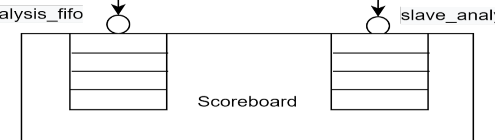

*Figure 3.7: Connection of the analysis ports of the monitor to the scoreboard analysis fifo*

### 3.2.11 AHB Scoreboard

The scoreboard extends `uvm_scoreboard` and is responsible for:

1. Comparing `HWDATA`, `HADDR`, `HWRITE`, and `HRDATA` observed on the slave and master sides
2. Tracking pass/fail counts
3. Reporting the comparison result at the end of simulation

It uses analysis FIFOs to collect packets from the monitor proxies.

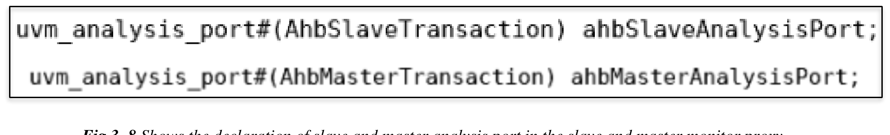

*Figure 3.8: Declaration of slave and master analysis port in the slave and master monitor proxy*

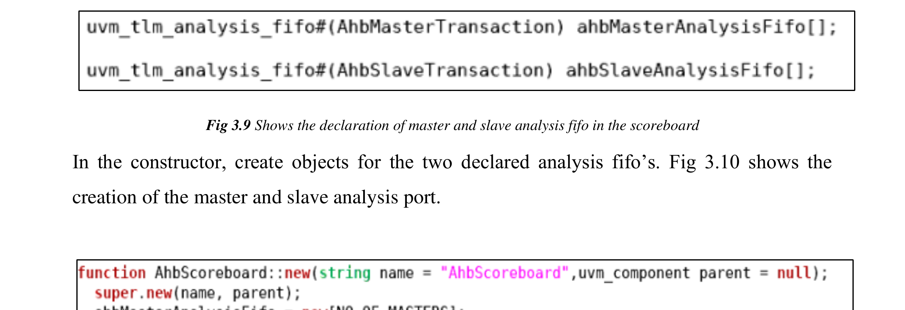

*Figure 3.9: Declaration of master and slave analysis fifo in the scoreboard*

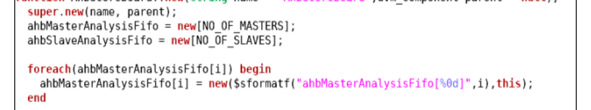

*Figure 3.10: Creation of the master and slave analysis port*

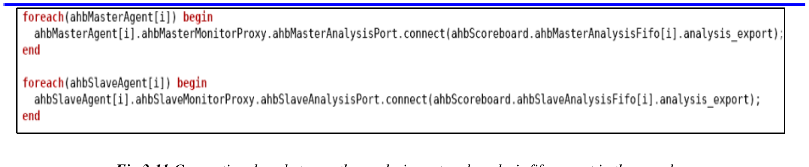

*Figure 3.11: Connection done between the analysis port and analysis fifo export in the env class*

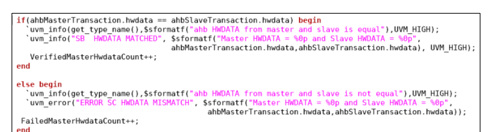

*Figure 3.12: Use of get method to get the packet from monitor analysis port*

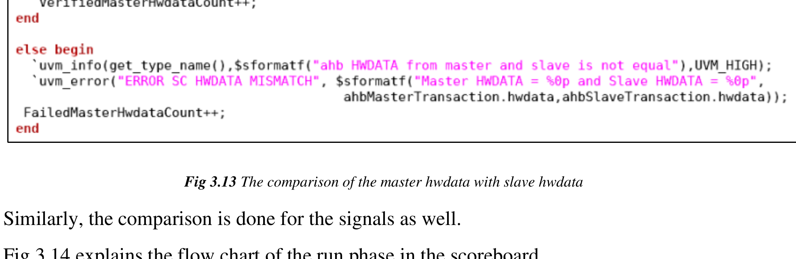

*Figure 3.13: The comparison of the master hwdata with slave hwdata*

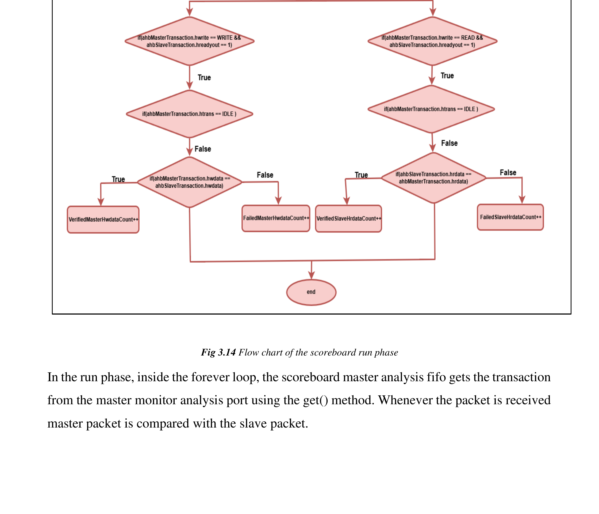

*Figure 3.14: Flow chart of the scoreboard run phase*

*Figure 3.15: Flow chart of the scoreboard report phase*

### 3.2.12 AHB Virtual Sequencer

The virtual sequencer coordinates stimulus between the AHB master and AHB slave sequencers.
It declares both handles and initializes them during `build_phase`.

### 3.2.13 AHB Master Agent

The AHB master agent extends `uvm_agent`. Based on `AhbMasterAgentConfig`, it creates the
master sequencer, driver proxy, monitor proxy, and optional coverage collector. When the agent
is active, the connect phase links the driver proxy and sequencer through TLM ports and
connects the monitor proxy to coverage collection.

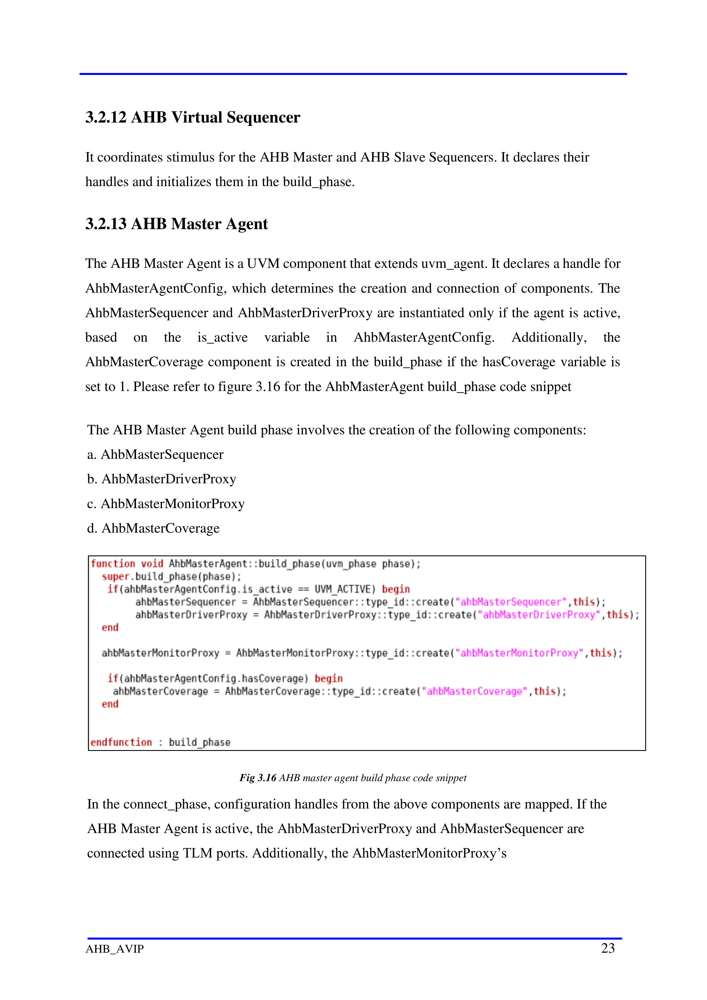

*Figure 3.16: AHB master agent build phase code snippet*

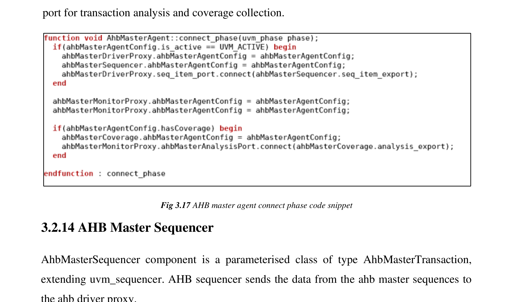

*Figure 3.17: AHB master agent connect phase code snippet*

### 3.2.14 AHB Master Sequencer

`AhbMasterSequencer` is a parameterized `uvm_sequencer` over `AhbMasterTransaction`. It
forwards sequence items generated by the master sequences to the master driver proxy.

### 3.2.15 AHB Master Driver Proxy

The master driver proxy extends `uvm_driver`, receives `AhbMasterTransaction` items through
`get_next_item()`, converts transactions and configuration objects into struct forms, and calls
`driveToBFM()` in the master driver BFM.

*Figure 3.18: Flowchart of communication between ahb master driver proxy and ahb master driver bfm*

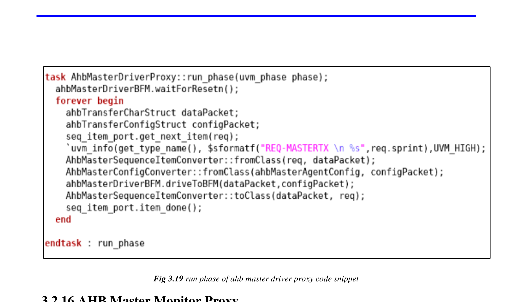

*Figure 3.19: run phase of ahb master driver proxy code snippet*

### 3.2.16 AHB Master Monitor Proxy

The master monitor proxy extends `uvm_monitor`. It samples `hwdata` and `hrdata` according to
the configuration, creates `ahbMasterAnalysisPort`, and publishes sampled data to downstream
components.

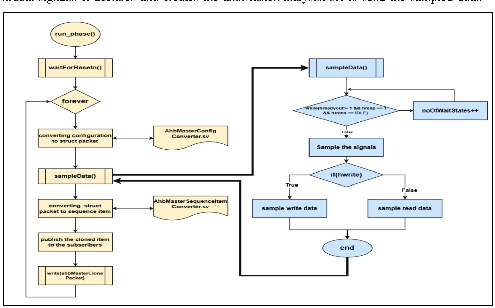

*Figure 3.20: Flowchart of ahb master monitor proxy and ahb master monitor bfm communication*

### 3.2.17 AHB Slave Agent

The AHB slave agent extends `uvm_agent`. Based on `AhbSlaveAgentConfig`, it creates the slave
sequencer, driver proxy, monitor proxy, and optional coverage collector. The connect phase wires
the driver proxy, sequencer, and coverage analysis exports together.

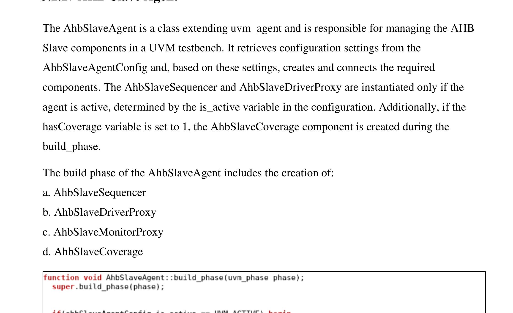

*Figure 3.21: AHB slave agent build phase code snippet*

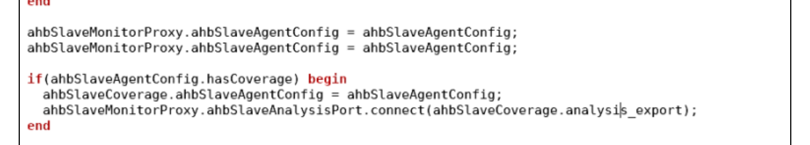

*Figure 3.22: AHB slave agent connect phase code snippet*

### 3.2.18 AHB Slave Sequencer

`AhbSlaveSequencer` is a parameterized `uvm_sequencer` over `AhbSlaveTransaction`. It passes
slave sequence items into the slave driver proxy.

### 3.2.19 AHB Slave Driver Proxy

The slave driver proxy extends `uvm_driver`. It obtains `AhbSlaveTransaction` items,
converts both transaction and configuration objects to struct forms, and passes them to
`slaveDriveToBFM()` in the slave driver BFM.

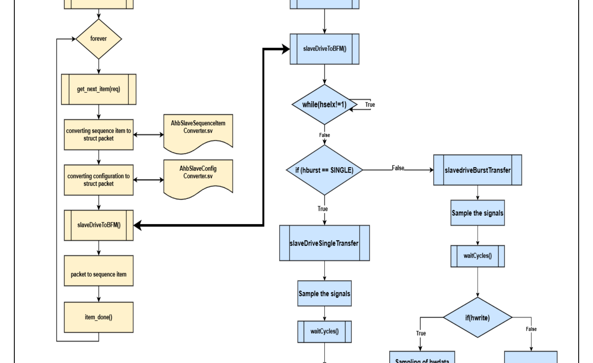

*Figure 3.23: Flowchart of ahb slave driver bfm and slave driver proxy communication*

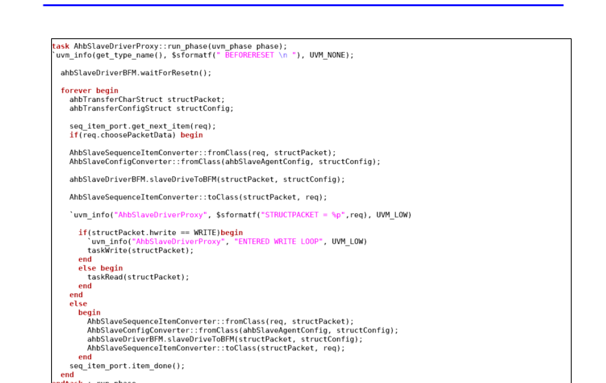

*Figure 3.24: AHB slave driver proxy run phase code snippet*

### 3.2.20 AHB Slave Monitor Proxy

The slave monitor proxy extends `uvm_monitor`, samples the key slave-side bus signals, converts
the sampled data with `AhbSlaveSequenceItemConverter`, and forwards the result through
`ahbSlaveAnalysisPort`.

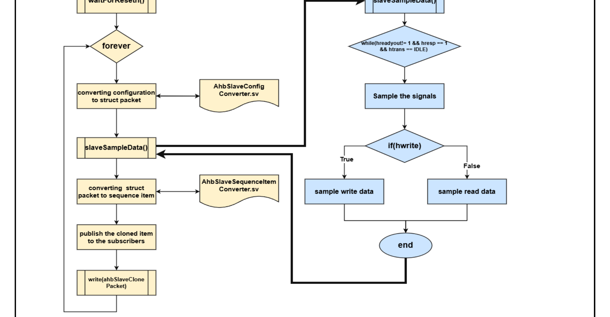

*Figure 3.25: Flowchart of ahb slave monitor bfm and slave monitor proxy communication*

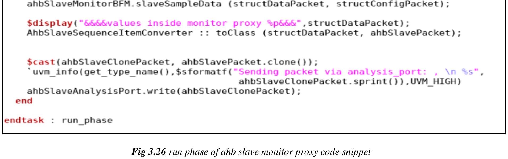

*Figure 3.26: run phase of ahb slave monitor proxy code snippet*

### 3.2.21 UVM Verbosity

The document summarizes the predefined UVM verbosity settings and notes that messages at
`UVM_MEDIUM` and below are printed by default.

| Verbosity | Default Value |
| --- | --- |
| `UVM_NONE` | `0` (highest priority) |
| `UVM_LOW` | `100` |
| `UVM_MEDIUM` | `200` |
| `UVM_HIGH` | `300` |
| `UVM_FULL` | `400` |
| `UVM_DEBUG` | `500` (lowest priority) |

| Verbosity | Description |
| --- | --- |
| `UVM_NONE` | Bare minimum regression reporting with only vital messages. |
| `UVM_LOW` | Reduced verbosity with only important messages. |
| `UVM_MEDIUM` | Default level; used for normal informational messages and prints by default. |
| `UVM_HIGH` | Higher verbosity that shows both failing and passing transaction information without full phase chatter. |
| `UVM_FULL` | Includes phase-status information as well as passing and failing transaction information. |
