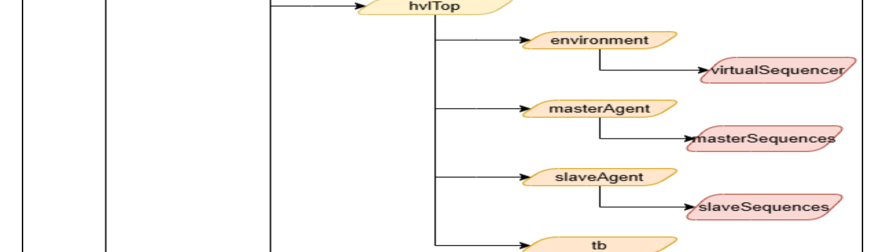

# Chapter 4 - Directory Structure

## 4.1 Package Content

*Figure 4.1: Package Structure of AHB_AVIP*

The package structure diagram shows where the main documentation, source, testbench, and
simulation collateral live inside the `ahb_avip` package.

| Directory | Description |
| --- | --- |
| `ahb_avip/doc` | Testbench architecture, component descriptions, verification plan, and assertion plan documentation. |
| `ahb_avip/sim` | Simulation collateral, including tool scripts and `ahb_compile.f`. |
| `ahb_avip/src/globals` | Global package parameters, names, and mode definitions. |
| `ahb_avip/src/hvlTop` | Top-level HVL testbench component folders, including environment, master agent, slave agent, and testbench code. |
| `ahb_avip/src/hdlTop` | HDL-facing BFM files and the AHB interface. |
| `ahb_avip/src/hdlTop/masterAgentBFM` | Master agent driver and monitor BFMs, along with master coverproperty and assertion files. |
| `ahb_avip/src/hdlTop/slaveAgentBFM` | Slave agent driver and monitor BFMs, along with slave coverproperty and assertion files. |
| `ahb_avip/src/hdlTop/ahbInterface` | The AHB interface definition. |
| `ahb_avip/src/hvlTop/tb` | Testbench files for assertions and coverproperties, `ahbAssertion.f`, test files, test lists, and virtual sequences. |
| `ahb_avip/src/hvlTop/tb/test` | Individual test files. |
| `ahb_avip/src/hvlTop/tb/testList` | Regression test lists. |
| `ahb_avip/src/hvlTop/tb/virtualSequences` | Virtual-sequence test files. |
| `ahb_avip/src/hvlTop/environment` | Environment package, configuration objects, scoreboard, and virtual-sequencer support. |
| `ahb_avip/src/hvlTop/environment/virtualSequencer` | Master and slave virtual sequencers plus the base virtual sequencer. |
| `src/hvlTop/masterAgent` | Master agent sources: config, converter, coverage, driver proxy, monitor proxy, package, sequencer, transactions, and master sequences. |
| `src/hvlTop/masterAgent/masterSequences` | Master-side test sequences. |
| `src/hvlTop/slaveAgent` | Slave agent sources: config, converter, coverage, driver proxy, monitor proxy, package, sequencer, transactions, and slave sequences. |
| `src/hvlTop/slaveAgent/slaveSequences` | Slave-side test sequences. |
