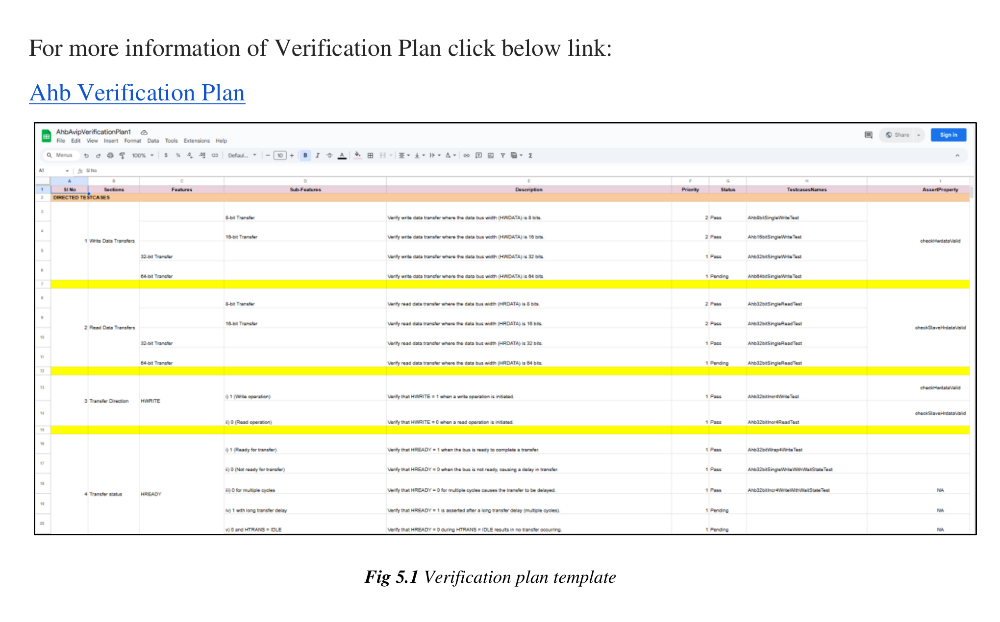

# Chapter 6 - Verification Plan
<!-- page 42 -->

Chapter 6
                                   Verification Plan
6.1 Verification plan
Verification plan is an important step in Verification flow, it defines the plan of an entire project
and verifies the different scenarios to achieve the test plan.
A Verification plan defines what needs to be verified in Design under test(DUT) and then drives
the verification strategy. As an example, the verification plan may define the features that a
system has and these may get translated into the coverage metrics that are set.
6.2 Template of Verification Plan
For more information of Verification Plan click below link:
Ahb Verification Plan
                                    Fig 5.1 Verification plan template
AHB_AVIP                                                                                         41
<!-- page 43 -->
6.3 Sections for different test Scenarios
6.3.1 Directed test
These directed tests provide explicit stimulus to the design inputs, run the design in simulation,
and check the behavior of the design against expected results.
This test describes the different transactions and burst transfers.
Table 9: Checking coverage closure for the different transactions and burst transfers
 Sl. no                        Test names                    Description
       1                     AhbWriteTest                    Verifies AHB write operation for burst types WRAP4,
                                                             INCR4, WRAP8, INCR8, WRAP16, INCR16
       2                      AhbReadTest                    Verifies AHB read operation for burst types WRAP4,
                                                             INCR4, WRAP8, INCR8, WRAP16, INCR16
       3                  AhbSingleWriteTest                 Verifies AHB write operation for SINGLE burst transfer
       4                  AhbSingleReadTest                  Verifies AHB read operation for SINGLE burst transfer
       5                AhbWriteWithBusyTest                 Verifies AHB write operation with BUSY transaction
       6                AhbReadWithBusyTest                  Verifies AHB read operation with BUSY transaction
       7         AhbSingleWriteWithWaitStateTest             Verifies AHB write operation with wait state for Single
                                                             Transfer
       8           AhbSingleReadWithWaitStateTest            Verifies AHB read operation with wait state for Single
                                                             Transfer
       9            AhbWriteWithWaitStateTest                Verifies AHB write operation with wait state
      10             AhbReadWithWaitStateTest                Verifies AHB read operation with wait state
AHB_AVIP                                                                                                          42
