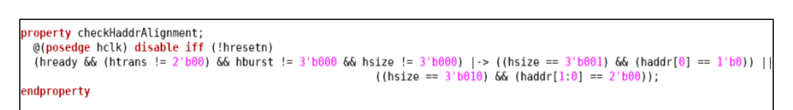
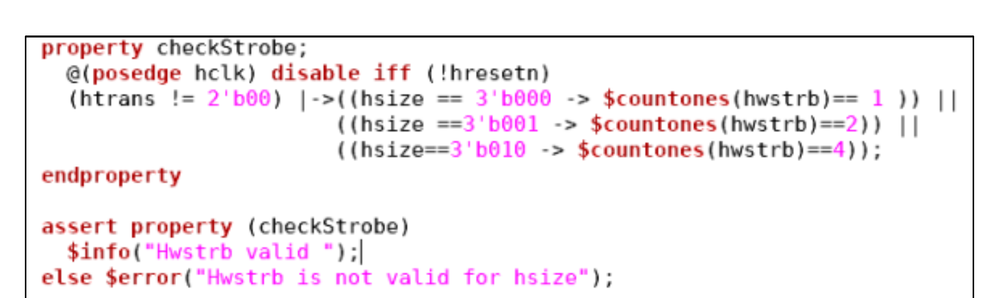
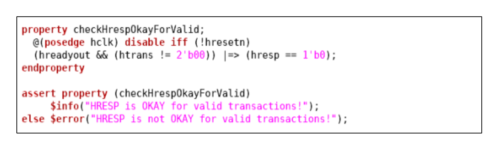
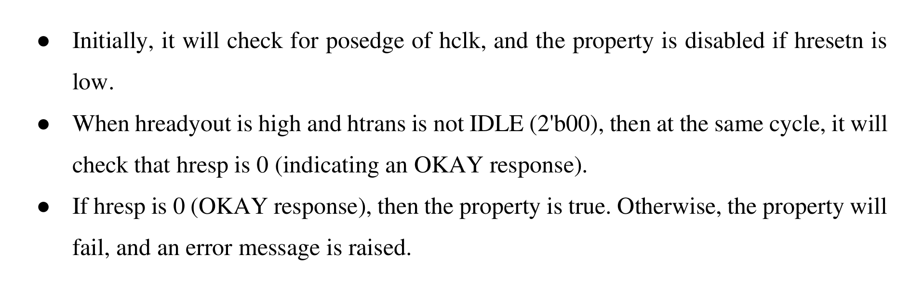

# Chapter 7 - Assertion Plan
<!-- page 44 -->
Chapter 7
                                   Assertion Plan
7.1 Assertion Plan overview
Assertion plan is an important step in verification flow, which validates the behaviour of
design at every instance.
7.1.1 What are Assertions?
   ● An assertion specifies the behavior of the system.
   ● It is a piece of verification code that monitors a design implementation for compliance
       with the specifications.
   ● It is a directive to a verification tool to prove, assume, or count a given property using
       formal methods.
   ● Helps in detecting functional bugs early in the design cycle.
   ● Can be used in simulation, formal verification, and emulation environments.
7.1.2 Why Do We Use Assertions?
   ● Assertions are primarily used to validate the behavior of a design.
   ● They help in detecting functional bugs early and locating their source faster.
   ● Assertions provide functional coverage to ensure all scenarios are exercised.
   ● They flag invalid input stimulus that does not conform to assumed requirements.
   ● Enable formal verification by proving or checking properties automatically.
7.1.3 Benefits of Assertions
   ● Improves observability of the design.
   ● Improves debugging of the design.
   ● Improves documentation of the design.
AHB_AVIP                                                                                   43
<!-- page 45 -->

7.2 Template of Assertion Plan
The Assertion Plan template is provided in an Excel sheet. Please refer to the link below.
AHB Assertion Plan
7.3 Master Assertion Condition
7.3.1 checkHaddrAlignment
                                Fig 7.1 checkHaddrAlignment Assertion
The checkHaddrAlignment property is evaluated as follows:
   ● Initially, it will check for posedge of hclk, and the property is disabled if hresetn is
       low.
   ● When hready is high, htrans is not IDLE (2'b00), hburst is not SINGLE (3'b000), and
       hsize is not BYTE (3'b000), then at the same cycle, it will check the alignment of
       HADDR based on HSIZE:
         o If hsize is HALFWORD (3'b001), then haddr[0] should be 0.
         o If hsize is WORD (3'b010), then haddr[1:0] should be 00.
   ● If the above alignment conditions hold, then the property is true. Otherwise, the
       property will fail, and an error message is raised.
AHB_AVIP                                                                                     44
<!-- page 46 -->

7.3.2 checkStrobe
                                    Fig 7.2 checkStrobe Assertion
The checkStrobe property is evaluated as follows:
   ● Initially, it will check for posedge of hclk, and the property is disabled if hresetn is
       low.
   ● When htrans is not IDLE (2'b00), then at the same cycle, it will check the validity of
       hwstrb based on hsize:
           o If hsize is BYTE (3'b000), then hwstrb should have exactly 1 bit set (1'b1
              count = 1).
           o If hsize is HALFWORD (3'b001), then hwstrb should have exactly 2 bits set
              (1'b1 count = 2).
           o If hsize is WORD (3'b010), then hwstrb should have exactly 4 bits set (1'b1
              count = 4).
   ● If the above strobe conditions hold, then the property is true. Otherwise, the property
       will fail, and an error message is raised.
AHB_AVIP                                                                                   45
<!-- page 47 -->

7.4 Slave Assertion Condition
7.4.1 checkHrespOKayForValid
                              Fig 7.3 checkHrespOKayForValid Assertion
The checkHrespOKayForValid property is evaluated as follows:
   ● Initially, it will check for posedge of hclk, and the property is disabled if hresetn is
       low.
   ● When hreadyout is high and htrans is not IDLE (2'b00), then at the same cycle, it will
       check that hresp is 0 (indicating an OKAY response).
   ● If hresp is 0 (OKAY response), then the property is true. Otherwise, the property will
       fail, and an error message is raised.
7.4.1 checkSlaveHrdataValid
                                Fig 7.4 checkSlaveHrdataValid Assertion
The checkSlaveHrdataValid property is evaluated as follows:
   ● Initially, it will check for posedge of hclk, and the property is disabled if hresetn is
       low.
AHB_AVIP                                                                                   46
<!-- page 48 -->
  ● When hwrite is low (indicating a read transfer), hreadyout is high, htrans is not IDLE
     (2'b00) and hselx is 1 then at next clock cycle, check whether hreadyout is stable if
     true check whether is unknown.
  ● If hrdata is valid (not unknown), then the property is true, Otherwise, the property
     will fail, and an error message is raised.
AHB_AVIP                                                                                47
