# Chapter 8 - Coverage Plan

## 8.1 Template of Coverage Plan

The document says the formal coverage-plan template is maintained in an Excel sheet and is
referenced as `AHB Coverage Plan`.

## 8.2 Functional Coverage

Functional coverage captures user-defined coverage models and assertions during simulation. It
is used to identify which DUT features have been exercised and which remain unverified. The
document highlights that functional coverage is preferred when the team wants manual control
over bins rather than relying only on automatically generated code-coverage buckets.

## 8.3 `uvm_subscriber`

`uvm_subscriber` provides an analysis export that receives transactions from a connected
analysis port. Subclasses implement `write()` to process incoming transactions, which makes the
class a natural fit for coverage collectors attached to monitors.

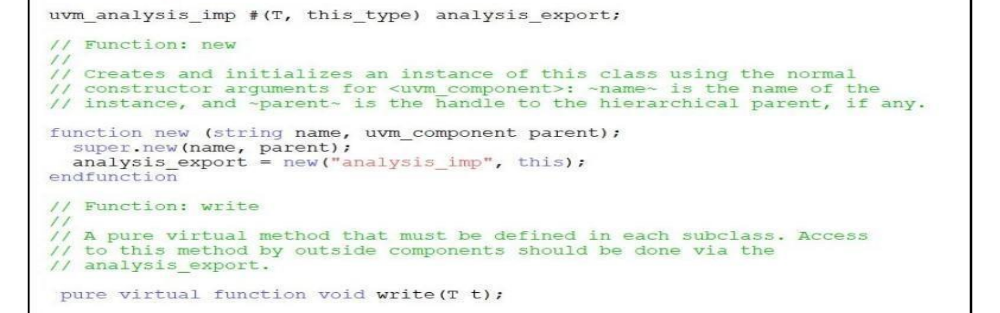

*Figure 8.1: uvm_subscriber*

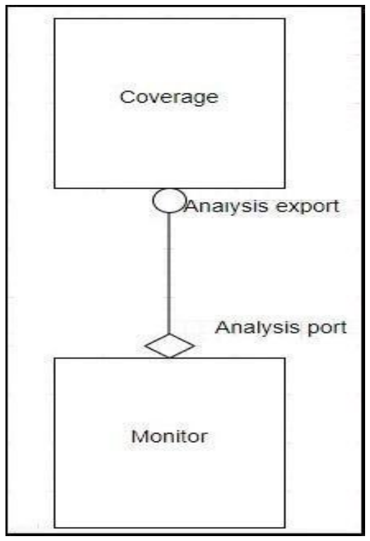

*Figure 8.2: Monitor and coverage connection*

### 8.3.1 Analysis Export

The analysis export exposes the `write()` method that derived subscribers must implement.

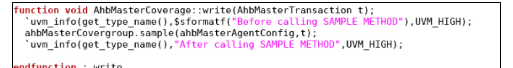

*Figure 8.3: Write function*

### 8.3.2 Write Function

The `write()` function processes incoming transactions and performs the sampling needed by the
coverage model.

## 8.4 Covergroup

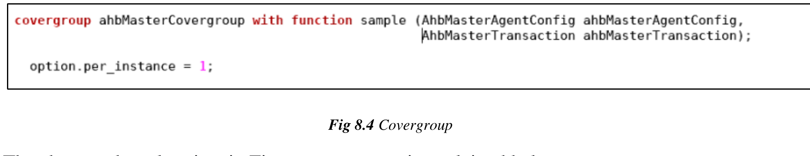

*Figure 8.4: Covergroup*

The covergroup examples in this chapter call out several configuration features:

1. `with function sample` is used to pass variables into the covergroup.
2. Parameter values determine how the coverpoints are generated.
3. `option.per_instance` preserves per-instance coverage data instead of merging everything.
4. `option.comment` helps annotate the coverage report for easier analysis.

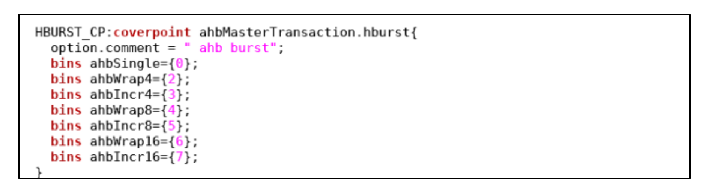

*Figure 8.5: option.comment*

## 8.5 Bucket

The bucket example shows how one bin can represent multiple values.

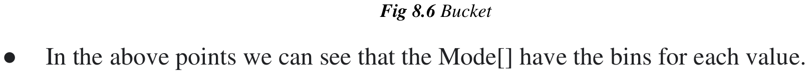

*Figure 8.6: Bucket*

## 8.6 Coverpoints

The example coverpoints create bins for write and read operations.

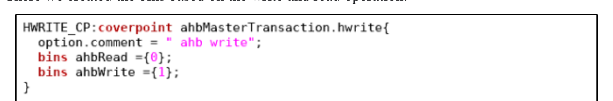

*Figure 8.7: Coverpoint*

## 8.7 Cross Coverpoints

Cross coverage tracks information observed simultaneously on more than one coverpoint. The
example crosses `HSIZE_CP` with `HBURST_CP`.

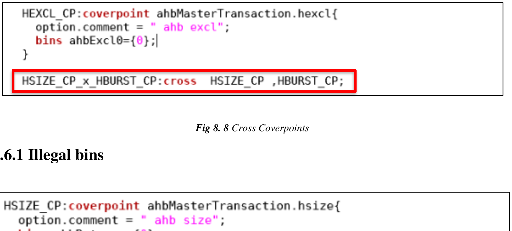

*Figure 8.8: Cross Coverpoints*

### 8.7.1 Illegal Bins

Illegal bins are used to declare values that should never occur. The example explicitly marks
selected `hsize` values as illegal.

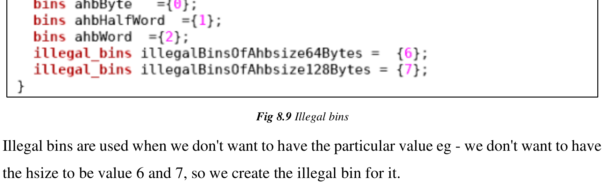

*Figure 8.9: Illegal bins*

## 8.8 Creation of the Covergroup

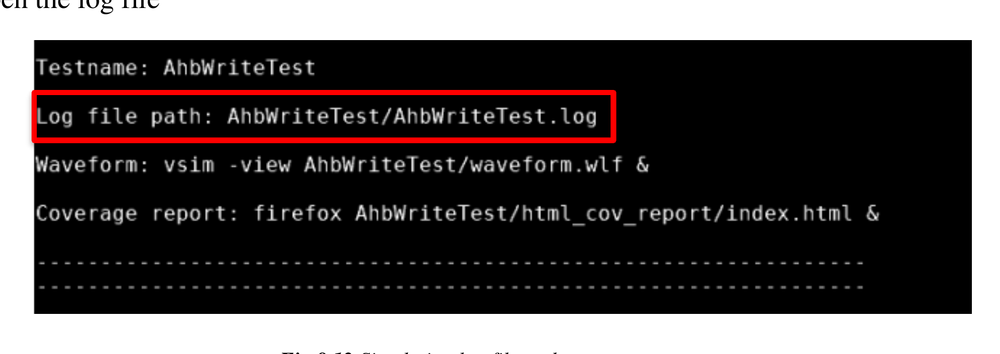

*Figure 8.10: Creation of covergroup*

The covergroup is created in the constructor using `new`.

## 8.9 Sampling of the Covergroup

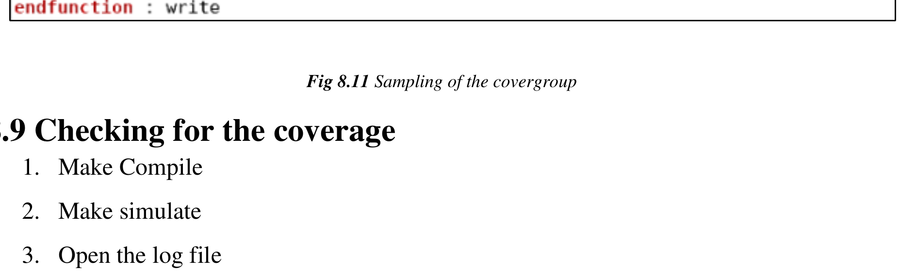

*Figure 8.11: Sampling of the covergroup*

Sampling occurs from the `write()` function when transactions arrive.

## 8.10 Checking for the Coverage

The chapter describes a simple workflow for checking coverage:

1. Compile
2. Simulate
3. Open the log file
4. Search the log for the aggregate coverage summary
5. Open the coverage report to inspect individual bins

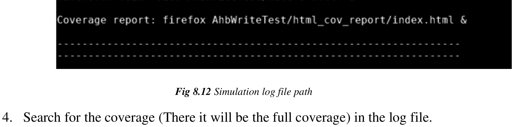

*Figure 8.12: Simulation log file path*

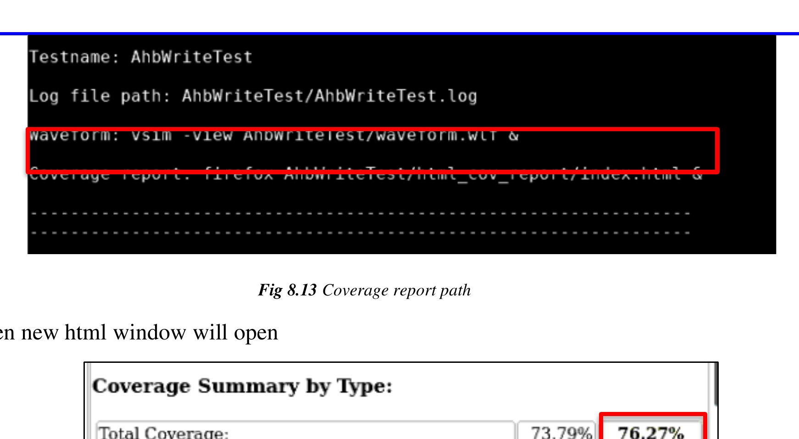

*Figure 8.13: Coverage report path*

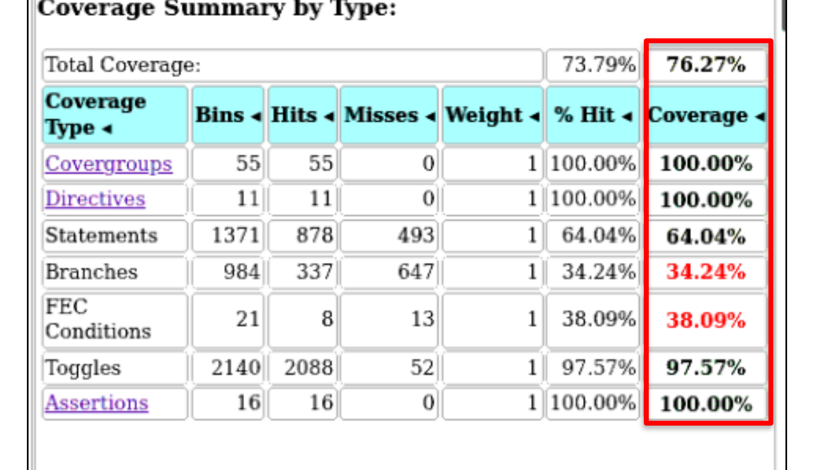

*Figure 8.14: HTML window showing all coverage*

The HTML report shows per-instance covergroups and the individual coverpoints and bins inside
each instance.

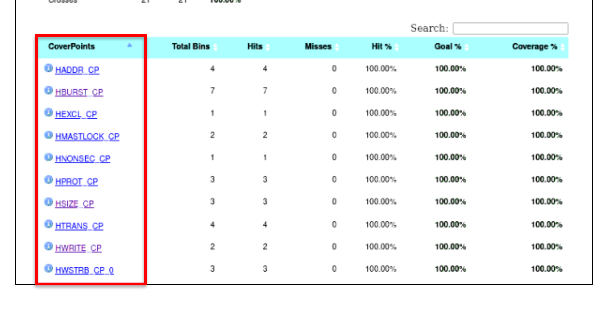

*Figure 8.15: All coverpoints present in the Master Covergroup*

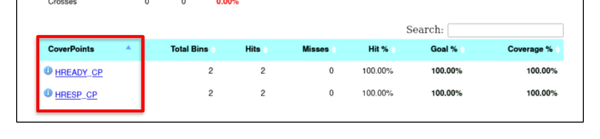

*Figure 8.16: All coverpoints present in the Slave Covergroup*

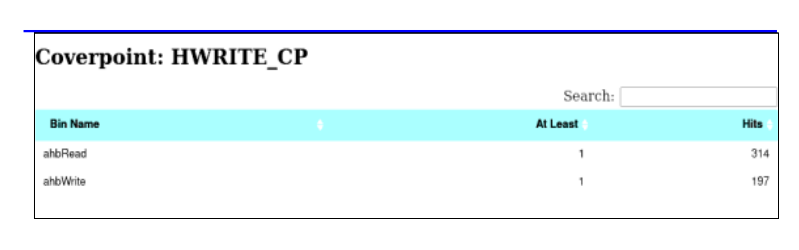

*Figure 8.17: Individual Coverpoint Hit*
