# Chapter 9 - Test Cases

## 9.1 Test Flow

The testbench starts from the UVM test, launches a virtual sequence, and then starts the master
and slave sequences that create and send `sequence_item` transactions.

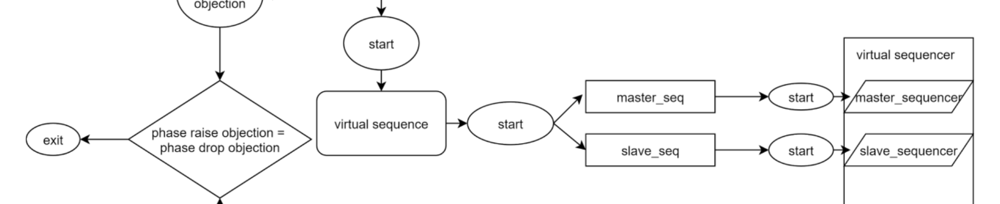

*Figure 9.1: Test flow*

## 9.2 AHB Test Cases FlowChart

The flowchart below shows the relationship between the test, virtual sequence, master/slave
sequences, and phase-raise/phase-drop objection handling.

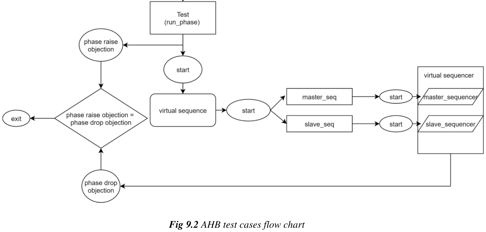

*Figure 9.2: AHB test cases flow chart*

## 9.3 Transaction

| Variable | Type | Description |
| --- | --- | --- |
| `haddr` | `bit` | AHB address bus. The document describes it as up to 32 bits wide. |
| `hselx` | `bit` | Slave-select signal asserted by the master. |
| `hburst` | `enum` | Burst type, indicating a single transfer or a burst sequence. |
| `hmastlock` | `bit` | Locked-transfer indicator. |
| `hprot` | `enum` | Protection type for the transaction. |
| `hsize` | `enum` | Transfer size, such as byte, halfword, or word. |
| `hnonsec` | `bit` | Security attribute for secure or non-secure transfers. |
| `hmaster` | `bit` | Identifies the active master in a multi-master system. |
| `htrans` | `enum` | Transfer type: busy, idle, sequential, or non-sequential. |
| `hwdata` | `bit` | Write data bus from master to slave. |
| `hwstrb` | `bit` | Write strobes identifying valid byte lanes in `hwdata`. |
| `hwrite` | `enum` | Read/write direction indicator. |
| `hrdata` | `bit` | Read data bus from slave to master. |
| `hreadyout` | `bit` | Slave-ready indication for the current transfer. |
| `hresp` | `enum` | Transfer response status. |
| `hexokay` | `bit` | Exclusive-access success indication. |
| `hready` | `bit` | Final ready signal for transfer completion. |
| `noOfWaitStatesDetected` | `int` | Number of wait states inserted before transfer completion. |
| `busyControl` | `bit` | Indicates whether the master is in a `BUSY` state. |

### 9.3.1 `AhbMasterTransaction`

`AhbMasterTransaction` extends `uvm_sequence_item` and holds the data required to drive
master-side stimulus. It declares the core AHB transaction variables and constrains slave select,
data transfer size, and burst behavior.

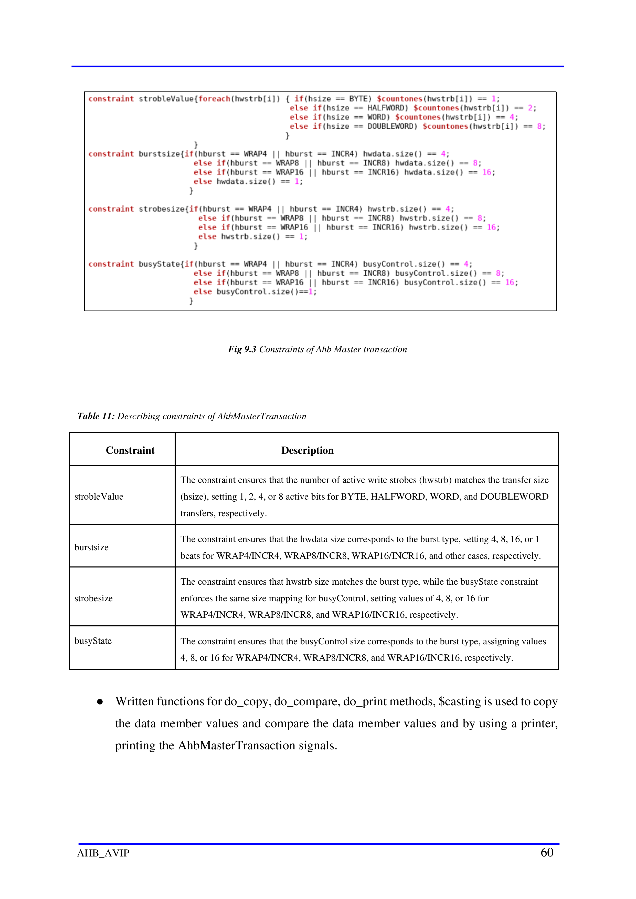

*Figure 9.3: Constraints of Ahb Master transaction*

| Constraint | Description |
| --- | --- |
| `strobleValue` | Ensures the number of active `hwstrb` bits matches `hsize`, using 1, 2, 4, or 8 active bits for byte, halfword, word, and doubleword transfers. |
| `burstsize` | Sets the data size according to burst type, including `WRAP4/INCR4`, `WRAP8/INCR8`, and `WRAP16/INCR16`. |
| `strobesize` | Aligns `hwstrb` size with burst type. |
| `busyState` | Aligns `busyControl` with the selected burst type. |

The class also implements `do_copy`, `do_compare`, and `do_print`.

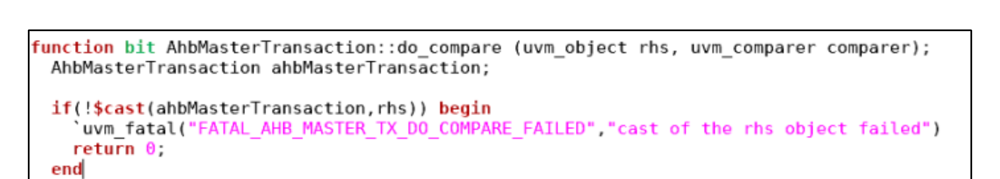

*Figure 9.4: do_compare method of Master Transaction*

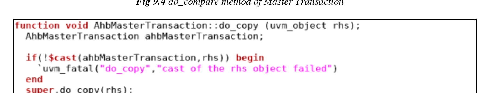

*Figure 9.5: do_copy method of Master Transaction*

### 9.3.2 `AhbSlaveTransaction`

`AhbSlaveTransaction` also extends `uvm_sequence_item` and carries the data required to drive
slave-side stimulus. It mirrors the transaction fields used by the master-side transaction object.

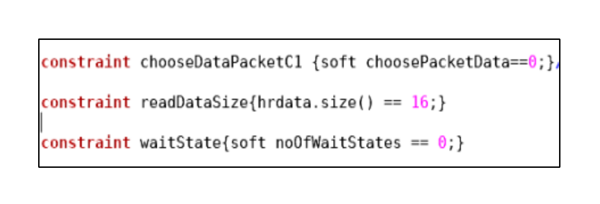

*Figure 9.6: Constraints of Ahb Slave transaction*

| Constraint | Description |
| --- | --- |
| `chooseDataPacketC1` | Softly assigns `choosePacketData` to `0` by default. |
| `readDataSize` | Constrains the `hrdata` array to a fixed size of 16 elements. |
| `waitState` | Softly constrains `noOfWaitStates` to `0` by default. |

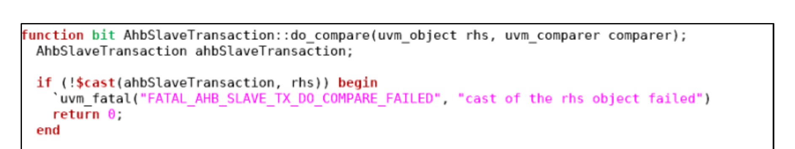

*Figure 9.7: do_compare method of Slave Transaction*

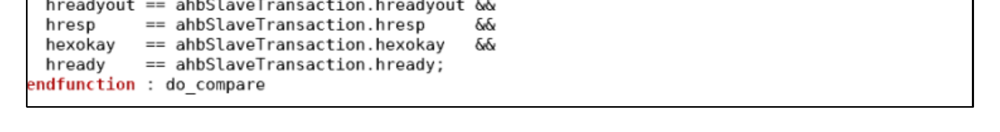

*Figure 9.8: do_copy method of Slave Transaction*

## 9.4 Sequences

A UVM sequence is an object that generates stimulus. It creates a series of sequence items and
sends them to the driver through the sequencer.

### 9.4.1 Methods

| Method | Description |
| --- | --- |
| `new` | Creates and initializes a new sequence object. |
| `start_item` | Sends the request item to the sequencer so it can be forwarded to the driver. |
| `req.randomize()` | Generates the transaction item. |
| `finish_item` | Waits for acknowledgement or response. |

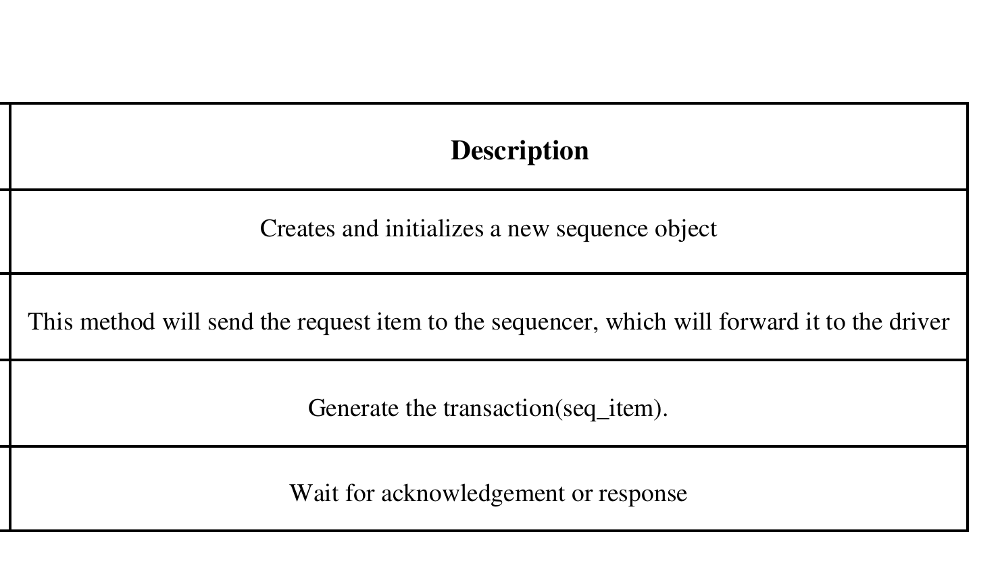

*Figure 9.9: Flow chart for sequence methods*

### 9.4.2 Master and Slave Sequences

The document groups the master and slave sequences as follows:

| Section | Master Sequences | Slave Sequences | Description |
| --- | --- | --- | --- |
| `BaseSequence` | `AhbMasterBaseSequence` | `AhbSlaveBaseSequence` | Base class extending `uvm_sequence` and parameterized with the transaction type. |
| `Data transfers` | `AhbMasterSequence` | `AhbSlaveSequence` | Derived sequence that randomizes the request item with inline constraints between `start_item` and `finish_item`. |

In the master sequence body, `req` is created, `start_item(req)` begins the sequence, the
transaction is randomized with inline constraints, and `finish_item(req)` completes it.

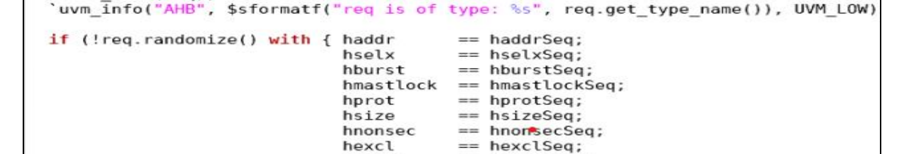

*Figure 9.10: Master sequence body method*

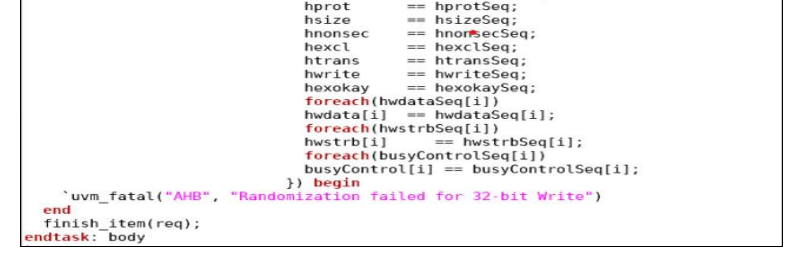

*Figure 9.11: Constraints Of Master Sequence*

The slave sequence follows the same flow for slave-side stimulus.

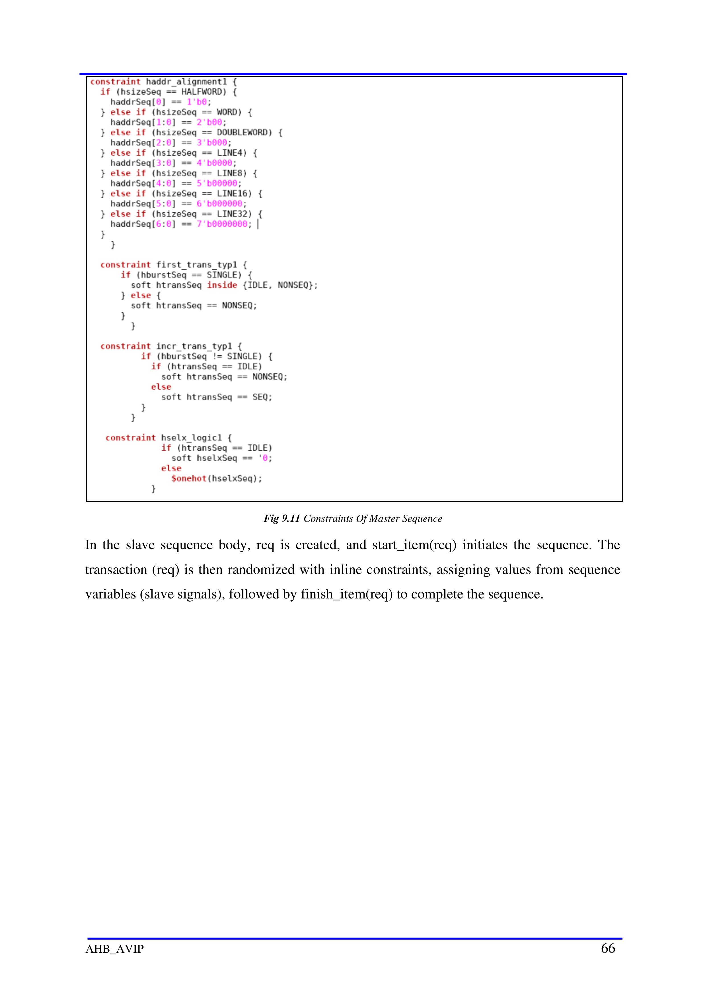

*Figure 9.12: Slave sequence body method*

## 9.5 Virtual Sequences

A virtual sequence starts multiple sequences on different sequencers in the environment. It is
typically executed by a virtual sequencer that already holds handles to the real sequencers.

### 9.5.1 Virtual Sequence Base Class

The base virtual sequence extends `uvm_sequence` and is parameterized with
`uvm_transaction`. It declares `p_sequencer` and carries handles to the virtual sequencer, the
master/slave sequencers, and the environment configuration.

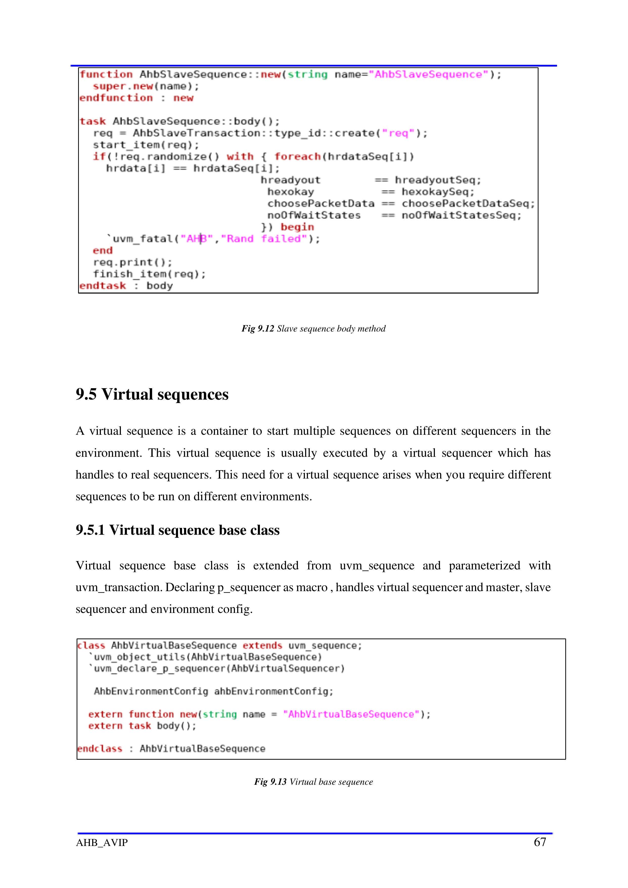

*Figure 9.13: Virtual base sequence*

The virtual-sequence body fetches the environment configuration, performs the dynamic casts
for the sequencer handles, and connects the master and slave sequencers to their local handles.

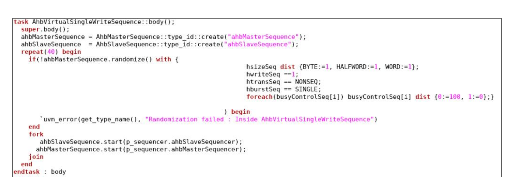

*Figure 9.14: Virtual base sequence body*

The single-write virtual sequence creates master and slave sequence handles and starts them in a
`fork...join` style flow.

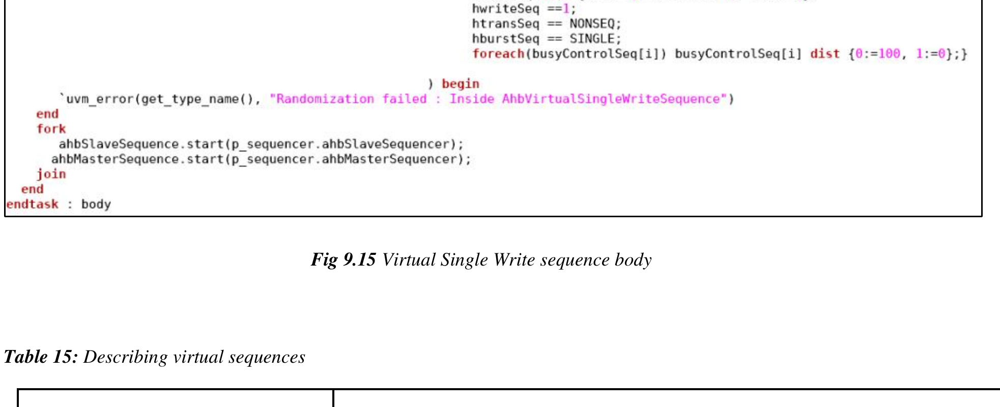

*Figure 9.15: Virtual Single Write sequence body*

| Virtual Sequence | Description |
| --- | --- |
| `AhbVirtualSingleWriteSequence` | Extends the base class, creates master and slave sequence handles, and randomizes the master sequence for `BYTE`, `HALFWORD`, and `WORD` transfer sizes with a write operation, `NONSEQ` transfer type, and `SINGLE` burst type. |
| `AhbVirtualSingleReadSequence` | Same structure as the single-write sequence, but drives read operations with `NONSEQ` and `SINGLE`. |
| `AhbVirtualWriteSequence` | Drives write operations across burst types such as `WRAP4`, `INCR4`, `WRAP8`, `INCR8`, `WRAP16`, and `INCR16`. |
| `AhbVirtualReadSequence` | Drives read operations across the same burst-type set. |
| `AhbVirtualWriteWithBusySequence` | Adds `BUSY` transaction behavior to the write-sequence flow. |
| `AhbVirtualReadWithBusySequence` | Adds `BUSY` transaction behavior to the read-sequence flow. |
| `AhbSingleVirtualWriteWithWaitStateSequence` | Single-burst write flow with injected wait states. |
| `AhbSingleVirtualReadWithWaitStateSequence` | Single-burst read flow with injected wait states. |
| `AhbVirtualWriteWithWaitStateSequence` | Burst-write flow with injected wait states. |
| `AhbVirtualReadWithWaitStateSequence` | Burst-read flow with injected wait states. |
| `AhbWriteFollowedByReadVirtualSequence` | A single-write operation followed by a single-read operation. |

## 9.6 Test Cases

The `uvm_test` layer defines the scenario and verification goal. The base test declares
environment configuration and environment handles, builds the environment, and then configures
the master and slave agent settings before starting a selected virtual sequence.

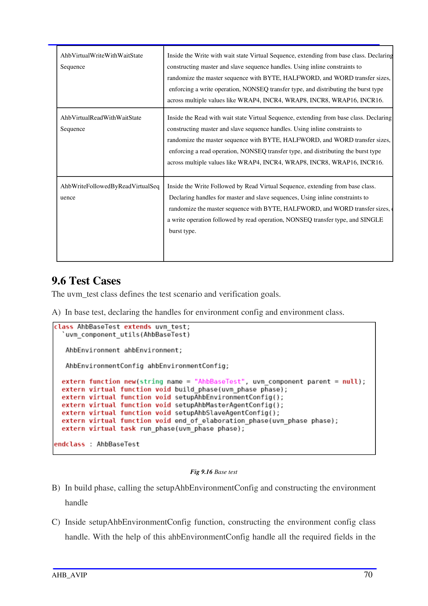

*Figure 9.16: Base test*

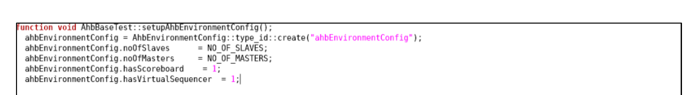

*Figure 9.17: Setup Environment Config*

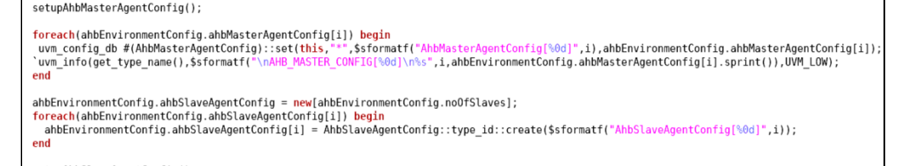

*Figure 9.18: Master Agent Config setup*

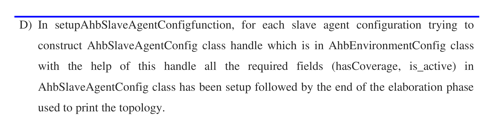

*Figure 9.19: Slave Agent Config setup*

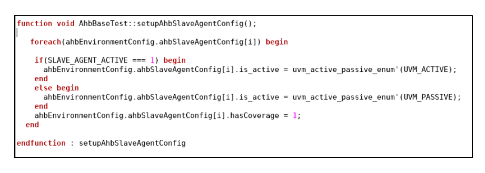

*Figure 9.20: Example for Single Write test*

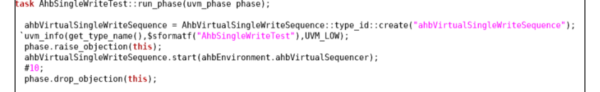

*Figure 9.21: Run phase of Single Write test*

| Test Name | Description |
| --- | --- |
| `AhbSingleWriteTest` | Extends the base test, creates the single-write virtual sequence handle, and starts it between phase raise/drop objections. |
| `AhbSingleReadTest` | Extends the base test, creates the single-read virtual sequence handle, and starts it between phase raise/drop objections. |
| `AhbWriteTest` | Extends the base test, creates the write virtual sequence handle, and starts it between phase raise/drop objections. |
| `AhbReadTest` | Extends the base test, creates the read virtual sequence handle, and starts it between phase raise/drop objections. |
| `AhbWriteWithBusyTest` | Extends the base test and runs the write-with-busy virtual sequence. |
| `AhbReadWithBusyTest` | Extends the base test and runs the read-with-busy virtual sequence. |
| `AhbWriteWithWaitStateTest` | Extends the base test and runs the write-with-wait-state virtual sequence. |
| `AhbReadWithWaitStateTest` | Extends the base test and runs the read-with-wait-state virtual sequence. |
| `AhbWriteFollowedByReadTest` | Extends the base test and runs a single-write sequence followed by a single-read sequence. |

## 9.7 Testlists

The regression list for AHB collects the standard directed tests used by the package.

| Test Case Name | Description |
| --- | --- |
| `AhbSingleWriteTest` | Checks a single-transfer write operation. |
| `AhbSingleReadTest` | Checks a single-transfer read operation. |
| `AhbWriteTest` | Checks write operation for burst transfers other than `SINGLE`. |
| `AhbReadTest` | Checks read operation for burst transfers other than `SINGLE`. |
| `AhbWriteWithBusyTest` | Checks `BUSY` behavior for write operations. |
| `AhbReadWithBusyTest` | Checks `BUSY` behavior for read operations. |
| `AhbSingleWriteWithWaitStateTest` | Checks wait-state insertion for single-burst write transfers. |
| `AhbSingleReadWithWaitStateTest` | Checks wait-state insertion for single-burst read transfers. |
| `AhbWriteWithWaitStateTest` | Checks wait-state insertion for burst-write transfers. |
| `AhbReadWithWaitStateTest` | Checks wait-state insertion for burst-read transfers. |
| `AhbWriteFollowedByReadTest` | Checks a single write operation followed by a read operation. |
