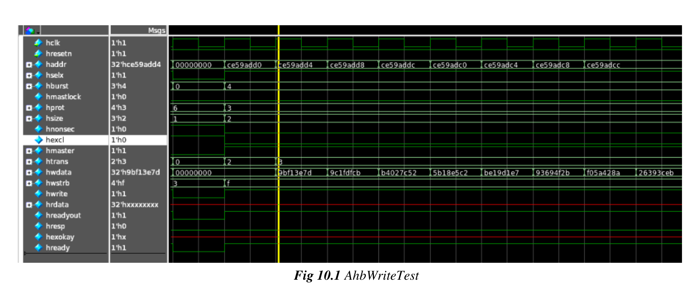
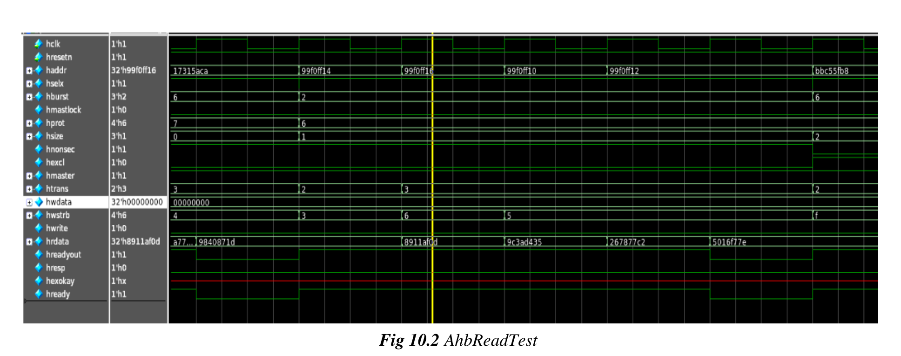
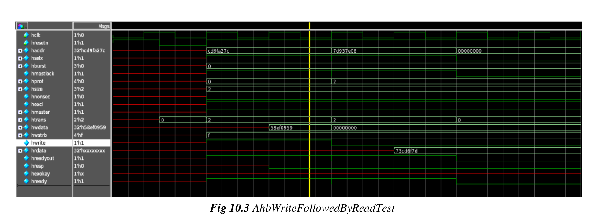

# Chapter 10 - Simulation Results and Waveform

This chapter collects example waveform and simulation-result snapshots from representative AHB
tests.

*Figure 10.1: AhbWriteTest*

The write-test waveform shows the expected behavior for an AHB write transaction.

*Figure 10.2: AhbReadTest*

The read-test waveform captures the corresponding read-transaction behavior.

*Figure 10.3: AhbWriteFollowedByReadTest*

The combined write-followed-by-read waveform demonstrates the end-to-end transition between
the two operations in a single scenario.
