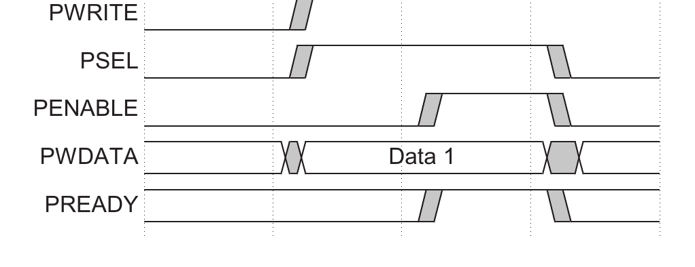
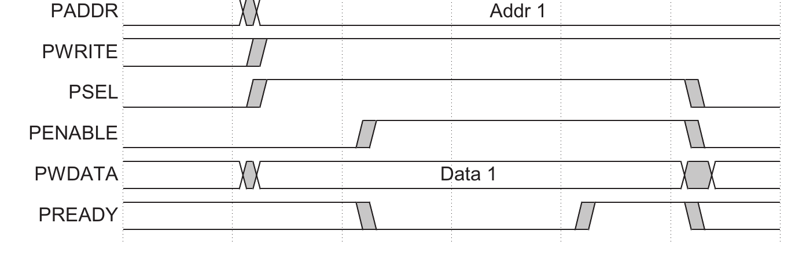
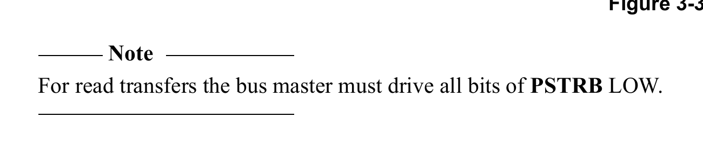
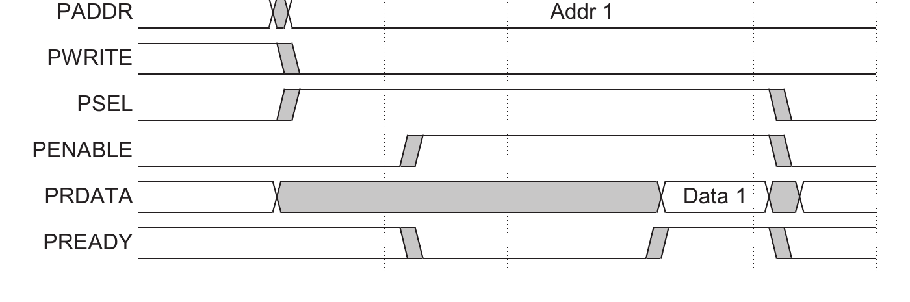
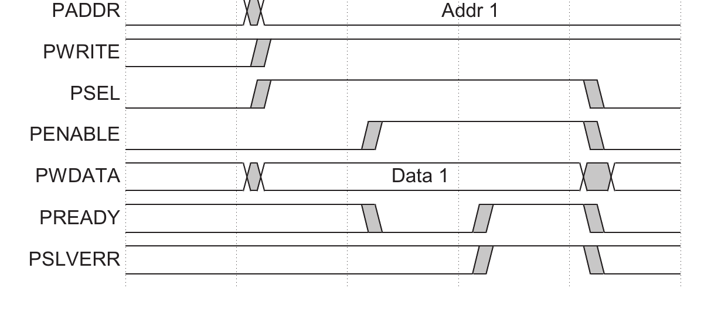
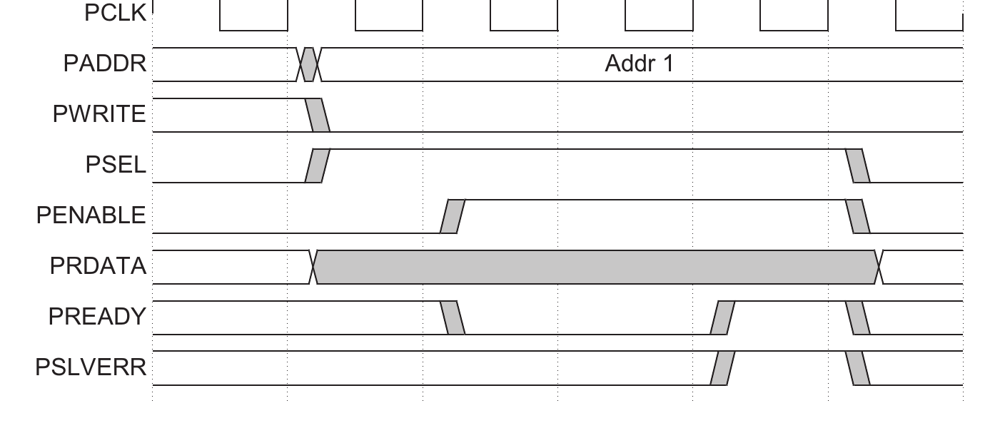

# Chapter 3 Transfers
This chapter describes typical AMBA APB transfers, the error response, and protection unit support. It contains the following sections:
- *Write transfers* on page 3-2
- *Write strobes* on page 3-4
- *Read transfers* on page 3-5
- *Error response* on page 3-6.
- *Protection unit support* on page 3-8
## 3.1 Write transfers
This section describes the following types of write transfer:
- *With no wait states*
- *With wait states*.
### 3.1.1 With no wait states
Figure 3-1 shows a basic write transfer with no wait states.

At T1, a write transfer starts with address **PADDR**, write data **PWDATA**, write signal **PWRITE**, and select signal **PSEL**, being registered at the rising edge of **PCLK**. This is called the Setup phase of the write transfer.
At T2, enable signal **PENABLE**, and ready signal **PREADY**, are registered at the rising edge of **PCLK**.
When asserted, **PENABLE** indicates the start of the Access phase of the transfer.
When asserted, **PREADY** indicates that the slave can complete the transfer at the next rising edge of **PCLK**.
The address **PADDR**, write data **PWDATA**, and control signals all remain valid until the transfer completes at T3, the end of the Access phase.
The enable signal **PENABLE**, is deasserted at the end of the transfer. The select signal **PSEL**, is also deasserted unless the transfer is to be followed immediately by another transfer to the same peripheral.
### 3.1.2 With wait states
Figure 3-2 on page 3-3 shows how the slave can use the **PREADY** signal to extend the transfer. During an Access phase, when **PENABLE** is HIGH, the slave extends the transfer by driving **PREADY** LOW. The following signals remain unchanged while **PREADY** remains LOW:
- address, **PADDR**
- write signal, **PWRITE**
- select signal, **PSEL**
- enable signal, **PENABLE**
- write data, **PWDATA**
- write strobes, **PSTRB**
- protection type, **PPROT**.

**PREADY** can take any value when **PENABLE** is LOW. This ensures that peripherals that have a fixed two cycle access can tie **PREADY** HIGH.
> **Note**
>
> It is recommended that the address and write signals are not changed immediately after a transfer, but remain stable until another access occurs. This reduces power consumption.
## 3.2 Write strobes
The write strobe signals, **PSTRB**, enable sparse data transfer on the write data bus. Each write strobe signal corresponds to one byte of the write data bus. When asserted HIGH, a write strobe indicates that the corresponding byte lane of the write data bus contains valid information.
There is one write strobe for each eight bits of the write data bus, so **PSTRB[n]** corresponds to **PWDATA[(8n + 7):(8n)]**. Figure 3-3 shows this relationship on a 32-bit data bus.

> **Note**
>
> For read transfers the bus master must drive all bits of **PSTRB** LOW.
## 3.3 Read transfers
Two types of read transfer are described in this section:
- *With no wait states*
- *With wait states*.
### 3.3.1 With no wait states
Figure 3-4 shows a read transfer. The timing of the address, write, select, and enable signals are as described in *Write transfers* on page 3-2. The slave must provide the data before the end of the read transfer.

### 3.3.2 With wait states
Figure 3-5 shows how the **PREADY** signal can extend the transfer. The transfer is extended if **PREADY** is driven LOW during an Access phase. The protocol ensures that the following remain unchanged for the additional cycles:
- address, **PADDR**
- write signal, **PWRITE**
- select signal, **PSEL**
- enable signal, **PENABLE**
- protection type, **PPROT**.
Figure 3-5 shows that two cycles are added using the **PREADY** signal. However, you can add any number of additional cycles, from zero upwards.

## 3.4 Error response
You can use **PSLVERR** to indicate an error condition on an APB transfer. Error conditions can occur on both read and write transactions.
**PSLVERR** is only considered valid during the last cycle of an APB transfer, when **PSEL**, **PENABLE**, and **PREADY** are all HIGH.
It is recommended, but not mandatory, that you drive **PSLVERR** LOW when it is not being sampled. That is, when any of **PSEL**, **PENABLE**, or **PREADY** are LOW.
Transactions that receive an error, might or might not have changed the state of the peripheral. This is peripheral-specific and either is acceptable. When a write transaction receives an error, this does not mean that the register within the peripheral has not been updated. Read transactions that receive an error can return invalid data. There is no requirement for the peripheral to drive the data bus to all 0s for a read error.
APB peripherals are not required to support the **PSLVERR** pin. This is true for both existing and new APB peripheral designs. Where a peripheral does not include this pin then the appropriate input to the APB bridge is tied LOW.
### 3.4.1 Write transfer
Figure 3-6 shows an example of a failing write transfer that completes with an error.

### 3.4.2 Read transfer
A read transfer can also complete with an error response, indicating that there is no valid read data available. Figure 3-7 shows a read transfer completing with an error response.

### 3.4.3 Mapping of PSLVERR
When bridging:
**From AXI to APB**  An APB error is mapped back to **RRESP/BRESP = SLVERR**. This is achieved by mapping **PSLVERR** to the AXI signals **RRESP[1]** for reads and **BRESP[1]** for writes.
**From AHB to APB** **PSLVERR** is mapped back to **HRESP = ERROR** for both reads and writes. This is achieved by mapping **PSLVERR** to the AHB signal **HRESP[0]**.
## 3.5 Protection unit support
To support complex system designs, it is often necessary for both the interconnect and other devices in the system to provide protection against illegal transactions. For the APB interface, this protection is provided by the **PPROT[2:0]** signals.
The three levels of access protection are:
### Normal or privileged, PPROT[0]
- LOW indicates a normal access
- HIGH indicates a privileged access.
This is used by some masters to indicate their processing mode. A privileged processing mode typically has a greater level of access within a system.
### Secure or non-secure, PPROT[1]
- LOW indicates a secure access
- HIGH indicates a non-secure access.
This is used in systems where a greater degree of differentiation between processing modes is required.
> **Note**
>
> This bit is configured so that when it is HIGH then the transaction is considered non-secure and when LOW, the transaction is considered as secure.
### Data or Instruction, PPROT[2]
- LOW indicates a data access
- HIGH indicates an instruction access.
This bit gives an indication if the transaction is a data or instruction access.
> **Note**
>
> This indication is provided as a hint and is not accurate in all cases. For example, where a transaction contains a mix of instruction and data items. It is recommended that, by default, an access is marked as a data access unless it is specifically known to be an instruction access.
Table 3-1 summarizes the encoding of the **PPROT[2:0]** signals.
### Table 3-1 Protection encoding
| PPROT[2:0] | Protection level |
|---|---|
| [0] | 1 = privileged access 0 = normal access |
| [1] | 1 = nonsecure access 0 = secure access |
| [2] | 1 = instruction access 0 = data access |
> **Note**
>
> The primary use of **PPROT** is as an identifier for Secure or Non-secure transactions. It is acceptable to use different interpretations of the **PPROT[0]** and **PPROT[2]** identifiers.
