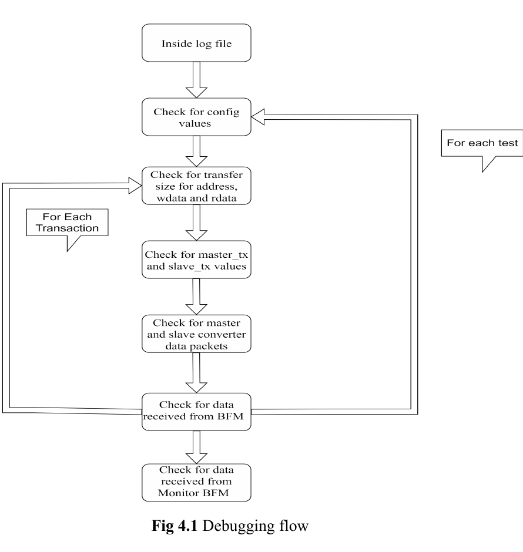
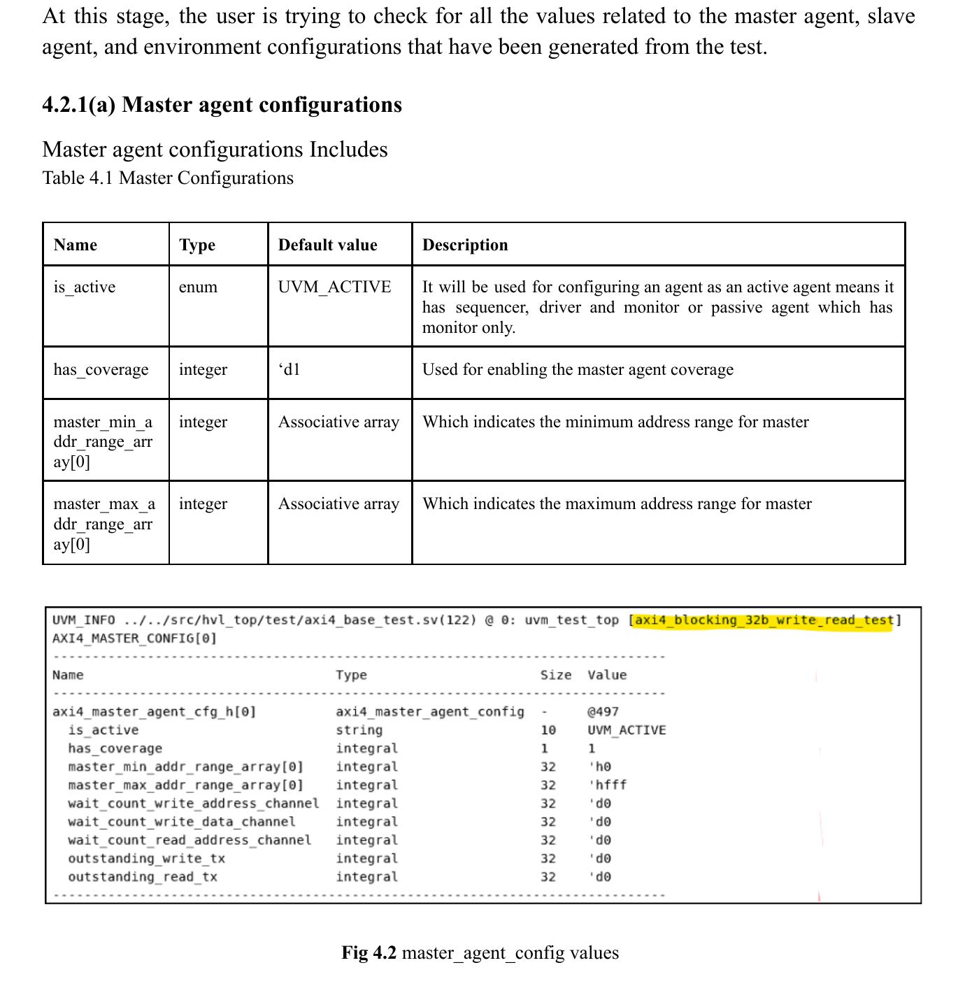

## 9. Debug and Configuration Examples
The source pages available for this section of the user guide show debug-oriented examples rather than protocol waveforms. The material is still useful because it documents how the AXI4 AVIP environment is typically debugged and what master-agent configuration values the logs expose.

### 9.1 AXI4 Debugging Flow

Figure 4.1 shows a recommended debug flow for the `axi4_blocking_32b_write_read_test` example. The flow starts from the run log, checks configuration values, validates transfer sizes for address/data/write-data, compares master and slave transaction values, checks the converter data packets, and finally compares data observed by the BFMs and monitor.

### 9.2 Example Master-Agent Configuration Values

Figure 4.2 captures an example master-agent configuration table and the corresponding log output. It highlights fields such as `is_active`, `has_coverage`, and the configured address-range array values that are useful when debugging an AXI4 AVIP run.
