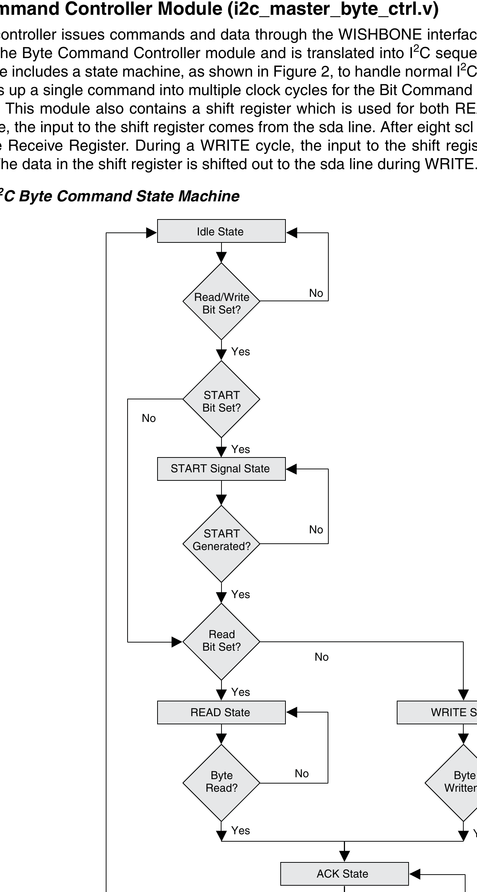

## Byte Command Controller Module (i2c_master_byte_ctrl.v)
The microcontroller issues commands and data through the WISHBONE interface in byte format. The information is fed into the Byte Command Controller module and is translated into I2C sequences required for a byte transfer. This module includes a state machine, as shown in Figure 2, to handle normal I2C transfer sequences. The module then breaks up a single command into multiple clock cycles for the Bit Command Controller to work on bit-level I2C operations. This module also contains a shift register which is used for both READ and WRITE cycles. During a READ cycle, the input to the shift register comes from the sda line. After eight scl cycles, the shifted-in data is copied into the Receive Register. During a WRITE cycle, the input to the shift register comes from the WISHBONE data bus. The data in the shift register is shifted out to the sda line during WRITE.

--- 
