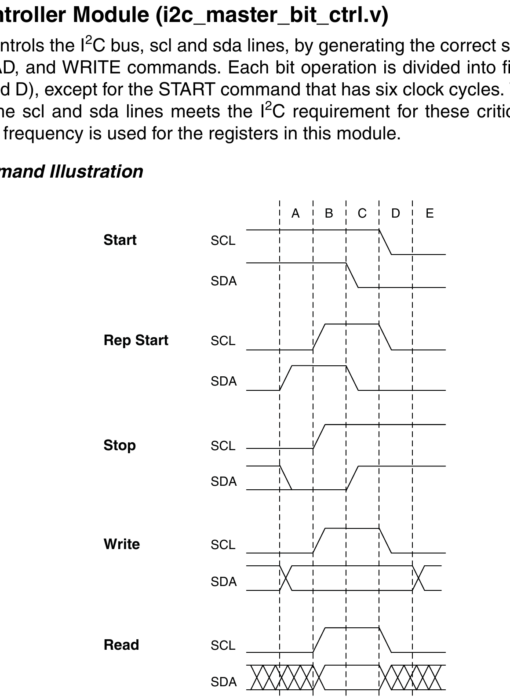

## Bit Command Controller Module (i2c_master_bit_ctrl.v)
This module directly controls the I2C bus, scl and sda lines, by generating the correct sequences for START, STOP, Repeated START, READ, and WRITE commands. Each bit operation is divided into five (5 × scl frequency) clock cycles (idle, A, B, C, and D), except for the START command that has six clock cycles. This ensures that the logical relationship between the scl and sda lines meets the I2C requirement for these critical commands. The internal clock running at 5 × scl frequency is used for the registers in this module.

--- 
