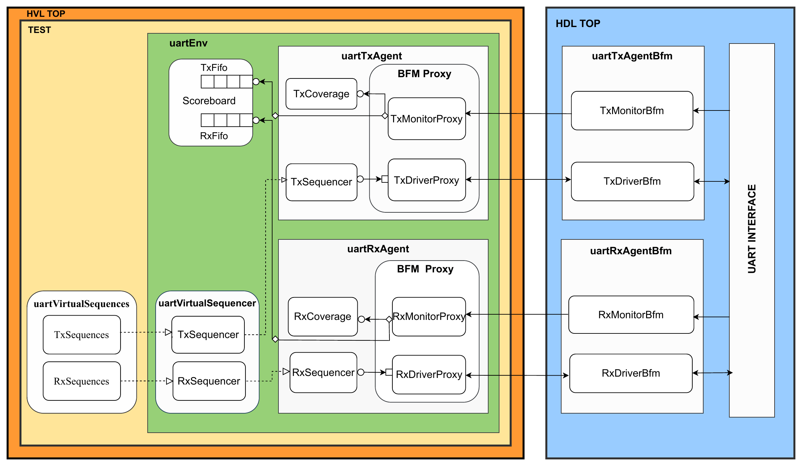

# UART AVIP architecture

This page shows the layered UART verification architecture spanning HVL TOP and HDL TOP.
## Hierarchy
```text
HVL TOP
  TEST
    uartEnv
      Scoreboard
        TxFifo
        RxFifo
      uartVirtualSequences
        TxSequences
        RxSequences
      uartVirtualSequencer
        TxSequencer
        RxSequencer
      uartTxAgent
        TxCoverage
        TxSequencer
        BFM Proxy
          TxMonitorProxy
          TxDriverProxy
      uartRxAgent
        RxCoverage
        RxSequencer
        BFM Proxy
          RxMonitorProxy
          RxDriverProxy
HDL TOP
  uartTxAgentBfm
    TxMonitorBfm
    TxDriverBfm
  uartRxAgentBfm
    RxMonitorBfm
    RxDriverBfm
  UART INTERFACE
```
## Connectivity
- `TxSequences` and `RxSequences` in `uartVirtualSequences` drive the `uartVirtualSequencer`.
- The `uartVirtualSequencer` fans out to the `TxSequencer` and `RxSequencer` used by the agents.
- `uartTxAgent` contains `TxCoverage`, `TxSequencer`, and a `BFM Proxy` with `TxMonitorProxy` and `TxDriverProxy`.
- `uartRxAgent` contains `RxCoverage`, `RxSequencer`, and a `BFM Proxy` with `RxMonitorProxy` and `RxDriverProxy`.
- `uartTxAgentBfm` contains `TxMonitorBfm` and `TxDriverBfm`; `uartRxAgentBfm` contains `RxMonitorBfm` and `RxDriverBfm`.
- The monitor/driver proxies bridge between the HVL agents and the HDL BFMs across the UART interface.
- `Scoreboard` includes `TxFifo` and `RxFifo`.
