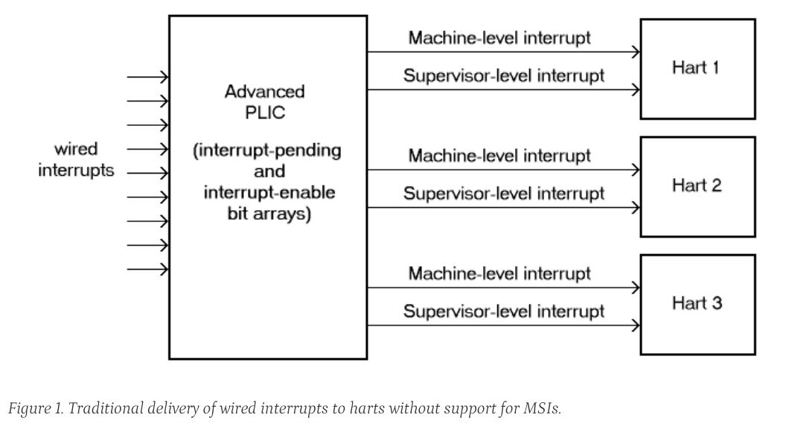
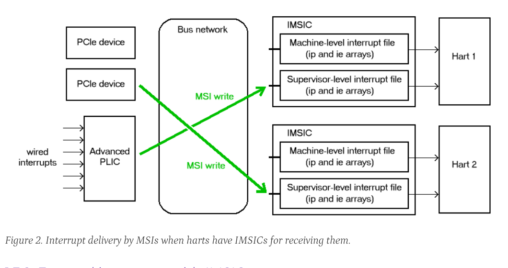

<!-- Page 8 -->
follow-on extension, either separately or as part of a future version of the interrupt architecture of this document.

## 1.2. Limits

In its current version, the RISC-V Advanced Interrupt Architecture can support RISC-V symmetric multiprocessing (SMP) systems with up to 16,384 harts. If the harts are 64-bit (RV64) and implement the H extension, and if all features of the Advanced Interrupt Architecture are fully implemented as well, then for each physical hart there may be up to 63 active virtual harts and potentially thousands of additional idle (swapped-out) virtual harts, where each virtual hart has direct control of one or more physical devices.

Table 1 summarizes the main limits on the numbers of harts, both physical and virtual, and the numbers of distinct interrupt identities that may be supported with the Advanced Interrupt Architecture.

> We assume that any single RISC-V computer (or any single node in a cluster or distributed system) with many thousands of physical harts will probably need an interrupt infrastructure adapted to the machine’s specific organization, which we do not attempt to predict.

*Table 1. Absolute limits on the numbers of harts and interrupt identities in a system. Individual implementations are likely to have smaller limits.*

| Item | Maximum | Requirements |
| --- | --- | --- |
| Physical harts | 16,384 | |
| Active virtual harts having direct control of a device, per physical hart | 31 for RV32, 63 for RV64 | RISC-V H extension; IMSICs with guest interrupt files; and an IOMMU |
| Idle (swapped-out) virtual harts having direct control of a device, per physical hart | potentially thousands | An IOMMU with support for memory-resident interrupt files |
| Wired interrupts at a single APLIC | 1023 | |
| Distinct identities usable for MSIs at each hart (physical or virtual) | 2047 | IMSICs |

## 1.3. Overview of main components

A RISC-V system’s overall architecture for signaling interrupts depends on whether it is built mainly for message-signaled interrupts (MSIs) or for more traditional wired interrupts. In systems with full support for MSIs, every hart has an *Incoming MSI Controller* (IMSIC) that serves as the hart’s own private interrupt controller for external interrupts. Conversely, in systems based primarily on traditional wired interrupts, harts do not have IMSICs. Larger systems, and especially those with PCI devices, are expected to fully support MSIs by giving harts IMSICs, whereas many smaller systems may continue to be best served with wired interrupts and simpler harts without IMSICs.

### 1.3.1. External interrupts without IMSICs

When RISC-V harts do not have Incoming MSI Controllers, external interrupts are signaled to harts through dedicated wires. In that case, an *Advanced Platform-Level Interrupt Controller* (APLIC) acts as a traditional central hub for interrupts, routing and prioritizing external interrupts for each hart as illustrated in Figure 1. Interrupts may be selectively routed either to machine level or to supervisor level at each hart. The APLIC is specified in Chapter 4.

Without IMSICs, the current Advanced Interrupt Architecture does not support the direct signaling of external interrupts to virtual machines, even when RISC-V harts implement the H extension. Instead, an interrupt must be sent to the relevant hypervisor, which can then choose to inject a virtual interrupt into the virtual machine.

*Figure 1. Traditional delivery of wired interrupts to harts without support for MSIs.*

*Figure 2. Interrupt delivery by MSIs when harts have IMSICs for receiving them.*

### 1.3.2. External interrupts with IMSICs

To be able to receive message-signaled interrupts (MSIs), each RISC-V hart must have an Incoming MSI Controller (IMSIC) as shown in Figure 2. Fundamentally, a message-signaled interrupt is simply a memory write to a specific address that hardware accepts as indicating an interrupt. To that end, every IMSIC is assigned one or more distinct addresses in the machine’s address space, and when a write is made to one of those addresses in the expected format, the receiving IMSIC interprets the write as an external interrupt for the respective hart.

Because all IMSICs have unique addresses in the machine’s physical address space, every IMSIC can receive MSI writes from any agent (hart or device) with permission to write to it. IMSICs have separate addresses for MSIs directed to machine and supervisor levels, in part so the ability to signal interrupts at each privilege level can be separately granted or denied by controlling write permissions at the different addresses, and in part to better support virtualizability (pretending that one privilege level is a higher level). MSIs intended for a hart at a specific privilege level are recorded within the IMSIC in an interrupt file, which consists mainly of an array of interrupt-pending bits and a matching array of interrupt-enable bits, the latter indicating which individual interrupts the hart is currently prepared to receive.

IMSIC units are fully defined in Chapter 3. The format of MSIs used by the RISC-V Advanced Interrupt Architecture is described in that chapter, Section 3.2.

When the harts in a RISC-V system have IMSICs, the system will normally still contain an APLIC, but its role is changed. Instead of signaling interrupts to harts directly by wires as in Figure 1, an APLIC converts incoming wired interrupts into MSI writes that are sent to harts via their IMSIC units. Each MSI is sent to a single target hart according to the APLIC’s configuration set by software.

If RISC-V harts implement the H extension, IMSICs may have additional guest interrupt files for delivering interrupts to virtual machines. Besides Chapter 3 on the IMSIC, see Chapter 6 which specifically covers interrupts to virtual machines. If the system also contains an IOMMU to perform address translation of memory accesses made by I/O devices, then MSIs from those same devices may require special handling. This topic is addressed in Chapter 8, "IOMMU Support for MSIs to Virtual Machines."

<!-- Page 9 -->

### 1.3.3. Other interrupts

In addition to external interrupts from I/O devices, the RISC-V Privileged Architecture specifies a few other major classes of interrupts for harts. The Privileged Architecture’s timer interrupts remain supported in full, and software interrupts remain at least partly supported, although neither appears in Figure 1 and Figure 2. For the specifics on software interrupts, refer to Chapter 7, "Interprocessor Interrupts (IPIs)."

The Advanced Interrupt Architecture adds considerable support for local interrupts at a hart, whereby a hart essentially interrupts itself in response to asynchronous events, usually errors. Local interrupts remain contained within a hart (or close to it), so like standard RISC-V timer and software interrupts, they do not pass through an APLIC or IMSIC.

## 1.4. Interrupt identities at a hart

The RISC-V Privileged Architecture gives every interrupt cause at a hart a distinct major identity number, which is the Exception Code automatically written to CSR `mcause` or `scause` on an interrupt trap. Interrupt causes that are standardized by the base Privileged Architecture have major identities in the range 0-15, while numbers 16 and higher are officially available for platform standards or for custom use. The Advanced Interrupt Architecture claims further authority over identity numbers in the ranges 16-23 and 32-47, leaving numbers in the range 24-31 and all major identities 48 and higher still free for custom use. Table 2 characterizes all major interrupt identities with this extension.

*Table 2. Major and minor identities for all interrupt causes at a hart. Major identities 0-15 are the purview of the base Privileged Architecture.*

| Major identity | Minor identity | Description |
| --- | --- | --- |
| 0 | - | Reserved by base Privileged Architecture |
| 1 | - | Supervisor software interrupt |
| 2 | - | Virtual supervisor software interrupt |
| 3 | - | Machine software interrupt |
| 4 | - | Reserved by base Privileged Architecture |
| 5 | - | Supervisor timer interrupt |
| 6 | - | Virtual supervisor timer interrupt |
| 7 | - | Machine timer interrupt |
| 8 | - | Reserved by base Privileged Architecture |
| 9 | Determined by external interrupt controller | Supervisor external interrupt |
| 10 | Determined by external interrupt controller | Virtual supervisor external interrupt |
| 11 | Determined by external interrupt controller | Machine external interrupt |
| 12 | - | Supervisor guest external interrupt |
| 13 | - | Counter overflow interrupt |
| 14-15 | - | Reserved by base Privileged Architecture |
| 16-23 | - | Reserved for standard local interrupts |
| 24-31 | - | Designated for custom use |
| 32-34 | - | Reserved for standard local interrupts |
| 35 | - | Low-priority RAS event interrupt |
| 36-42 | - | Reserved for standard local interrupts |
| 43 | - | High-priority RAS event interrupt |
| 44-47 | - | Reserved for standard local interrupts |
| ≥48 | - | Designated for custom use |

Interrupts from most I/O devices are conveyed to a hart by the external interrupt controller for the hart, which is either the hart’s IMSIC (Figure 2) or an APLIC (Figure 1). As Table 2 shows, external interrupts at a given privilege level all share a single major identity number: 11 for machine level, 9 for supervisor level, and 10 for VS-level. External interrupts from different causes are distinguished from one another at a hart by their minor identity numbers supplied by the external interrupt controller.

Other interrupt causes besides external interrupts might also have their own minor identities. However, this document has need to discuss minor identities only with regard to external interrupts.

The local interrupts defined by the Advanced Interrupt Architecture and their handling are covered mainly in Chapter 5, "Interrupts for Machine and Supervisor Levels."

<!-- Page 10 -->

## 1.5. Selection of harts to receive an interrupt

Each signaled interrupt is delivered to only one hart at one privilege level, usually determined by software in one way or another. Unlike some other architectures, the RISC-V Advanced Interrupt Architecture provides no standard hardware mechanism for the broadcast or multicast of interrupts to multiple harts.

For local interrupts, and for any "virtual" interrupts that software injects into less-privileged levels at a hart, the interrupts are entirely a local affair at the hart and are never visible to other harts. The RISC-V Privileged Architecture’s timer interrupts are also uniquely tied to individual harts. For other interrupts, received by a hart from sources outside the hart, each interrupt signal (whether delivered by wire or by an MSI) is configured by software to go to only a single hart.

To send an interprocessor interrupt (IPI) to multiple harts, the originating hart need only execute a loop, sending an individual IPI to each destination hart. For IPIs to a single destination hart, see Chapter 7.

> The effort that a source hart expends in sending individual IPIs to multiple destinations will invariably be dwarfed by the combined effort at the receiving harts to handle those interrupts. Hence, providing an automated mechanism for IPI multicast could be expected to reduce a system’s total overall work only modestly at best. With a very large number of harts, a hardware mechanism for IPI multicast must contend with the question of how exactly software specifies the intended destination set with each use, and furthermore, the actual physical delivery of IPIs may not differ that much from the software version.

> We do not exclude the future possibility of an optional hardware mechanism for multicast IPI, but only if a significant advantage can be demonstrated in real use. As of 2020, Linux has been observed not to make use of multicast IPI hardware even on systems that have it.

In the rare event that a single interrupt from an I/O device needs to be communicated to multiple harts, the interrupt must be sent to a single hart which can then signal the other harts by IPIs.

> We contend that the need to communicate an I/O interrupt to multiple harts is sufficiently rare that standardizing hardware support for multicast cannot be justified in this case.

> Along with multicast delivery, other architectures support an option for "1-of-N" delivery of interrupts, whereby the hardware chooses a single destination hart from among a configured set of N harts, with the goal of automatic load balancing of interrupt handling among the harts. Experiments in the 2010s called into question the utility of 1-of-N modes in practice, showing that software could often do a better job of load balancing than the hardware algorithms implemented in actual chips. Linux was consequently modified to discontinue using 1-of-N interrupt delivery even on systems that have it.

> We remain open to the argument that hardware load balancing of interrupt handling may be beneficial for certain specialized markets, such as networking. However, the claims made so far in this regard do not justify requiring support for 1-of-N delivery in all RISC-V servers. With more evidence, some mechanism for 1-of-N delivery might become a future option.

> The original Platform-Level Interrupt Controller (PLIC) for RISC-V is configurable so each interrupt source signals external interrupts to any subset of the harts, potentially all harts. When multiple harts receive an external interrupt from a single cause at the PLIC, the first hart to claim the interrupt at the PLIC is the one responsible for servicing it. Usually this sets up a race, where the subset of harts configured to receive the multicast interrupt all take an external interrupt trap simultaneously and compete to be the first to claim the interrupt at the PLIC. The intention is to provide a form of 1-of-N interrupt delivery. However, for all the harts that fail to win the claim, the interrupt trap becomes wasted effort.

> For the reasons already given, the Advanced PLIC supports sending each signaled interrupt to only a single hart chosen by software, not to multiple harts.

<!-- Page 11 -->

## 1.6. ISA extensions Smaia and Ssaia

The Advanced Interrupt Architecture (AIA) defines two names for extensions to the RISC-V instruction set architecture (ISA), one for machine-level execution environments, and another for supervisor-level environments. For a machine-level environment, extension Smaia encompasses all added CSRs and all modifications to interrupt response behavior that the AIA specifies for a hart, over all privilege levels. For a supervisor-level environment, extension Ssaia is essentially the same as Smaia except excluding the machine-level CSRs and behavior not directly visible to supervisor level.

Extensions Smaia and Ssaia cover only those AIA features that impact the ISA at a hart. Although the following are described or discussed in this document as part of the AIA, they are not implied by Smaia or Ssaia because the components are categorized as non-ISA: APLICs, IOMMUs, and any mechanisms for initiating interprocessor interrupts apart from writing to IMSICs.

As revealed in subsequent chapters, the exact set of CSRs and behavior added by the AIA, and hence implied by Smaia or Ssaia, depends on the base ISA’s XLEN (RV32 or RV64), on whether S-mode and the H extension are implemented, and on whether the hart has an IMSIC. But individual AIA extension names are not provided for each possible valid subset. Rather, the different combinations are inferable from the intersection of features indicated (such as RV64I + S-mode + Smaia, but without the H extension).

Software development tools like compilers and assemblers need not be concerned about whether an IMSIC exists but should just allow attempts to access the IMSIC CSRs (described in Chapter 2 and Chapter 3) if Smaia or Ssaia is indicated. Without an actual IMSIC, such attempts may trap, but that is not a problem for the development tools.

If extension Smaia/Ssaia is implemented, then anywhere that the AIA specification has an irreconcilable conflict with the requirements of another implemented RISC-V extension, the AIA is intended to have priority, unless the other extension explicitly extends or overrides the AIA.

> Extension Smcsrind/Sscsrind explicitly extends the AIA’s facility for indirect CSR access provided by the `*iselect` and `*ireg` CSRs described in the next chapter. Hence, if Smcsrind/Sscsrind is also implemented, any perceived conflicts between it and the AIA should be resolved in favor of Smcsrind/Sscsrind.

<!-- Page 12 -->

# Chapter 2. Control and Status Registers (CSRs) Added to Harts

For each privilege level at which a RISC-V hart can take interrupt traps, the Advanced Interrupt Architecture adds CSRs for interrupt control and handling.

## 2.1. Machine-level CSRs

Table 3 lists both the CSRs added for machine level and existing machine-level CSRs whose size is changed by the Advanced Interrupt Architecture. Existing CSRs `mie`, `mip`, and `mideleg` are widened to 64 bits to support a total of 64 interrupt causes.

For RV32, the high-half CSRs listed in the table allow access to the upper 32 bits of registers `mideleg`, `mie`, `mvien`, `mvip`, and `mip`. The Advanced Interrupt Architecture requires that these high-half CSRs exist for RV32, but the bits they access may all be merely read-only zeros.

CSRs `miselect` and `mireg` provide a window for accessing multiple registers beyond the CSRs in Table 3. The value of `miselect` determines which register is currently accessible through alias CSR `mireg`. `miselect` is a WARL register, and it must support a minimum range of values depending on the implemented features. When an IMSIC is not implemented, `miselect` must be able to hold at least any 6-bit value in the range 0 to 0x3F. When an IMSIC is implemented, `miselect` must be able to hold any 8-bit value in the range 0 to 0xFF. The Advanced Interrupt Architecture makes use of these subranges of values for `miselect`:

0x30-0x3F major interrupt priorities

0x70-0xFF external interrupts (only with an IMSIC)

*Table 3. Machine-level CSRs added or widened by the Advanced Interrupt Architecture.*

*Machine-Level Window to Indirectly Accessed Registers*

| Number | Privilege | Width | Name | Description |
| --- | --- | --- | --- | --- |
| 0x350 | MRW | XLEN | `miselect` | Machine indirect register select |
| 0x351 | MRW | XLEN | `mireg` | Machine indirect register alias |

*Machine-Level Interrupts*

| Number | Privilege | Width | Name | Description |
| --- | --- | --- | --- | --- |
| 0x304 | MRW | 64 | `mie` | Machine interrupt-enable bits |
| 0x344 | MRW | 64 | `mip` | Machine interrupt-pending bits |
| 0x35C | MRW | MXLEN | `mtopei` | Machine top external interrupt (only with an IMSIC) |
| 0xFB0 | MRO | MXLEN | `mtopi` | Machine top interrupt |

*Delegated and Virtual Interrupts for Supervisor Level*

| Number | Privilege | Width | Name | Description |
| --- | --- | --- | --- | --- |
| 0x303 | MRW | 64 | `mideleg` | Machine interrupt delegation |
| 0x308 | MRW | 64 | `mvien` | Machine virtual interrupt enables |
| 0x309 | MRW | 64 | `mvip` | Machine virtual interrupt-pending bits |

*Machine-Level High-Half CSRs (RV32 only)*

<!-- Page 13 -->

| Number | Privilege | Width | Name | Description |
| --- | --- | --- | --- | --- |
| 0x313 | MRW | 32 | `midelegh` | Upper 32 bits of `mideleg` (only with S-mode) |
| 0x314 | MRW | 32 | `mieh` | Upper 32 bits of `mie` |
| 0x318 | MRW | 32 | `mvienh` | Upper 32 bits of `mvien` (only with S-mode) |
| 0x319 | MRW | 32 | `mviph` | Upper 32 bits of `mvip` (only with S-mode) |
| 0x354 | MRW | 32 | `miph` | Upper 32 bits of `mip` |

Values of `miselect` with the most-significant bit set (bit XLEN - 1 = 1) are designated for custom use, presumably for accessing custom registers through `mireg`. If XLEN changes, the most-significant bit of `miselect` moves to the new position, retaining its value from before. An implementation is not required to support any custom values for `miselect`.

Other `miselect` values are reserved for other RISC-V extensions.

> RISC-V extension Smcsrind generalizes the mechanism of indirect register access provided by `miselect` and `mireg`.

Normally, the range for external interrupts, 0x70-0xFF, is populated only when an IMSIC is implemented; else, attempts to access `mireg` when `miselect` is in this range cause an illegal instruction exception. The contents of the external-interrupts region are documented in Chapter 3 on the IMSIC.

CSR `mtopei` also exists only when an IMSIC is implemented, so is documented in Chapter 3 along with the indirectly accessed IMSIC registers.

CSR `mtopi` reports the highest-priority interrupt that is pending and enabled for machine level, as specified in Section 5.2.2.

When S-mode is implemented, CSRs `mvien` and `mvip` support interrupt filtering and virtual interrupts for supervisor level. These facilities are explained in Section 5.3.

If extension Smcsrind is also implemented, then when `miselect` has a value in the range 0x30-0x3F or 0x70-0xFF, attempts to access alias CSRs `mireg2` through `mireg6` raise an illegal instruction exception.

## 2.2. Supervisor-level CSRs

Table 4 lists the supervisor-level CSRs that are added and existing CSRs that are widened to 64 bits, if the hart implements S-mode. The functions of these registers all match their machine-level counterparts.

*Table 4. Supervisor-level CSRs added or widened by the Advanced Interrupt Architecture.*

*Supervisor-Level Window to Indirectly Accessed Registers*

| Number | Privilege | Width | Name | Description |
| --- | --- | --- | --- | --- |
| 0x150 | SRW | XLEN | `siselect` | Supervisor indirect register select |
| 0x151 | SRW | XLEN | `sireg` | Supervisor indirect register alias |

*Supervisor-Level Interrupts*

| Number | Privilege | Width | Name | Description |
| --- | --- | --- | --- | --- |
