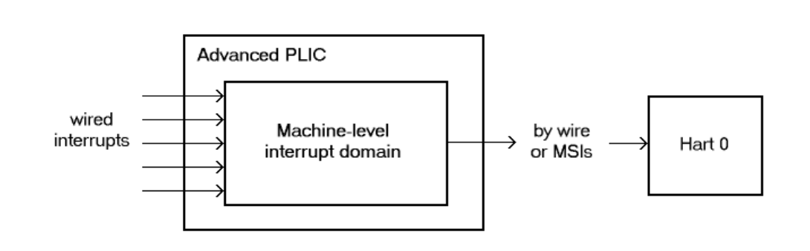
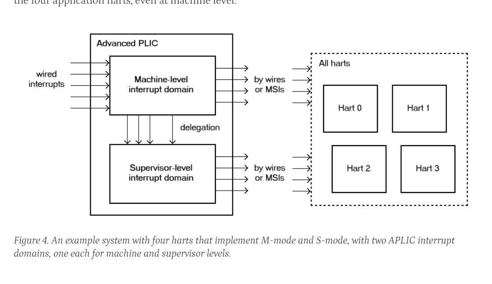
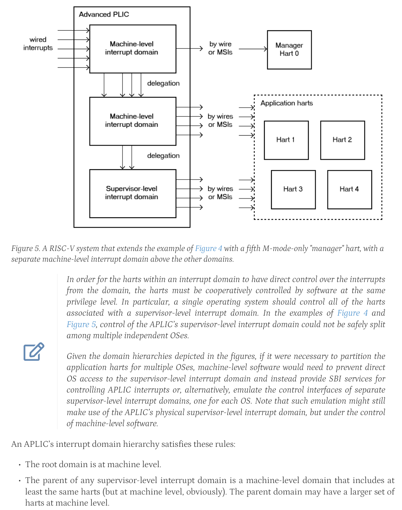

<!-- 4.1. Interrupt sources and identities | Page 32 -->

# 4.1. Interrupt sources and identities

An individual APLIC supports a fixed number of *interrupt sources*, corresponding exactly with the set of physical incoming interrupt wires at the APLIC. Most often, each source’s incoming wire is connected to the output interrupt wire from a single device or device controller. (For level-sensitive interrupts, the interrupt outputs of multiple devices or controllers may be combined to drive the incoming wire of a single interrupt source at an APLIC. An interrupt source’s incoming wire might also be simply tied high or low, if, for example, the source will always be configured as Detached. See Section 4.5.2 for a description of *source modes*.)

Each of an APLIC’s interrupt sources has a fixed unique *identity number* in the range 1 to *N*, where *N* is the total number of sources at the APLIC. The number zero is not a valid interrupt identity number at an APLIC. The maximum number of interrupt sources an APLIC may support is 1023.

When an APLIC delivers interrupts directly to harts at a given privilege level (rather than forwarding interrupts as MSIs), the APLIC is the external interrupt controller for the harts at that privilege level, and the interrupt identities at the APLIC become directly the *minor identities* for external interrupts at the harts.

On the other hand, when an APLIC forwards interrupts by MSIs, software configures a new interrupt identity number for the outgoing MSIs of each source. Consequently, in this case, the source identity numbers at a given APLIC only distinguish the incoming interrupts at the APLIC and have no relevance outside the APLIC.

## 4.2. Interrupt domains

An APLIC supports one or more *interrupt domains*, each associated with a subset of RISC-V harts at one privilege level (machine or supervisor level). The harts within an interrupt domain are those that the domain can interrupt at the corresponding privilege level. Each domain has its own memory-mapped control region in the machine’s address space that appears to control a complete, separate APLIC, though in fact all domain interfaces together access a single combined interrupt controller.

Figure 3 through Figure 5 depict some possible hierarchies of interrupt domains implemented by an APLIC in a RISC-V system.

The first figure represents a minimal system that has a single hart not supporting supervisor mode, with a single interrupt domain for machine level on that hart. The next figure, Figure 4, shows a basic arrangement for a larger system designed for symmetric multiprocessing (SMP), with multiple harts that all implement supervisor mode. In such cases, the APLIC will usually provide a separate interrupt domain for supervisor level, as the figure portrays. This supervisor-level interrupt domain allows an operating system, running in S-mode on the multiple harts, to have direct control over the interrupts it receives, avoiding the need to call upon M-mode to exercise that control.

<!-- footer: The RISC-V Advanced Interrupt Architecture | © RISC-V International -->
<!-- 4.2. Interrupt domains | Page 33 -->



*Figure 3. Example of a RISC-V system that has a single hart implementing only M-mode, with a single machine-level interrupt domain for that hart.*

An APLIC’s interrupt domains are arranged in a tree hierarchy, with the root domain always being at machine level. Incoming interrupt wires arrive first at the root domain. Each domain may then selectively delegate all or a subset of interrupt sources to its child domains in the hierarchy. Within a given APLIC, interrupt source numbers are invariant across all domains, so source identity number *i* always refers to the same source in every domain, corresponding to incoming wire number *i*. For an interrupt domain below the root, interrupt sources not delegated down to that domain appear to the domain as being not implemented.

Figure 5 shows a hierarchy of three interrupt domains, two at machine level and one at supervisor level. The arrangement in the figure, when combined with PMP (physical memory protection), allows machine-level software to isolate a selection of interrupts exclusively for hart 0, beyond the reach of the four application harts, even at machine level.



*Figure 4. An example system with four harts that implement M-mode and S-mode, with two APLIC interrupt domains, one each for machine and supervisor levels.*

> In order for the harts within an interrupt domain to have direct control over the interrupts from the domain, the harts must be cooperatively controlled by software at the same privilege level. In particular, a single operating system should control all of the harts associated with a supervisor-level interrupt domain. In the examples of Figure 4 and Figure 5, control of the APLIC’s supervisor-level interrupt domain could not be safely split among multiple independent OSes.

> Given the domain hierarchies depicted in the figures, if it were necessary to partition the application harts for multiple OSes, machine-level software would need to prevent direct OS access to the supervisor-level interrupt domain and instead provide SBI services for controlling APLIC interrupts or, alternatively, emulate the control interfaces of separate supervisor-level interrupt domains, one for each OS. Note that such emulation might still make use of the APLIC’s physical supervisor-level interrupt domain, but under the control of machine-level software.

An APLIC’s interrupt domain hierarchy satisfies these rules:

  • The root domain is at machine level.
  • The parent of any supervisor-level interrupt domain is a machine-level domain that includes at least the same harts (but at machine level, obviously). The parent domain may have a larger set of harts at machine level.
  • For each interrupt domain, interrupts from the domain are signaled to harts all by the same method, either by wire or by MSIs, not by a mixture of methods among the harts.

When a RISC-V hart’s external interrupt controller is an APLIC, not an IMSIC, the hart can be within only one interrupt domain of this APLIC at each privilege level.

<!-- footer: The RISC-V Advanced Interrupt Architecture | © RISC-V International -->
<!-- 4.2. Interrupt domains | Page 34 -->



*Figure 5. A RISC-V system that extends the example of Figure 4 with a fifth M-mode-only "manager" hart, with a separate machine-level interrupt domain above the other domains.*

On the other hand, a hart that has an IMSIC for its external interrupt controller may, at each privilege level, be in multiple APLIC interrupt domains, even those of the same APLIC, and may potentially receive MSIs from multiple different APLICs in the machine.

A platform might give software a way to choose between multiple interrupt domain hierarchies for any given APLIC. Any such configurability is outside the scope of this specification, but should be available to machine level only.

<!-- footer: The RISC-V Advanced Interrupt Architecture | © RISC-V International -->
<!-- 4.3. Hart index numbers | Page 35 -->

## 4.3. Hart index numbers

Within a given interrupt domain, each of the domain’s harts has a unique *index number* in the range 0 to 2^14 - 1 (= 16,383). The index number a domain associates with a hart may or may not have any relationship to the unique hart identifier ("hart ID") that the Privileged Architecture assigns to the hart. Two different interrupt domains may employ a different mapping of index numbers to the same set of harts. However, if any of an APLIC’s interrupt domains can forward interrupts by MSI, then all machine-level domains of the APLIC share a common mapping of index numbers to harts.

> For efficiency, implementations should prefer small integers for hart index numbers.

## 4.4. Overview of interrupt control for a single domain

Each interrupt domain implemented by an APLIC has its own separate physical control interface that is memory-mapped in the machine’s address space, allowing access to each domain to be easily regulated by both PMP (physical memory protection) and page-based address translation. The control interfaces of all interrupt domains have a common structure. In most respects, every domain appears to software as though it were a root domain, without visibility of the domains above it in the hierarchy.

An individual interrupt domain has the following components for each interrupt source at the APLIC:

  • Source configuration. This determines whether the specific source is active in the domain and, if so, how the incoming wire is to be interpreted, such as level-sensitive or edge-sensitive. For a source that is inactive in the domain, source configuration controls any delegation to a child domain.
  • Interrupt-pending and interrupt-enable bits. For an inactive source, these two bits are read-only zeros. Otherwise, the pending bit records an interrupt that arrived and has not yet been signaled or forwarded, while the enable bit determines whether interrupts from this source should currently be delivered, or should remain pending.
  • Target selection. For an active source, target selection determines the hart to receive the interrupt and either the interrupt’s priority or the new interrupt identity when forwarding as an MSI.

For interrupt domains that deliver interrupts directly to harts rather than forwarding by MSIs, the domain has a final set of components for controlling interrupt delivery to harts, one instance per hart in the domain.

> Although an APLIC with multiple interrupt domains may appear to duplicate the per-source state listed above (source configuration, etc.) by a factor equal to the number of domains, in fact, APLIC implementations can exploit the fact that each source is ultimately active in only one domain. In all domains to which a specific interrupt source has not been delegated, the state associated with the source appears as read-only zeros, requiring no physical register bits.

<!-- footer: The RISC-V Advanced Interrupt Architecture | © RISC-V International -->
<!-- 4.5. Memory-mapped control region for an interrupt domain | Page 36 -->

## 4.5. Memory-mapped control region for an interrupt domain

For each interrupt domain that an APLIC supports, there is a dedicated memory-mapped control region for managing interrupts in that domain. This control region is a multiple of 4 KiB in size and aligned to a 4-KiB address boundary. The smallest valid control region is 16 KiB. An interrupt domain’s control region is populated by a set of 32-bit registers. The first 16 KiB contains the registers listed in Table 6.

*Table 6. The registers of the first 16 KiB of an interrupt domain’s memory-mapped control region.*

```text
offset  size       register name
0x0000  4 bytes    domaincfg
0x0004  4 bytes    sourcecfg[1]
0x0008  4 bytes    sourcecfg[2]
    …               …
0x0FFC  4 bytes    sourcecfg[1023]
0x1BC0  4 bytes    mmsiaddrcfg               (machine-level interrupt domains only)
0x1BC4  4 bytes    mmsiaddrcfgh              ”
0x1BC8  4 bytes    smsiaddrcfg               ”
0x1BCC  4 bytes    smsiaddrcfgh              ”
0x1C00  4 bytes    setip[0]
0x1C04  4 bytes    setip[1]
    …               …
0x1C7C  4 bytes    setip[31]
0x1CDC  4 bytes    setipnum
0x1D00  4 bytes    in_clrip[0]
0x1D04  4 bytes    in_clrip[1]
    …               …
0x1D7C  4 bytes    in_clrip[31]
0x1DDC  4 bytes    clripnum
0x1E00  4 bytes    setie[0]
0x1E04  4 bytes    setie[1]
    …               …
0x1E7C  4 bytes    setie[31]
0x1EDC  4 bytes    setienum
0x1F00  4 bytes    clrie[0]
0x1F04  4 bytes    clrie[1]
    …               …
0x1F7C  4 bytes    clrie[31]
0x1FDC  4 bytes    clrienum
0x2000  4 bytes    setipnum_le
0x2004  4 bytes    setipnum_be
0x3000  4 bytes    genmsi
0x3004  4 bytes    target[1]
0x3008  4 bytes    target[2]
    …               …
0x3FFC  4 bytes    target[1023]
```

Starting at offset 0x4000, an interrupt domain’s control region may optionally have an array of interrupt delivery control (IDC) structures, one for each potential hart index number in the range 0 to some maximum that is at least as large as the maximum hart index number for the interrupt domain. IDC structures are used only when the domain is configured to deliver interrupts directly to harts instead of being forwarded by MSIs. An interrupt domain that supports only interrupt forwarding by MSIs and not the direct delivery of interrupts by the APLIC does not need IDC structures in its control region.

The first IDC structure, if any, is for the hart with index number 0; the second is for the hart with index number 1; and so forth. Each IDC structure is 32 bytes and has these defined registers:

```text
offset  size    register name
0x00    4 bytes idelivery
0x04    4 bytes iforce
0x08    4 bytes ithreshold
0x18    4 bytes topi
0x1C    4 bytes claimi
```

IDC structures are packed contiguously, 32 bytes per structure, so the offset from the beginning of an interrupt domain’s control region to its second IDC structure (hart index 1), if it exists, is 0x4020; the offset to the third IDC structure (hart index 2), if it exists, is 0x4040; etc.

The array of IDC structures may include some for potential hart index numbers that are not actual hart index numbers in the domain. For example, the first IDC structure is always for hart index 0, but 0 is not necessarily a valid index number for any hart in the domain. For each IDC structure in the array that does not correspond to a valid hart index number in the domain, the IDC structure’s registers may (or may not) be all read-only zeros.

Aside from the registers in Table 6 and those listed above for IDC structures, all other bytes in an interrupt domain’s control region are reserved and are implemented as read-only zeros.

Only naturally aligned 32-bit simple reads and writes are supported within an interrupt domain’s control region. Writes to read-only bytes are ignored. For other forms of accesses (other sizes, misaligned accesses, or AMOs), implementations should preferably report an access fault or bus error but must otherwise ignore the access.

<!-- footer: The RISC-V Advanced Interrupt Architecture | © RISC-V International -->
<!-- 4.5. Memory-mapped control region for an interrupt domain | Page 37 -->

The registers of the first 16 KiB of an interrupt domain’s control region (all but the IDC structures) are documented individually below. IDC structures are documented later, in Section 4.8, "Interrupt delivery directly by the APLIC."

### 4.5.1. Domain configuration (domaincfg)

The domaincfg register has this format:

```text
bits 31:24  read-only 0x80
bit 8       IE
bit 7       read-only 0
bit 2       DM (WARL)
bit 0       BE (WARL)

All other register bits are reserved and read as zeros.
```

Bit IE (Interrupt Enable) is a global enable for all active interrupt sources at this interrupt domain. Only when IE = 1 are pending-and-enabled interrupts actually signaled or forwarded to harts.

The value of bit IE affects only whether interrupts are delivered to harts. It has no effect on any other APLIC state, including the interrupt-enable and interrupt-pending bits of interrupt sources and IDC registers idelivery, topi, and claimi.

Field DM (Delivery Mode) is WARL and determines how this interrupt domain delivers interrupts to harts. The two possible values for DM are:

```text
0 = direct delivery mode
1 = MSI delivery mode
```

In direct delivery mode, interrupts are prioritized and signaled directly to harts by the APLIC itself. In MSI delivery mode, interrupts are forwarded by the APLIC as MSIs to harts, presumably for further handling by IMSICs at those harts. A given APLIC implementation may support either or both of these delivery modes for each interrupt domain.

If the interrupt domain’s harts have IMSICs, then unless the relevant interrupt files of those IMSICs support value 0x40000000 for register eidelivery, setting DM to zero (direct delivery mode) will have the same effect as setting IE to zero. See Section 3.8.1 and Section 4.8.2.

BE (Big-Endian) is a WARL field that determines the byte order for most registers in the interrupt domain’s memory-mapped control region. If BE = 0, byte order is little-endian, and if BE = 1, it is big-endian. For RISC-V systems that support only little-endian, BE may be read-only zero, and for those that support only big-endian, BE may be read-only one. For bi-endian systems, BE is writable.

Field BE affects the byte order of accesses to the domaincfg register itself, just as for other registers in the interrupt domain’s control region. To deal with this fact, the read-only value in domaincfg’s most-significant byte, bits 31:24, serves two purposes. First, for any read of domaincfg, the register’s correct byte order is easily determined from the four-byte value obtained: When interpreted in the correct byte order, bit 31 is one, and in the wrong order, bit 31 is zero. Second, if the value of BE is uncertain (prior to software initializing the interrupt domain, presumably), an 8-bit value x can be safely written to domaincfg by writing (x<<24)|x, where <<24 represents shifting left by 24 bits, and the vertical bar

<!-- footer: The RISC-V Advanced Interrupt Architecture | © RISC-V International -->
<!-- 4.5. Memory-mapped control region for an interrupt domain | Page 39 -->

(|) represents bitwise logical OR. After domaincfg is written once, the value of BE should then be known, so subsequent writes should not need to repeat the same trick.

At system reset, all writable bits in domaincfg are initialized to zero, including IE. If an implementation supports additional forms of reset for the APLIC, it is implementation-defined (or possibly platform-defined) how these other resets may affect domaincfg.

### 4.5.2. Source configurations (sourcecfg[1]–sourcecfg[1023])

For each possible interrupt source *i*, register sourcecfg[*i*] controls the *source mode* for source *i* in this interrupt domain as well as any delegation of the source to a child domain. When source *i* is not implemented, or appears in this domain not to be implemented, sourcecfg[*i*] is read-only zero. If source *i* was not delegated to this domain and is then changed (at the parent domain) to become delegated to this domain, sourcecfg[*i*] remains zero until successfully written with a nonzero value.

Bit 10 of sourcecfg[*i*] is a 1-bit field called D (Delegate). If D = 1, source *i* is delegated to a child domain, and if D = 0, it is not delegated to a child domain. Interpretation of the rest of sourcecfg[*i*] depends on field D.

When interrupt source *i* is delegated to a child domain, sourcecfg[*i*] has this format:

```text
bit 10    D, =1
bits 9:0  Child Index (WLRL)

All other register bits are reserved and read as zeros.
```

Child Index is a WLRL field that specifies the interrupt domain to which this source is delegated. For an interrupt domain with child domains, this field must be able to hold integer values in the range 0 to *C* - 1. Each interrupt domain has a fixed mapping from these index numbers to child domains.

If an interrupt domain has no children in the domain hierarchy, bit D cannot be set to one in any sourcecfg register for that domain. For such a leaf domain, attempting to write a sourcecfg register with a value that has bit 10 = 1 causes the entire register to be set to zero instead.

When interrupt source *i* is not delegated to a child domain, sourcecfg[*i*] has this format:

```text
bit 10    D, =0
bits 2:0  SM (WARL)

All other register bits are reserved and read as zeros.
```

The SM (Source Mode) field is WARL and controls whether the interrupt source is active in this domain, and if so, what values or transitions on the incoming wire are interpreted as interrupts. The values allowed for SM and their meanings are listed in Table 7. Inactive (zero) is always supported for field SM. Implementations are free to choose, independently for each interrupt source, what other values are supported for SM.

*Table 7. Encoding of the SM (Source Mode) field of a sourcecfg register when bit D = 0*

```text
Value  Name      Description
0      Inactive  Inactive in this domain (and not delegated)
```

<!-- The provided page images end before the remainder of Table 7. -->

<!-- footer: The RISC-V Advanced Interrupt Architecture | © RISC-V International -->
