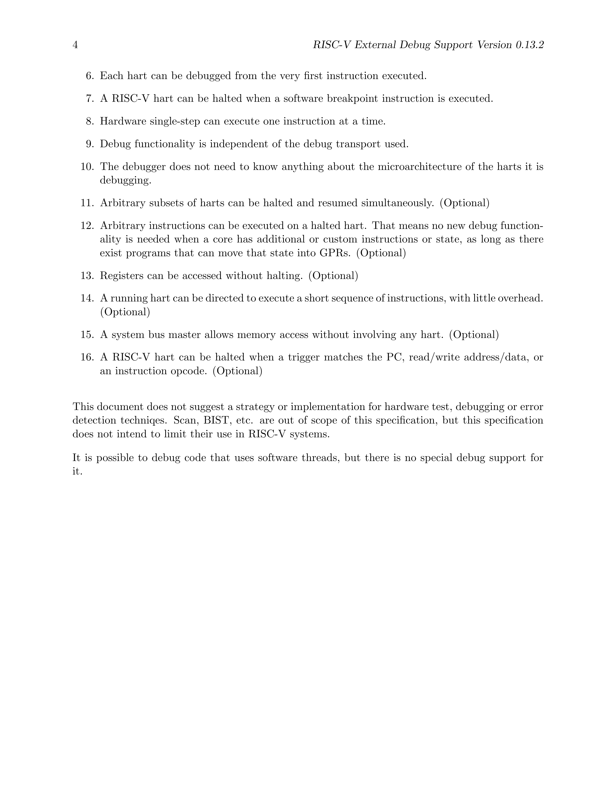

<!-- page 1 -->

# List of Figures

- 2.1 RISC-V Debug System Overview ................................................................ 6
- 3.1 Run/Halt Debug State Machine ................................................................ 17

<!-- page 2 -->

# List of Tables

- 1.2 Register Access Abbreviations ................................................................ 3
- 3.1 Use of Data Registers ................................................................ 11
- 3.2 Meaning of cmdtype ................................................................ 12
- 3.3 Abstract Register Numbers ................................................................ 13
- 3.7 System Bus Data Bits ................................................................ 18
- 3.8 Debug Module Debug Bus Registers ................................................................ 20
- 4.1 Core Debug Registers ................................................................ 42
- 4.3 Virtual address in DPC upon Debug Mode Entry ................................................................ 44
- 4.4 Virtual Core Debug Registers ................................................................ 45
- 4.5 Privilege Level Encoding ................................................................ 46
- 5.1 action encoding ................................................................ 49
- 5.2 Trigger Registers ................................................................ 49
- 5.8 Suggested Breakpoint Timings ................................................................ 53
- 6.1 JTAG DTM TAP Registers ................................................................ 63
- 6.5 MIPI-10 Connector Diagram ................................................................ 67
- 6.6 MIPI-20 Connector Diagram ................................................................ 67
- 6.7 JTAG Connector Pinout ................................................................ 68

<!-- page 3 -->

# Chapter 1

# Introduction

When a design progresses from simulation to hardware implementation, a user's control and understanding of the system's current state drops dramatically. To help bring up and debug low level software and hardware, it is critical to have good debugging support built into the hardware. When a robust OS is running on a core, software can handle many debugging tasks. However, in many scenarios, hardware support is essential.

This document outlines a standard architecture for external debug support on RISC-V platforms. This architecture allows a variety of implementations and tradeoffs, which is complementary to the wide range of RISC-V implementations. At the same time, this specification defines common interfaces to allow debugging tools and components to target a variety of platforms based on the RISC-V ISA.

System designers may choose to add additional hardware debug support, but this specification defines a standard interface for common functionality.

## 1.1 Terminology

A *platform* is a single integrated circuit consisting of one or more *components*. Some components may be RISC-V cores, while others may have a different function. Typically they will all be connected to a single system bus. A single RISC-V core contains one or more hardware threads, called *harts*.

DXLEN of a hart is its widest supported XLEN, ignoring the current value of MXL in misa.

### 1.1.1 Context

This document is written to work with:

1. The RISC-V Instruction Set Manual, Volume I: User-Level ISA, Document Version 2.2 (the ISA Spec)
2. The RISC-V Instruction Set Manual, Volume II: Privileged Architecture, Version 1.10 (the Privileged Spec)

<!-- page 4 -->

## 1.1.2 Versions

Version 0.13 of this document was ratified by the RISC-V Foundation's board. Versions 0.13.x are bug fix releases to that ratified specification.

Version 0.14 will be forwards and backwards compatible with Version 0.13.

## 1.2 About This Document

### 1.2.1 Structure

This document contains two parts. The main part of the document is the specification, which is given in the numbered sections. The second part of the document is a set of appendices. The information in the appendices is intended to clarify and provide examples, but is not part of the actual specification.

### 1.2.2 Register Definition Format

All register definitions in this document follow the format shown below. A simple graphic shows which fields are in the register. The upper and lower bit indices are shown to the top left and top right of each field. The total number of bits in the field are shown below it.

After the graphic follows a table which for each field lists its name, description, allowed accesses, and reset value. The allowed accesses are listed in Table 1.2. The reset value is either a constant or "Preset." The latter means it is an implementation-specific legal value.

Names of registers and their fields are hyperlinks to their definition, and are also listed in the index on page 82.

#### 1.2.2.1 Long Name (shortname, at 0x123)

```text
 31                 8 7       0
+--------------------+---------+
|         0          |  field  |
+--------------------+---------+
        24                 8
```

Field | Description | Access | Reset
--- | --- | --- | ---
field | Description of what this field is used for. | R/W | 15

<!-- page 5 -->

Table 1.2: Register Access Abbreviations

| Abbrev | Meaning |
| --- | --- |
| R | Read-only. |
| R/W | Read/Write. |
| R/W1C | Read/Write. For each bit in the field, writing 1 clears that bit. Writing 0 has no effect. |
| W | Write-only. When read this field returns 0. |
| W1 | Write-only. Only writing 1 has an effect. |
| WARL | Write any, read legal. A debugger may write any value. If a value is unsupported, the implementation converts the value to one that is supported. |

## 1.3 Background

There are several use cases for dedicated debugging hardware, both internal to a CPU core and with an external connection. This specification addresses the use cases listed below. Implementations can choose not to implement every feature, which means some use cases might not be supported.

- Debugging low-level software in the absence of an OS or other software.
- Debugging issues in the OS itself.
- Bootstrapping a system to test, configure, and program components before there is any executable code path in the system.
- Accessing hardware on a system without a working CPU.

In addition, even without a hardware debugging interface, architectural support in a RISC-V CPU can aid software debugging and performance analysis by allowing hardware triggers and breakpoints.

## 1.4 Supported Features

The debug interface described in this specification supports the following features:

1. All hart registers (including CSRs) can be read/written.
2. Memory can be accessed either from the hart's point of view, through the system bus directly, or both.
3. RV32, RV64, and future RV128 are all supported.
4. Any hart in the platform can be independently debugged.
5. A debugger can discover almost[^1] everything it needs to know itself, without user configuration.

[^1]: Notable exceptions include information about the memory map and peripherals.

<!-- page 6 -->

6. Each hart can be debugged from the very first instruction executed.
7. A RISC-V hart can be halted when a software breakpoint instruction is executed.
8. Hardware single-step can execute one instruction at a time.
9. Debug functionality is independent of the debug transport used.
10. The debugger does not need to know anything about the microarchitecture of the harts it is debugging.
11. Arbitrary subsets of harts can be halted and resumed simultaneously. (Optional)
12. Arbitrary instructions can be executed on a halted hart. That means no new debug functionality is needed when a core has additional or custom instructions or state, as long as there exist programs that can move that state into GPRs. (Optional)
13. Registers can be accessed without halting. (Optional)
14. A running hart can be directed to execute a short sequence of instructions, with little overhead. (Optional)
15. A system bus master allows memory access without involving any hart. (Optional)
16. A RISC-V hart can be halted when a trigger matches the PC, read/write address/data, or an instruction opcode. (Optional)

This document does not suggest a strategy or implementation for hardware test, debugging or error detection techniques. Scan, BIST, etc. are out of scope of this specification, but this specification does not intend to limit their use in RISC-V systems.

It is possible to debug code that uses software threads, but there is no special debug support for it.

## Chapter 2

# System Overview

Figure 2.1 shows the main components of External Debug Support. Blocks shown in dotted lines are optional.

The user interacts with the Debug Host (e.g. laptop), which is running a debugger (e.g. gdb). The debugger communicates with a Debug Translator (e.g. OpenOCD, which may include a hardware driver) to communicate with Debug Transport Hardware (e.g. Olimex USB-JTAG adapter). The Debug Transport Hardware connects the Debug Host to the Platform's Debug Transport Module (DTM). The DTM provides access to one or more Debug Modules (DMs) using the Debug Module Interface (DMI).

Each hart in the platform is controlled by exactly one DM. Harts may be heterogeneous. There is no further limit on the hart-DM mapping, but usually all harts in a single core are controlled by the same DM. In most platforms there will only be one DM that controls all the harts in the platform.

DMs provide run control of their harts in the platform. Abstract commands provide access to GPRs. Additional registers are accessible through abstract commands or by writing programs to the optional Program Buffer.

The Program Buffer allows the debugger to execute arbitrary instructions on a hart. This mechanism can also be used to access memory. An optional system bus access block allows memory accesses without using a RISC-V hart to perform the access.

Each RISC-V hart may implement a Trigger Module. When trigger conditions are met, harts will halt and inform the debug module that they have halted.



Figure 2.1: RISC-V Debug System Overview

<!-- page 7 -->

<!-- page 7 repeats Figure 2.1 in the source images -->

<!-- page 8 -->

<!-- page 8 repeats Figure 2.1 in the source images -->
